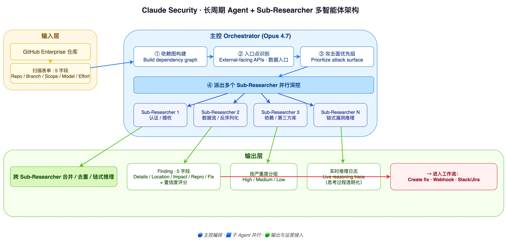
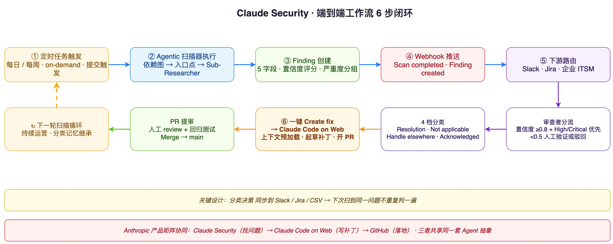
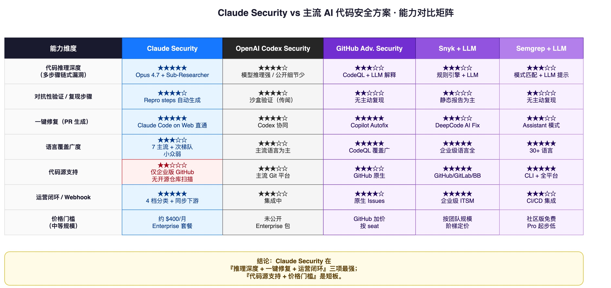

> Around the May Day holiday, Anthropic released the Claude Security beta, powered by Opus 4.7. For now it is open only to Claude Enterprise customers; Team and Max users will have to wait several more months.

> After working through the full feature briefing, we ran a teardown. The conclusion up front: **compared to OpenAI Codex Security, this toolkit shows almost no "disruptive highlights"**—but **its posture toward productizing and operationalizing "AI as a security researcher" is remarkably solid**. This article walks through six dimensions to help you decide whether to buy it, whether to track it, and—if you are building AI security products—how to position your own offering against it.

## 1. Both Arsonist and Firefighter

The "AI for Security" narrative around large models over the past two years has carried an awkward paradox:

**LLMs are both "arsonist"—they can be misused to generate exploits, assist 0-day authoring, and bypass security products; and "firefighter"—their ability to read code, reason over context, and explain attack chains far exceeds traditional static scanners (SAST).**

Claude Security is essentially Anthropic's attempt to productize the "firefighter" side. Its approach:

1. Let the AI **actually read code** the way a security researcher does;
2. **Validate findings** in its own way (rather than just listing warnings);
3. Package the vulnerability, impact, reproduction, and recommended fix into **a surface that drops directly into engineering workflows**.

Worth noting: it does **not** take the heavyweight "threat modeling + sandbox validation + penetration testing" route that observers had speculated for AWS Security Agent / OpenAI Codex Security. Instead it looks more like an **Agent team + skill + role prompt combination**—closer to a long-running agent that delivers a **security operationalization workflow** spanning discovery, validation, and fix-PR generation.

It does not sound flashy, but that is precisely the differentiation. Let us peel it apart layer by layer.

## 2. Product Positioning: A Long-Running Agent for Security Operationalization

To understand Claude Security, you first need to align it against several competitors in the market:

| Category | Representative Products | Core Positioning |
|---|---|---|
| Heavyweight AI Security Agent | AWS Security Agent, (rumored) Codex Security heavyweight edition | Threat modeling, sandbox attack reproduction, penetration testing |
| AI-Augmented SAST | GitHub Advanced Security (Copilot-augmented), Snyk, Semgrep + LLM | LLM explanation and false-positive filtering layered on top of traditional rule-based scanners |
| **Productized AI Security Researcher** | **Claude Security** | **Long-running agent covering discovery → validation → fix PR → workflow integration** |

Note the middle row: GitHub Advanced Security, Snyk, and Semgrep are already doing "traditional SAST + LLM layer." Claude Security does not slug it out with them on "scan more" or "scan faster"—it pulls the battlefield to **depth of code reasoning + adversarial validation + the security operations loop**.

**Behind this is a very pragmatic judgment**: in the enterprise, the pain of "security alert overload" is never about "we cannot scan it"—it is about:

- Too many findings, and no way to tell which ones to act on;
- Working a single issue requires constant context switching: from scanner to IDE, then to ticket system, then to PR;
- After a fix lands, the relationship between the alert and the fix is not preserved long-term, so the next scan re-triggers the same triage.

Claude Security's core improvements revolve almost entirely around **this operations layer**: a live reasoning log makes the analysis traceable; classification decisions persist via Slack/Jira/CSV sync so "known risks" stop consuming attention; one-click Create fix hands off directly to a Claude Code on Web session, bringing the full context with it.

In other words, what it builds is not "a better scanner" but **"an AI security researcher that keeps showing up for work on your codebase."**

## 3. Architecture Deep Dive: The Sub-Researcher Multi-Agent Setup Behind the Live Reasoning Log



The diagram above is our reconstruction of what happens internally during a single Claude Security scan. After you click start, what you see is not a spinning progress bar but a **live reasoning log**—and that log matters, because it exposes the agent's thought process:

1. **Dependency graph construction**: first, the entire repo's dependency graph is computed—a "topographic map" of the code;
2. **Entry-point identification**: external-facing interfaces, data ingress, and privileged-call boundaries are identified—attack-surface localization;
3. **Attack-surface prioritization**: which paths warrant deeper investigation, which can be skipped;
4. **Parallel dispatch of multiple Sub-Researchers**: each Sub-Researcher digs deep on a different part of the codebase;
5. **Cross Sub-Researcher merging / dedup / chained reasoning**: many vulnerabilities arise from multi-function interactions and cannot be judged in isolation.

This structure is in fact the "long-running agent + sub-agent division of labor" paradigm that Anthropic has validated on Claude Code and Computer Use. Ported into the code-security setting, **Opus 4.7's advantage on multi-step chained vulnerabilities is significantly amplified**.

Why? Because traditional SAST tools can be roughly summarized as "pattern matching + dataflow tracing + rule sets." They are good at single-point issues—an unsafe call on a single line, an unfiltered input. But **a large share of real-world medium- and high-severity vulnerabilities are not single-line issues**—they are interaction chains spanning two or three functions:

```text
HTTP handler  →  ORM query  →  cache layer  →  serialized output
       ↑ user input             ↑ deserialization logic
```

Each step on this chain looks "compliant" in isolation, but together they form a deserialization vulnerability or a privilege bypass. These "chained vulnerabilities" are precisely what grep-style tools miss most easily—and where LLMs add the most incremental value.

**From an engineering perspective, several of Claude Security's key design choices point at exactly this**:

- Each scan locks in **Opus 4.7** (not the cheaper Sonnet or Haiku), meaning Anthropic chose to put reasoning depth above throughput;
- The Effort field offers **two tiers, Standard and Extended**, letting users decide how many tokens they are willing to spend on deeper reasoning;
- The live reasoning log exposes **the agent's thinking path**—rare in SaaS security products. Most vendors prefer to black-box internal behavior because exposing the process means the result can be picked apart; Claude's choice is to **trade transparency for the trust of professional users**.

A reminder: the live log is a "product-form choice," not "the totality of a security researcher." It solves the visibility problem of "what is the AI doing," but **it does not solve "did the AI actually get it right?"**—we will return to that in section five.

## 4. From Finding to PR: Engineering the Discovery-Validation-Fix Loop



After the scan is where Claude Security really earns its keep. It does not just hand you a report—it gives you **a pipeline that drops directly into the engineering process**.

### 4.1 Five Finding Fields: Turning a "Security Finding" into an "Executable Task"

Every scan result (Finding) has 5 fixed fields:

| Field | Content |
|---|---|
| **Details** | Vulnerability description and dataflow trace |
| **Location** | File path and specific line numbers |
| **Impact** | Possible impact an attacker could cause |
| **Reproduction steps** | Step-by-step instructions to trigger the issue |
| **Recommended fix** | Suggested remediation |

Plus a metadata bundle: severity, status, category, repository, branch, creation time, and **confidence score**.

These five fields are not arbitrary. They map to **the minimum engineerable security-task template**: with Location, the engineer knows where to edit; with Impact, they know how serious it is; with Reproduction steps, they can reproduce locally; with Recommended fix, they can draft a patch. **The confidence score is the hidden lynchpin**: it makes triage quantifiable—confidence ≥0.8 + severity high/critical goes first; <0.5 is suitable for human validation or rejection with a stated reason.

### 4.2 Four-Way Classification: Stop Burning Attention on "Known Risks"

The classification dropdown on the Finding action panel has only 4 options:

- **Resolution**: fixed / about to be fixed
- **Not applicable**: does not affect this codebase
- **Handle elsewhere**: owned by another repo / team / system
- **Acknowledged**: known risk, accepted

The key design point: **classification decisions persist into third-party integrations**—synced to Slack, Jira, and CSV exports. This means that next time the same issue is found, the classification does not get lost, and the team does not re-triage from scratch.

This detail looks small, but anyone who has operated a SAST tool knows: **80% of security tools fail not because they are inaccurate, but because their alerts have no "memory"**—the same false positive scanned weekly, triaged weekly, and three weeks later nobody looks anymore.

### 4.3 Create fix: The Shortest Path from Finding to PR

Click Create fix and you jump straight into a **Claude Code on Web** session—with **the context already preloaded**: the affected files, surrounding code, Impact description, and Reproduction steps come along. Claude drafts the fix and opens a PR. The next time you come back, the button reads "Open session," letting you continue where you left off.

This handoff is, in fact, coordination across Anthropic's own product matrix: **Claude Security (find the problem) → Claude Code on Web (write the patch) → GitHub PR (ship it)**. All three products use the same agent abstraction, and context flows seamlessly between them. No competitor can match this, because no competitor has its own "AI engineer" product.

### 4.4 Webhooks Push AI Decisions Outward

The last mile is webhooks: scan-completion events and Finding-creation events can be pushed to Slack, Jira, or enterprise ITSM. This step **routes the AI's judgment back into human workflows**—you get notified without sitting in the Claude Security UI.

The full loop in 6 steps:

```text
Scheduled job → Agentic scan → Finding triggers webhook
              ↓                          ↓
Claude Code drafts patch ←  Downstream routing (Slack / Jira)
              ↓
PR review → Next scan cycle
```

## 5. Capability Boundaries: What Claude Security Can and Cannot Do



This is the section of the article that requires the most "marketing restraint." Claude Security is **not** a silver bullet, and its boundaries are clear—Anthropic itself acknowledges most of them in the release notes.

### 5.1 Chained Vulnerabilities Are the "Real Increment" of AI Scanning

This is Claude Security's hard advantage over grep-style tools. Multi-step chained vulnerabilities—issues arising from two- or three-function interactions—either require dedicated rules in traditional SAST, or are simply not covered. The LLM's ability to read code and trace across files takes these from "essentially unscannable" to "the scanner can reliably point them out." **This is the most defensible value proposition for AI-driven vulnerability hunting.**

### 5.2 Business-Logic Vulnerabilities Are Still Hard

Claude Security does **not** inherently possess business context at startup. It can spot SQL injection, deserialization, and privilege boundaries—but it cannot tell that "this endpoint is supposed to limit VIP users to 10 calls per day."

Unless analysts also feed specs, business processes, and invariants alongside the repo, business-logic vulnerabilities—including but not limited to privilege bypass, state-machine inconsistencies, and risk-control evasion—remain blind spots for AI.

### 5.3 LLM Review Results Are Stochastic

Anthropic owns this directly: the result of each scan is **not deterministic**. Two consecutive runs on the same repo might surface 12 issues this time and 10 next time. The engineering implications:

- Do not treat scan results as ground truth—human review is mandatory;
- Use periodic scans (nightly / weekly) plus multi-run merging, rather than drawing conclusions from a single run;
- For scans before key release milestones, set Effort to Extended and accept longer runtime.

### 5.4 Language Coverage Is Uneven

Initial language support is broad, but **priorities differ**: Python, JavaScript / TypeScript, Java, Go, Rust, C, and C++ are tier 1; Ruby, PHP, Kotlin, Swift, Scala, and Lua come next; more niche languages (Elixir, Clojure, Haskell, Erlang, OCaml, etc.) may produce less stable results. **If your core repo is not in tier 1, pilot small-scale before deciding.**

### 5.5 GitHub Enterprise Only

For now, only Enterprise GitHub is supported; other code hosts (GitLab, Bitbucket, self-hosted Gitea) are not. **Open-source repository scanning is also unsupported.** That means:

- If your code lives in GitLab or self-hosted systems, you cannot use it today;
- If you wanted to use Claude Security to audit open-source projects—you will have to wait.

## 6. Pricing, Privacy, and Code Sovereignty

### 6.1 The Pricing Logic

The release notes do not list a standalone price. Enterprise charges a base seat fee (role-based) plus token usage. **Industry estimate: handling a mid-sized project runs about $400 / month**.

How should you read that number?

- A full-time security engineer in the US averages roughly **$150K** annual salary, or ~$12.5K per month—on pure labor-cost comparison, $400/month gives Claude Security a striking ROI;
- But the real cost curve is non-linear. **Daily scanning** scales cost linearly with frequency; **codebases above 1M LOC** see significantly higher token consumption from dependency-graph construction plus multi-Sub-Researcher work;
- Effort = Extended typically costs about 1.5–3× more tokens than Standard.

**Simple math for buyers**: baseline budget against "one Standard scan per week," reserve additional budget for Extended scans at key business milestones, and avoid the runaway posture of "daily scans on a giant monorepo."

### 6.2 Privacy and Code Sovereignty

It runs under Enterprise terms: **code is not used to train future models**, and tenants are isolated. That is sufficient for most enterprises.

But for **healthcare, finance, and public-sector** regulated industries, if internal constraints are tighter (e.g., source code must not leave a specific region or network), the safer move is to add a layer of **pseudonymization or redaction** before code reaches the model. Concretely—hash or placeholder-substitute sensitive identifiers like variable names, API keys, database table names, and client IDs, then let Claude Security scan, and finally restore the placeholders inside the findings. This preserves code-logic readability without letting real identifiers leave the enterprise boundary.

## 7. Industry Landscape: Anthropic's 'Distribution Tactics'

This time, Anthropic did not do "direct sales only"—it announced a full ring of partners simultaneously. The list is telling:

**Security Platform Partners (product integration)**:

- CrowdStrike
- Microsoft Security
- Palo Alto Networks
- SentinelOne
- Trend.ai (Trend Micro's AI division)
- Wiz

**Consulting Service Partners (delivery)**:

- Accenture
- BCG
- Deloitte
- Infosys
- PwC

These two lists cover virtually **every entry point in the enterprise security ecosystem**. The strategic logic is clear:

1. **Anthropic gets distribution channels**: many enterprises buy security products through systems integrators rather than going to model vendors directly. The CrowdStrike + Claude Security combo lands more easily on a large customer's security purchasing list than a Claude Security direct sale ever could;
2. **Partners get reasoning capability**: CrowdStrike, Wiz, and others get to embed "AI reasoning + vulnerability analysis" into their platforms without training frontier models themselves. That is direct ROI uplift for their products;
3. **Real vulnerability data feeds the ecosystem**: real vulnerability data found by partners ultimately **flows back to nourish the entire Claude model + Anthropic security product iteration cycle**—not via direct training, but the discovered attack patterns and false-positive patterns become inputs Anthropic uses to tune the product.

Looking at the competitive landscape, the AI-driven application security market has settled into a few clear camps:

| Camp | Representative Products | Differentiation |
|---|---|---|
| Platform-native AI security | GitHub Advanced Security (Copilot-augmented) | Deep coupling with the GitHub workflow |
| Traditional SAST + LLM | Snyk, Semgrep | LLM explanation layered on existing rule sets |
| AI-Agent-as-product | **Claude Security** / OpenAI Codex Security | Reasoning depth + end-to-end operations loop |
| Heavyweight threat modeling | AWS Security Agent (rumored) | Sandbox validation + penetration testing |

**Claude Security's most direct competitors remain OpenAI Codex Security and the Microsoft ecosystem**. The differentiator is not "who scans more accurately" but "whose agent reasoning + tool coordination + workflow integration feels smoother."

## 8. Closing Thoughts: The Real Coordinates of AI for Security

Back to the opening question—**is Claude Security a disruption, and should security companies panic?**

**It is not disruption; it is productization.** It does not unveil a new security-research paradigm and does not exhibit capability beyond industry consensus. What it does is take the "AI reads code + AI finds bugs" demo everyone has been showing for two years and turns it into **a product form that genuinely lands on enterprise procurement lists**.

But productization itself has value. It means:

- **The bar has dropped**: capabilities you used to need a dedicated security researcher to access can now be bought by month and by token;
- **Operations becomes the differentiator**: the future of AI security products will not be won at the model layer but at **how the AI's judgment plugs into engineering workflows**—Claude Security has just drawn a new baseline for everyone;
- **Niches still have room**: business-logic vulnerabilities, open-source repo scanning, redaction solutions for regulated industries, GitLab / self-hosted source support—these are all places Claude Security cannot reach for now, and they are windows of opportunity for startups.

If you are an enterprise security lead, six suggestions for rolling out Claude Security:

1. **Pilot small first**: choose a directory or a microservice to calibrate results before expanding to the full repo;
2. **Default to weekly scans**: daily-scan cost is hard to control; weekly is the sweet spot between cost and coverage;
3. **Triage by confidence threshold**: ≥0.8 + high/critical first, <0.5 to human validation;
4. **Do not auto-apply patches**: run existing regression tests + human diff review before approving;
5. **Wire webhooks to downstream**: avoid alerts stagnating inside the Claude Security UI;
6. **Feed business context to the AI**: include specs, invariants, and key process diagrams in the repo to substantially improve hit rate on business-logic vulnerabilities.

If you build AI security products—Claude Security has not disrupted your product, but it has put the product form of "AI security researcher" on paper. The next move is to ask whether you can build differentiation in the niches it cannot reach.

> **References**: Anthropic Claude Security beta release notes, third-party feature analysis (WeChat article), Anthropic Claude Code & Computer Use docs, industry analysis reports.
