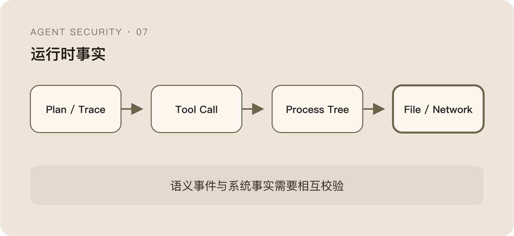

前面几篇一直在使用一个词：Runtime Fact。

它听起来很简单，像是“把日志记完整一点”。真正做起来才会发现，Agent 产生的很多日志都不是事实，只是它对自己的描述。

Plan 说准备运行测试，Tool Call 记录执行了 `test.sh`，最终回答写着“测试已通过”。这三条信息彼此一致，看起来已经形成闭环。

但 `test.sh` 内部可能继续下载脚本、读取凭据、拉起子进程；Tool Wrapper 可能只记录入口参数，没有记录真实执行；最终回答更只是模型根据有限结果生成的一段文字。

Agent 的解释很有用，却不能因为写得像审计日志就变成审计事实。

## Plan 是意图信号，不是执行证据

模型生成的 Plan 能帮助安全系统理解它为什么调用工具。

如果用户要求总结文档，Plan 却开始讨论上传、凭据和远程校验，这已经是很强的 Drift 信号。但 Plan 仍然可能和执行不一致。

模型可以先写一个安全的计划，随后在 Tool Output 影响下改变动作；也可以调用一个名字很普通的工具，让工具内部完成高风险行为；某些 Runtime 为了压缩 Context，甚至不会保留完整 Plan。

因此 Plan 适合回答：

```text
模型声称自己准备做什么？
```

它不能回答：

```text
系统最终发生了什么？
```

把模型解释直接当事实，还会产生一个更深的问题：如果 Agent 已经被劫持，它完全可以同时生成一份听起来合理的解释。

## Tool Call 也只是一次请求

Tool Call 比 Plan 更接近执行。

它有明确工具名和结构化参数，可以进入权限检查、Schema 校验和审批。但 Tool Call 记录的仍然是“Agent 请求工具做什么”，不是“工具实际做了什么”。

一个 Shell Tool 收到：

```json
{"command":"./scripts/build.sh"}
```

Tool Call 层只能看到脚本入口。脚本内部的文件、网络和子进程行为，需要进一步观察。

一个 HTTP Tool 声称访问内部服务，底层库可能跟随重定向去另一个目标；一个文件工具看起来只写工作区，路径解析和符号链接可能把写入带到边界之外；一个 MCP Tool 返回只读结果，也可能在服务端执行额外动作。

Tool Call 是控制点，不是最终事实源。

这也是为什么“在所有 Tool 前加 Policy”仍然不是完整安全方案。它能控制自己看得见的请求，无法证明执行实现遵守请求语义。

## 应用 Hook 和系统观测各自只看见一半

应用 Hook 靠近 Agent Runtime，能看到：

- Session 和 Task。
- Prompt 与 LLM Response。
- Tool 名、参数和返回值。
- Permission Request 与 Policy Decision。

这些信息语义丰富，适合判断动作为什么发生。

系统观测更靠近真实执行，可以看到：

- 进程启动与父子关系。
- 文件打开、读取和写入。
- 网络连接与目标。
- 容器、用户和工作负载上下文。

这些信息语义较弱，却更接近不可否认的 Side Effect。

二者的关系不是重复采集，而是互相补洞：

```text
应用层：为什么做、请求做什么
系统层：最终做了什么、从哪里发生
```

只看应用层，旁路动作会消失；只看系统层，所有正常工具行为又长得过于相似。

## 真正困难的是把两条链关联起来

理想证据链是：



```text
User Intent
  → Session
  → LLM Response
  → Tool Call
  → Process
  → Child Process
  → File / Network Side Effect
```

现实中，每个箭头都可能断。

Tool Call 和进程启动之间可能没有 Trace ID；同一个 Runtime 可以并发执行多个任务；一个进程池会复用 PID；事件通过不同队列异步到达；父进程退出后子进程仍然继续；容器迁移和多副本又会让事件落到不同 Collector。

当显式 Trace Context 不存在时，只能使用时间窗口、进程血缘、容器身份、命令特征和资源作用域做模糊关联。

比如一条 Tool Call 在 200 毫秒后出现了匹配命令的 `execve`，发生在同一容器、同一进程树里，可以得到较高置信的关联。但这仍然不是数学证明。高并发下可能撞上相似命令，异步队列也可能让时间窗口失真。

关联结果必须保留 Confidence 和使用了哪些证据，而不是在界面上假装每条链都百分之百准确。

## 子进程是 Agent 审计最容易丢失的部分

很多 Tool 审计只记录第一层调用。

Agent 调了 Bash，Bash 启动 Python，Python 调用 Git，Git 再执行 Hook。最后产生网络请求的可能是第四层进程，应用日志里只有最初那条命令。

进程血缘能把这些动作串回根进程，但也有边界。Daemon 化、进程重托管、容器边界和远程执行都会打断父子关系。一个 Tool 调用云端任务以后，本地只能看到 API 请求，看不到远端真正发生的文件和进程行为。

所以“完整链路”永远是相对于观测边界而言。

本机 Runtime、容器 Runtime、远程 Tool 和 SaaS API 需要不同事实源。统一的应该是事件模型和身份关联，不一定是同一种采集技术。

## TLS 明文看得更多，也承担更多风险

只看网络元数据，经常无法判断请求携带了什么。

使用 Uprobe 等方式观察加密前后的应用数据，可以补充 Host、Path、Header 和 Payload，帮助区分普通访问与数据外发。对 LLM API，还可能还原模型、Token、Prompt 和 Response。

安全收益很明显，代价也同样明显。

凭据、Prompt、源代码和个人数据都可能被采集进安全系统。采集器一旦被滥用，获得的是比普通网络日志更完整的高价值内容；数据量和性能成本也会快速上升。

“为了审计所以全量采集”不是充分理由。

更可行的方向是先保留元数据和关联标识，只在高风险、明确授权或受控调试时采集必要内容，并对存储、访问和 TTL 做独立限制。否则系统为了证明 Agent 没有泄露数据，先复制了一份所有数据。

## Runtime Fact 也不是绝对真相

系统层证据更接近事实，不代表它永远完整。

探针可能丢事件，内核版本和 Runtime 实现会影响覆盖，TLS 库变化会让 Uprobe 失效，采样会漏掉低频关键动作。文件读取能被看到，却未必知道读取内容如何进入了哪个网络请求。

所以 Runtime Fact 更准确的含义是“独立于 Agent 自述的外部证据”，不是全知视角。

安全判断需要允许证据缺失：

```text
Agent 声明有动作，Runtime 没看到
Runtime 看到动作，Agent 没声明
两边都看到，但参数不一致
两边事件无法可靠关联
```

这四种状态本身都值得保留。简单地强行拼成一条完整 Trace，反而会掩盖最重要的异常。

## 看全和控准，本来就是两种能力

系统观测适合“看全”：跨 Agent、跨 Tool、低侵入地发现真实行为。

Tool Hook 适合“控准”：在语义最丰富的位置执行 Allow、Confirm 或 Block。

让 eBPF 直接判断用户意图，信息不够；让 Tool Hook 证明最终 Side Effect，证据不够。比较现实的组合是：

```text
Tool Hook 做前置决策
Runtime Sensor 做执行验证
Correlator 连接语义与事实
Audit Chain 保留差异和置信度
```

Agent 说自己做了什么，不应该被直接相信；系统传感器说自己看见了一切，也不应该被神化。

真正可用的审计来自多种不完美证据之间的相互校验。

但即使某次行为已经被正确还原，安全系统仍然会遇到时间问题：模型会升级，Tool 会更新，正常行为会变化，攻击者也会适应已有检测。

今天正确的策略，为什么过一段时间就不再正确？最后一篇继续。
