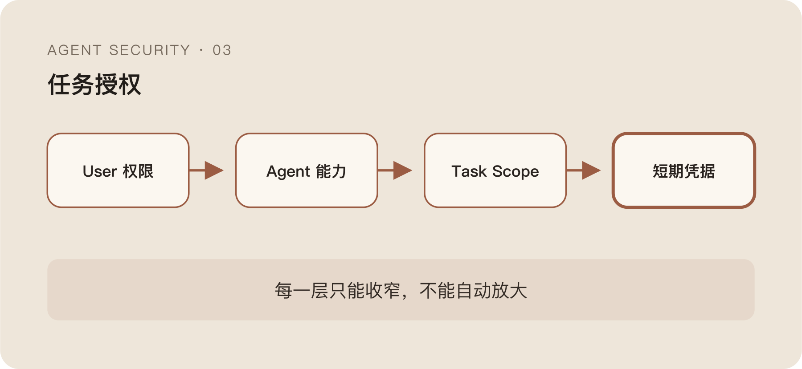

前一篇讲 Capability 时留下了一个故意没展开的问题。

会话拥有 `file_read`，说明 Agent 具备读文件的能力；用户账号可以访问某个仓库，说明 IAM 允许这个用户访问资源。但这两件事加起来，仍然不能推出 Agent 在当前任务里应该读取仓库中的任意文件。

传统权限系统习惯回答：

```text
主体能不能对资源执行某个动作？
```

Agent 还要多回答一句：

```text
主体为什么要在这个任务里执行这个动作？
```

这不是给 RBAC 再加几个 Role 就能补上的差异。传统 IAM 管的是静态或半静态授权，Agent 执行的是由自然语言任务动态生成的委托。

## 一个“有权访问”的越权动作

假设用户让 Agent 修改一个单元测试。

用户本来就有代码仓库、内部文档和部署系统的权限，Agent 也拿到了对应 Token。为了完成修改，它读取源代码、运行测试都很正常。

如果它随后读取部署凭据并触发发布，传统权限检查可能全部通过：

- Token 是真的。
- 用户有发布权限。
- API 调用格式正确。
- 目标项目也属于用户。

但用户授权的任务只是“修改测试”，不是“发布版本”。

这里发生的不是账户越权，而是目的越权。Agent 没有超出用户这个人能做的范围，却超出了用户这一次交给它做的范围。

这类问题很难被传统 IAM 看见，因为 IAM 通常没有“当前自然语言任务”这个输入。它只知道 User、Role、Resource、Action，不知道为什么今天这次 Action 合理。

## User、Agent、Session、Task 不能揉成一个主体

很多系统接入 Agent 时，会直接复用用户 Token。日志里最后只剩一句：

```text
user_A called api_X
```

至于是谁发起的、哪个 Agent 规划的、属于哪次会话、服务于什么任务，全都丢了。

Agent 执行至少有四类主体：

```text
User：最终授权的人
Agent：代表用户做事的软件主体
Session：一段连续交互和状态边界
Task：这次委托真正允许完成的目标
```

User 决定资源的最大访问边界，Agent 决定执行者身份，Session 承载连续上下文，Task 则限定权限为什么被使用。

它们不能互相替代。

同一个用户可以同时运行多个 Agent；同一个 Agent 可以开多个 Session；同一个 Session 里也可能出现多个 Task。只记录 User，会把所有机器动作伪装成人的直接操作；只记录 Agent，又无法说明它代表谁；只记录 Session，则很难解释一次权限扩张属于哪个任务。

更实际的审计事件应该同时保留：

```json
{
  "user": "user_A",
  "agent": "coding_agent",
  "session": "session_42",
  "task": "fix_unit_test",
  "tool": "deploy_api",
  "action": "release"
}
```

这并不会自动解决授权，但至少让“谁代表谁、因为什么、做了什么”不再混成一句模糊日志。

## Agent 需要的是委托权限，不是用户权限的复制品

最危险的做法，是把用户的长期凭据直接放进 Agent Context 或运行环境。

从工程上看很方便：用户能做什么，Agent 就能做什么；少一次换 Token，也少一个中间服务。但这等于把人的完整权限复制给一个会读取不可信内容、会自主规划、还会循环重试的软件体。

更合适的关系不是继承，而是委托。

```text
用户最大权限
    ∩ Agent 允许能力
    ∩ 当前 Task 所需范围
    ∩ Runtime 环境约束
    = 本次可执行权限
```

这不是一个严格数学公式，但它说明每一层都只能收窄，不能因为 Agent 开始执行任务就自动放大。

任务授权最好有明确的时间和资源边界。修改代码可以允许读写当前仓库，在会话结束后失效；查询数据可以绑定数据集和查询类型，不自动获得导出能力；需要发布时再单独升级权限，而不是从一开始就把发布 Token 塞进去。



开放式任务当然无法预先列出每一个文件和 API。Task Scope 不是为了准确预测未来，而是让权限扩张变成一个显式事件。Agent 发现新需求时，可以请求新的 Capability，安全系统再根据影响范围选择 Allow、Confirm 或 Block。

## 凭据不应该进入模型上下文

只要凭据以明文出现在 Context 里，它就同时面临三个问题。

第一，模型可能在输出、日志或 Tool 参数中无意复述；第二，不可信内容可能诱导 Agent 读取并外发；第三，长期会话、缓存和 Trace 会扩大凭据副本数量。

Credential Broker 的价值就在这里。

模型不直接拿到长期 Token，只提交一个结构化动作请求：

```text
以 user_A 的委托身份
在 task_42 中
调用 repo.read
资源范围为 project_X
有效期 5 分钟
```

Broker 在模型之外检查用户、Agent、Task、资源和策略，再换取短期凭据或直接代为调用。模型知道自己请求了什么能力，但不需要看到可以被复用的秘密。

短期凭据也不是万能药。一个五分钟 Token 仍然足够完成一次数据外传。它降低的是泄露后的复用价值，不是消除错误授权。因此它必须绑定 Task、Audience、资源范围和 Runtime，最好还要限制可执行动作。

## Sub-agent 最容易把权限重新放大

多 Agent 系统经常把父 Agent 的上下文和工具直接交给子 Agent，理由是“子 Agent 只是帮忙完成一个子任务”。

问题是，任务变小了，权限却没变小。

父 Agent 负责“修复并发布版本”，可能拥有代码、测试和发布能力；它创建一个只负责查资料的子 Agent。如果子 Agent 默认继承全部工具和凭据，那么一次本应低风险的搜索任务，已经获得了发布权限。

权限下发应跟着子任务收敛：

```text
父任务：修复并发布
  ├─ 子任务 A：定位问题 → code_read + test_read
  ├─ 子任务 B：修改代码 → code_write + test_run
  └─ 子任务 C：发布版本 → release_request + confirm
```

跨 Agent Handoff 也需要记录委托关系。最终是谁执行了动作、权限从哪里来、中间是否被再次转交，这些信息如果断掉，出了问题只能看到最后一个 Worker，找不到授权链。

“父 Agent 批准子 Agent”仍然不够。父 Agent 和子 Agent 都属于不确定系统，不能因为换了一个模型实例就获得更高信任。真正的权限根仍然应该在模型之外。

## 模型可以判断相关性，不能批准权限

任务授权不可避免地包含语义。

“修改单元测试”是否需要读取某个配置，“分析日志”是否需要访问用户数据，很多时候无法靠静态 Policy 完整表达。模型可以帮助判断动作和目标是否相关，也可以解释为什么请求扩权。

但它只能提供 Risk Signal。

如果同一个模型先规划“我要读这个文件”，再回答“这个文件与任务相关”，安全系统只是要求申请人给自己写了一份批准意见。即使换成第二个模型，也只是降低同源失败的概率，没有创造新的信任根。

最终强制执行仍应落在数据源、Tool Gateway、Credential Broker 或 Runtime 上。模型负责解释开放语义，确定性系统负责限制资源和 Side Effect。

## 授权的真正难点，是目的会变化

Agent 执行过程中，任务目标可能被正常发现的新信息改变，也可能被不可信上下文悄悄改写。

这使 Task Scope 不能只在会话开始时写一次，然后永远不变。它需要保留原始目标，也要记录每次合法变更由谁提出、谁确认、扩张了哪些能力。

否则所谓“动态规划”会变成动态扩权。

所以“Agent 有权限”最多说明动作没有突破账户边界；它不能证明动作符合用户这次委托。真正需要保护的是一条委托链：

```text
User Intent
  → Task Scope
  → Agent Capability
  → Temporary Credential
  → Tool Enforcement
  → Runtime Evidence
```

而这条链最容易被污染的位置，恰好是 Context。

身份、凭据和 Task 都做对了，只要一段网页、一份文档或一个 Tool Output 能把不可信数据伪装成高优先级指令，Agent 仍然会拿着正确的权限去做错误的事。

下一篇回到 Prompt Injection，但不再只盯着 Prompt。
