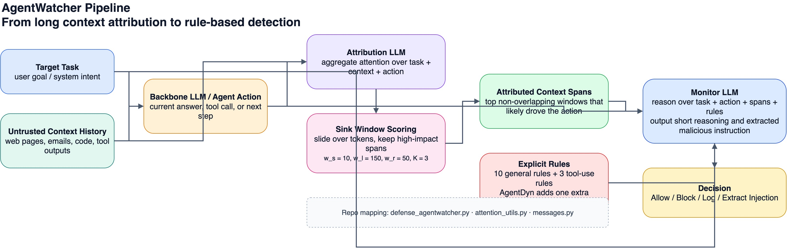
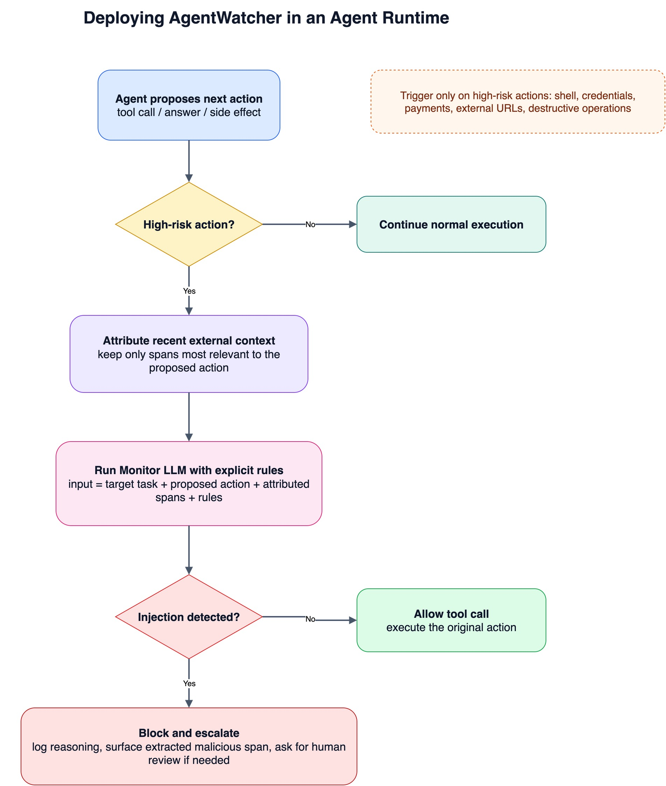

这篇论文我读完之后，最大的感受是：**它不是在把 Prompt Injection 检测做得更“大”，而是在把检测问题拆得更“准”。**

过去很多防御方案有两个老问题：

- **一到长上下文就掉性能**。Agent 的 observation、网页、代码、邮件、历史轨迹一长，检测器很容易被稀释。
- **判定过程太黑盒**。模型说“这是 injection”，但它为什么这么判、到底看到了哪一段、又依据了什么规则，工程团队很难复盘。

`AgentWatcher` 的切法非常直接：

1. 先不要让检测模型看完整个上下文，而是先找出**真正影响当前动作的片段**；
2. 再让一个 monitor LLM 按照**明确写出来的规则**去判断这里面是不是 prompt injection。

这就是它的核心价值：**把“检测”从一次性黑盒分类，改造成了“先归因、再判案”的两阶段流水线。**

这篇论文目前还是 arXiv 预印本，编号是 `arXiv:2604.01194v1`，论文提交日期是 **2026 年 4 月 1 日**。对应代码仓库也已经公开，能比较完整地复现实验。

## 一、这篇论文到底在解决什么问题

论文作者先抓住了两个非常现实的痛点。

### 1. Prompt Injection 检测在 Agent 场景里天然会遇到长上下文问题

如果你把一个 Web agent 或 coding agent 的运行轨迹摊开来看，里面会堆满：

- 用户目标；
- 外部网页内容；
- 工具返回；
- 历史 action / observation；
- 当前准备执行的动作。

攻击指令往往只藏在其中一小段，但检测器却要面对整段长文本。**这时候真正困难的，不是“有没有攻击”，而是“哪一段最该看”。**

### 2. 现有方法经常默认“什么算 injection”这件事不需要明说

不少检测方法本质上是 learned representation 或黑盒分类器：给它上下文，它吐一个 yes / no。问题在于，**工程落地时你真正需要的是规则体系，而不是情绪。**

你得知道：

- 哪些“额外指令”一定算 injection；
- 哪些来自任务指定来源的 instructions 应该算 benign；
- 工具调用场景里，什么叫必要动作，什么叫越权动作；
- 如果模型要拦截，能不能把那段恶意指令直接抽出来给人看。

`AgentWatcher` 的一个关键贡献，就是把这件事做成了**可解释的规则化判定**。

## 二、AgentWatcher 的核心设计：先缩上下文，再做规则推理

先看它的整体结构。

论文里的 `AgentWatcher` 可以概括成两步。

### 第一步：Attribution，先找出最影响当前动作的上下文片段

论文并不是把整段 context 分块后直接打分，而是先观察：**LLM 在生成当前 action 时，会对某些 token 投入异常集中的注意力。**

作者这里用了一个很实用的思路：

- 对 `target task + context + current action` 做一次前向；
- 汇总不同层、不同头对当前 action 的 attention；
- 用一个小的 sliding window 去找高分区域，也就是论文里说的 **sink-token windows**；
- 再对这些 window 向左、向右扩展，拼成最终的 attributed context。

论文默认超参数是：

- `w_s = 10`：核心窗口大小；
- `w_l = 150`：向左扩展；
- `w_r = 50`：向右扩展；
- `K = 3`：最多保留 3 个不重叠窗口。

这件事很重要，因为它不是“粗暴截断”，而是**把检测的注意力集中到真正驱动当前 action 的那几段文本上**。从代码实现上看，这个逻辑对应仓库里的 `src/defenses/agentwatcher/defense_agentwatcher.py`：它会先跑 attribution，再把选中的窗口文本交给 monitor LLM。

### 第二步：Monitor LLM，按显式规则判断是不是 injection

有了 attributed context 之后，第二阶段就不是单纯分类，而是**规则约束下的推理**。

论文和代码都强调，monitor LLM 的输入不只有可疑片段，还包括：

- 原始 target task；
- 当前 action / tool call；
- 一组明确写出来的 rules。

仓库里的 `src/defenses/monitor_llm_module/messages.py` 把这些规则写得很直白。通用规则大致覆盖了：

- 直接指挥 LLM 改变任务；
- 覆盖 system / developer instruction；
- 索取 secret 或 prompt；
- 引导数据外泄、恶意工具操作；
- 改写输出格式；
- 伪装成系统消息；
- 让模型做额外任务、无关任务或跳去外部来源。

更关键的是，它不是只有“什么算恶意”，还加了 tool-use 场景下的**例外规则**：

- 如果某个 action 本来就是完成目标任务所必需的，就不应该误判；
- 如果 untrusted context 里的 instructions 本来就是完成任务所需要的，也不该误判；
- 如果内容明确来自任务指定来源，比如“读取 Alice 的邮件”，那 Alice 邮件里的 instruction 不能一上来就当注入。

这就是为什么我说它更像“判案”而不是“分类”：**它允许 detector 在 robustness 和 utility 之间做规则化平衡。**

## 三、从代码实现看，这篇论文最值得注意的三个细节

### 1. 它真的把“归因”做进了主流程，而不是只拿来做可视化

很多论文里的 attribution 只是分析工具，但 `AgentWatcher` 不是。代码里 attribution 直接决定 monitor LLM 实际看到什么。

这意味着它的假设非常明确：

> Prompt injection 是否成立，不应该在整段长文本里盲判，而应该围绕“当前动作到底被哪几段上下文驱动”来判。

这也是它能在 long-context setting 下保持效果的根本原因。

### 2. 它要求 monitor 输出 reasoning，而且能抽取恶意片段

这点非常适合真实工程链路。

不是只给一个 `Yes / No`，而是要求 monitor：

- 先给一个很短的 `<Reasoning> ... </Reasoning>`；
- 如果有 injection，输出 `Yes, Injection: ...`；
- 尽量抽取出连续的恶意指令片段。

这对安全团队很有价值，因为你终于能把“为什么拦”和“拦的是哪段”一起写进日志、审计或人工复核流程里。

### 3. 它没有把规则写死在 paper 里，而是把规则生成也当成研究对象

论文不只试了默认规则，还做了自动规则生成：

- 直接让 LLM 生成规则；
- 从训练样本里总结规则；
- 同时生成“什么是 injection”和“什么不是 injection”的双向规则。

实验结果显示，**自动生成规则的表现已经接近人工规则**。这件事的意义在于：未来你可以把这套框架迁移到企业内部规则、不同业务 domain，甚至不同 agent 工具链上。

## 四、实验结果最说明问题的，不是“分数高”，而是 trade-off 做得很稳

先看论文里几组最值得记住的数据。

| Benchmark | No Defense | AgentWatcher | 我会怎么解读 |
| --- | --- | --- | --- |
| AgentDojo | Utility `0.73`，ASR `0.22 / 0.22` | Utility `0.71`，ASR `0.01 / 0.00` | 只损失约 2% utility，就把攻击成功率几乎打到 0 |
| InjecAgent | ASR `0.24 / 0.28` | ASR `0.04 / 0.01` | 对 base / enhanced attack 都明显更稳 |
| WASP | Utility `0.99`，ASR `0.31` | Utility `0.99`，ASR `0.02` | 基本没掉 utility，但 attack 成功率大幅下降 |
| AgentDyn case study | 多个 baseline 难兼顾 | ASR `0.0%`，Utility `48.3%` | 论文称这是唯一同时做到低 ASR 和相对强 utility 的方法 |

long-context 数据集上，论文也给出了一个非常硬的结论：**在所有设置里，AgentWatcher 是唯一一个把 ASR 持续压到 10% 以内的方法。**

更具体一点：

- 在 `LCC` 上，No Defense 的 direct / combined ASR 是 `0.32 / 0.50`，AgentWatcher 变成 `0.03 / 0.02`；
- 在 `GovReport` 上，从 `0.86 / 0.89` 直接压到 `0.06 / 0.00`；
- 在 `MultiNews` 上，从 `0.81 / 0.87` 压到 `0.05 / 0.00`；
- 在 `Passage Retrieval` 上，combined ASR 能做到 `0.00`；
- 在 `Qasper` 上，combined ASR 也降到 `0.00`。

这说明它不是只对某一个 benchmark 有用，而是**在“长上下文 + Agent 行为 + injection 检测”这个组合问题上，确实找到了一个比较稳的结构性解法。**

## 五、它为什么有效：本质上是在重新定义 detector 的输入

如果把这篇论文压缩成一句话，我会这么说：

> `AgentWatcher` 的真正创新，不只是“用了规则”或“用了 attention”，而是把 detector 的输入，从“整段不可信文本”改成了“与当前动作存在因果影响的高密度片段 + 目标任务 + 当前动作 + 明确规则”。

这四个元素缺一不可。

- **没有 attribution**，monitor LLM 会重新暴露在长上下文噪声里；
- **没有 target task**，模型很难区分“必要指令”和“越权指令”；
- **没有 current action**，检测器很难判断上下文到底有没有真正把 agent 带偏；
- **没有 explicit rules**，整套系统又会退回黑盒分类。

这也是为什么它看起来是“老组件组合”，但组合方式本身非常聪明。

## 六、论文也有明显边界，这些地方不能神化

当然，这篇论文不是银弹。

### 1. 它依然把 attention 当成了 causality 的近似

论文和实现都在说“causal attribution”，但从工程实现看，核心仍然是基于 attention 的 proxy。这个 proxy 很实用，但也要承认：**attention 高，不一定就是真正的因果决定因素；attention 低，也不代表那段文本完全无关。**

尤其是多跳 reasoning、长期 memory contamination、跨轮潜伏式 injection，可能不是单一高分 window 能完全覆盖的。

### 2. 它更像 step-level defense，而不是 end-to-end trajectory defense

论文自己也承认了这一点：单次检测大概有 **10 秒左右** 的开销，因此现实部署里不应该每一步都跑。

作者给出的建议是：只在**高风险动作**前触发，比如：

- 执行 shell；
- 发起外部请求；
- 使用高权限工具；
- 访问凭据；
- 执行支付、删除、分享类动作。

这也是更合理的系统形态。先做 risk gating，再对高风险 step 使用 AgentWatcher。

### 3. 自适应攻击还远没结束

论文在 Appendix 里测试了针对 monitor LLM 的 adaptive attack，包括：

- Safe environment；
- Fake definition；
- Utility loss warning；
- Fake delimiter；
- 以及 TAP / PAIR 这类优化式攻击。

结果当然比 No Defense 好很多。比如在 `LCC` 上：

- `TAP` 从 `ASR 0.60` 降到 `0.08`；
- `PAIR` 从 `0.55` 降到 `0.06`；
- 几种 heuristic adaptive attack 也大多压到了 `0.03` 到 `0.09`。

但这不代表 adaptive attack 已经解决了。更准确地说，**它说明 rule-based monitor 是一条有希望的方向，但离“在强对抗下稳定免疫”还很远。**

## 七、如果你在做 Agent 安全，我觉得这篇论文最值得拿走的不是代码，而是方法论

我自己会把它提炼成三条很实用的工程建议。

### 建议 1：不要对整段 context 直接做 injection 判定

先做风险压缩，再做安全判定。这个压缩步骤可以是 attribution，也可以是 retrieval、step-localization、tool-trigger filtering，但**一定不要让 detector 无差别吞完整轨迹。**

### 建议 2：规则必须显式写出来，而且要写“正例 + 反例”

企业内部最常见的问题不是规则不够多，而是规则只写了“什么危险”，没写“什么其实是允许的”。

一旦涉及邮件、客服、浏览器、文档代理这类工具使用场景，**没有 negative rules，误报一定会非常高。**

### 建议 3：把 detector 放在高风险动作之前，而不是所有动作之前

真正可落地的做法不是“全流程全拦截”，而是：

- 先枚举危险动作；
- 再在动作前做 attribution + monitor；
- 拦截时输出恶意片段与理由；
- 把结果接入审计、告警和人工复核。

如果未来 agent 平台都往这个方向演进，`AgentWatcher` 这类两阶段 detector 很可能会成为一种标准组件。

## 八、最后总结

`AgentWatcher` 最让我认可的一点，是它没有把 Prompt Injection 检测继续往“更大的黑盒分类器”上堆，而是反过来问了一个更本质的问题：

**当前这个危险动作，到底是被哪段外部上下文驱动的？然后，这段文本到底有没有违反明确规则？**

这两个问题一旦拆开，很多原本纠缠在一起的难题就被理顺了：

- 长上下文问题，被 attribution 缩短；
- 可解释性问题，被 rules + reasoning 拉回来；
- utility / robustness 冲突，被 target task 和 action 条件化后缓和；
- 工程落地问题，也终于能被接进高风险动作拦截链路。

所以如果你问我这篇 paper 最重要的价值是什么，我的答案会是：

> 它把 Prompt Injection Defense 从“黑盒检测器”往“可审计的安全决策模块”推了一步。

这一步，其实非常关键。

## 参考资料

- 论文：<https://arxiv.org/abs/2604.01194>
- 代码：<https://github.com/wang-yanting/AgentWatcher>
- Monitor rules 实现：`src/defenses/monitor_llm_module/messages.py`
- Attribution 主流程：`src/defenses/agentwatcher/defense_agentwatcher.py`
