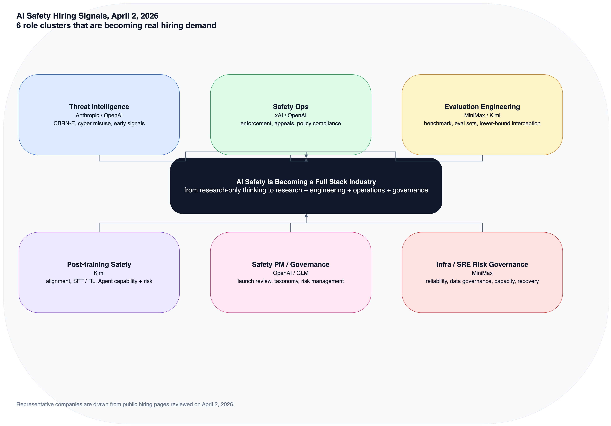
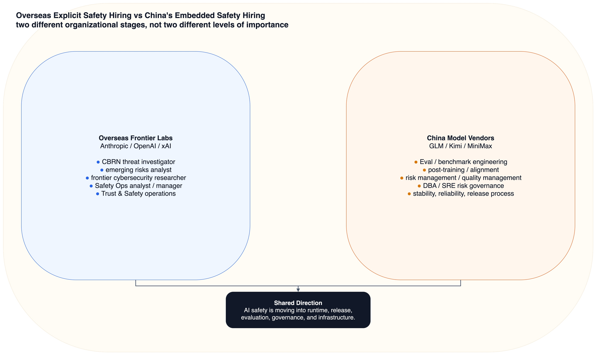

# 从 Anthropic / OpenAI / xAI / GLM / Kimi / MiniMax 的招聘信号，看 AI 安全行业正在长出哪些新需求

很多人一提到 AI 安全岗位，脑子里先冒出来的还是“对齐研究员”或者“安全政策研究员”。但如果你真的去翻最新招聘，会发现行业已经变了。

我在 **2026 年 4 月 2 日** 重新看了一遍 Anthropic、OpenAI、xAI、智谱 GLM、Kimi（月之暗面）、MiniMax 的公开招聘页面，最明显的感受不是“大家都在招安全”，而是：**AI 安全正在从一个抽象理念，变成一整套可执行、可运营、可评测、可响应的工程体系。**

换句话说，AI 安全行业现在最缺的，不只是“懂 alignment 的研究员”，而是下面这几类新角色。

> 图 1：把 2026 年 4 月 2 日公开招聘里最强的 6 类信号压成一张图。

## 一、最先冒出来的新岗位：安全不再只是模型问题，而是“威胁情报问题”

Anthropic 和 OpenAI 给出的信号最明显。

Anthropic 公开招聘里，除了 `Anthropic AI Security Fellow`，还在招 `Technical CBRN-E Threat Investigator`。这个岗位已经不是传统互联网安全岗位了，它要求候选人识别和阻断模型在 **化学、生物、放射、核与爆炸物** 方向上的滥用风险，要能做调查、做检测、做情报分析，还要和政府、科研机构、监管方打交道。

OpenAI 这边则直接把岗位做得更细：`AI Emerging Risks Analyst` 要做 horizon scanning、风险分类、早期信号识别、情景推演；`Researcher, Frontier Cybersecurity Risks` 则明确要搭建一整套“预防、监控、检测、执法”的 cyber misuse mitigation stack。

这说明什么？

**AI 安全行业已经开始大量需要“懂具体威胁场景的人”。**

不只是会写 policy，不只是会做模型训练，而是要有人真正懂：
- 网络攻击会怎么被 agent 放大
- 生物安全和双用途研究会怎么被模型辅助
- 国家行为体、诈骗团伙、灰产组织会怎么利用 AI
- 风险信号应该怎么从弱信号阶段就被发现

这是一类很新的需求：**“AI 安全 + 具体高风险领域知识”的复合型人才。**

## 二、第二个新需求：安全岗位开始明显“运营化”

xAI 的岗位特别能说明这一点。

它公开招聘 `Safety Operations Senior Analyst` 和 `Manager, Safety Operations`，JD 里面反复出现几个词：
- terms of service enforcement
- appeals
- labeling / annotations
- policy compliance
- red-teaming
- emerging abuse vectors

这说明在 xAI 眼里，AI 安全不是一套静态规则，而是一条持续运转的生产线：
**发现问题 -> 标注案例 -> 审核申诉 -> 优化自动化 -> 更新规则 -> 继续训练模型。**

OpenAI 的 `Trust & Safety Operations Analyst` 也是类似逻辑。它不是单纯做客服，也不是单纯做审核，而是既要处理高敏感案件，又要把案例沉淀成 SOP、宏、工作流、供应商流程和自动化系统。

这类岗位的出现，意味着 AI 安全行业正在补齐一个过去经常被低估的层：

**安全运营（Safety Ops / Trust & Safety Ops）正在成为大模型公司的常设基础设施。**

未来这个方向会越来越像今天成熟互联网平台里的风控中台、内容安全中台、合规运营中台，只不过对象从“帖子、账号、支付行为”升级成了“模型输出、Agent 行为、工具调用链、开发者使用方式”。

## 三、第三个新需求：评测工程师，正在成为 AI 安全的“基础设施岗位”

如果说欧美公司更强调 threat intelligence 和 misuse investigation，那么国内公司的招聘信号更像是在告诉你：
**安全首先会以“评测”和“能力边界控制”的形式落地。**

MiniMax 的 `AI评测开发工程师-2026届` 很典型。这个岗位不是泛泛地说“做 benchmark”，而是明确写到：
- 建设多模态模型 / Agent 评测体系
- 构建评测集和行业基准
- 提高自动评估占比，缩短评测周期
- 持续探索模型 / Agent 能力边界
- 拦截能力下限问题

注意最后一句：**“拦截能力下限问题”**。这几乎已经是安全语言了。

Kimi 的 `大模型Eval评测（工程方向/产品方向）` 也在强调让模型能力“可衡量、可对比、可解释”，并把评测结果反推成数据需求和能力改进方向。

这说明一个很重要的新变化：

**AI 安全不再只是“有没有红线”，而是“你有没有一套持续、自动、可复用的评测系统，知道模型今天比昨天危险了还是更稳了”。**

所以未来几年，AI 安全行业会越来越缺三类评测人才：
- 会做 benchmark 和 evaluation pipeline 的工程师
- 会做风险 taxonomies 和 failure case 归因的分析者
- 能把评测结果转回训练、产品、策略系统的人

换句话说，**评测工程师正在从“质量保障”升级成“安全基础设施工程师”。**

## 四、第四个新需求：Post-training 与安全正在快速合流

月之暗面的 `Post-Training Algorithm Researcher/Engineer` 是一个非常值得注意的信号。

这个岗位直接写明要参与：
- pre-training 与 alignment 数据质量改进
- SFT / RL
- Code/SWE Agent 能力提升
- tool、Docker 环境、任务构建

这里最关键的词是 `alignment`，但它出现的语境已经和几年前不一样了。

以前大家谈 alignment，更像是在谈“价值对齐”的研究问题；现在它越来越像一个**产品化、工程化、数据化**的问题：
- 什么数据会把 agent 训得更稳
- 什么任务环境会诱发危险行为
- 什么 post-training 流程会同时拉高能力上限、又不把风险一起放大

这意味着 AI 安全行业正在新增一类非常硬核的岗位：

**不是纯研究，也不是纯产品，而是“post-training safety engineer / alignment engineer”。**

他们要同时理解训练、数据、评测、Agent 行为、工具使用和上线风险。这类人会非常稀缺。

## 五、第五个新需求：安全开始要求“能落到产品发布流程里”

OpenAI 的 `AI Emerging Risks Analyst` 特别值得注意的一点，是它不只要求做分析，还要求：
- 做风险 taxonomy
- 做 0-24 个月的场景推演
- 参与产品 readiness 和 launch review
- 形成可复用的 playbook、FAQ、briefing materials

这说明大模型公司的安全部门，已经不是只在“出事后”响应，而是在产品上线之前就要参与。

于是行业会开始缺另一类人：

**既懂风险，又懂产品上线流程的安全 PM / 安全策略负责人。**

这类岗位不一定叫“Safety PM”，但工作内容已经很像：
- 把抽象风险翻译成发布门槛
- 把评测结果翻译成上线条件
- 把外部事件翻译成内部控制项
- 把安全问题翻译成工程、产品、法务都能执行的动作

国内公司虽然公开职位名称没有那么直接，但智谱官网“加入我们”页已经把一个信号写得很明白：`产品经理/项目经理（社招）` 的描述就是“项目计划、风险管理、质量管理等”。

这说明在国内语境里，很多 AI 安全需求未必挂着“安全”两个字，而是先以 **风险管理、质量控制、项目治理、评测体系** 的方式进入组织。

## 六、第六个新需求：AI 安全正在从“独立部门”扩散到基础设施岗位

MiniMax 公开岗位里，除了评测岗，还有一个很容易被忽视的信号：`DBA数据库研发工程师—2026届` 提到要做数据库优化和**风险治理**，`SRE工程师` 里则强调可靠性、容量管理、故障分析、性能调优。

这些岗位表面上不叫 AI safety，但在 Agent 和大模型产品环境里，它们正在变成安全的一部分。

因为今天很多风险，不再只来自“模型说错话”，还来自：
- 工具调用链失控
- 在线推理系统的越权与滥用
- 数据和日志治理不到位
- 大规模部署下的稳定性与故障恢复不足
- 自动化系统把局部错误放大成系统性风险

所以 AI 安全行业的边界正在扩大。

未来的招聘，不会只集中在“Safety team”里，还会扩散到：
- inference / infra / SRE
- data governance
- model evaluation
- security engineering
- launch readiness / operations

也就是说，**AI 安全正在变成整家公司工程体系的一种属性，而不只是一个单独部门。**

> 图 2：海外头部模型公司更早把安全岗位显性化，国内厂商则更多把安全能力嵌进评测、治理和基础设施岗位。

## 最后，怎么理解国内外公司的差异？

我看下来，一个很明显的区别是：

**海外头部模型公司已经把 AI 安全拆成了非常细的专业分工；国内公司更多还处在“隐性安全化”阶段。**

Anthropic / OpenAI / xAI 的安全招聘已经细到：
- CBRN threat investigator
- emerging risks analyst
- frontier cybersecurity researcher
- safety operations analyst
- safety operations manager
- AI security fellow

而 GLM / Kimi / MiniMax 公开招聘中，更常见的是：
- Eval / benchmark
- post-training / alignment
- 风险管理 / 质量管理
- 风险治理 / 稳定性 / 可靠性

这不代表国内不重视安全，而更像是说明：

**国内大模型公司的安全建设，目前更多是嵌在模型效果、评测体系、工程稳定性、项目治理里，而不是全部独立命名为 Trust & Safety。**

但从招聘信号看，这个阶段不会持续太久。随着 Agent 落地更深、监管更细、企业客户更重视可控性，国内公司迟早也会把这些“隐性安全需求”进一步显性化。

## 结语

如果要把这轮招聘信号总结成一句话，那就是：

**AI 安全行业正在从“研究导向”走向“研究 + 工程 + 运营 + 情报 + 治理”五位一体。**

接下来最缺的，不是单一背景的人，而是下面这些复合型角色：
- 懂 threat intelligence 的 AI 安全分析师
- 懂 enforcement 和 workflow automation 的 Safety Ops 负责人
- 懂 benchmark、红队、能力边界控制的评测工程师
- 懂 SFT / RL / alignment 的 post-training 安全工程师
- 懂产品发布、合规、风险分类的安全 PM / 策略负责人
- 懂大规模系统稳定性与风险治理的 infra / SRE 工程师

这可能才是 2026 年 AI 安全招聘市场最真实的画像：
**“安全”不再只是一个研究方向，而是在成为一门完整产业。**

---

## 参考来源（检索时间：2026-04-02）

- Anthropic Careers: https://www.anthropic.com/careers/jobs
- Anthropic AI Security Fellow: https://job-boards.greenhouse.io/anthropic/jobs/5030244008
- Anthropic Technical CBRN-E Threat Investigator: https://job-boards.greenhouse.io/anthropic/jobs/5066997008
- OpenAI Careers: https://openai.com/careers/search
- OpenAI Researcher, Frontier Cybersecurity Risks: https://jobs.ashbyhq.com/openai/97a7eeae-9625-4d00-874f-e50131f98369
- OpenAI AI Emerging Risks Analyst: https://jobs.ashbyhq.com/openai/6d5d982f-d00b-49b8-b023-c596f0096d76
- OpenAI Trust & Safety Operations Analyst: https://jobs.ashbyhq.com/openai/eb54b316-26fb-498f-a68c-9990ff9c402c
- xAI Careers: https://x.ai/careers/open-roles/
- xAI Safety Operations Senior Analyst: https://job-boards.greenhouse.io/xai/jobs/5090659007
- xAI Manager, Safety Operations: https://job-boards.greenhouse.io/xai/jobs/5090695007
- 智谱加入我们: https://www.zhipuai.cn/zh/joinus
- 月之暗面 Careers: https://www.moonshot.cn/careers
- 月之暗面社会招聘: https://app.mokahr.com/su/qglvjp
- 月之暗面 Post-Training Algorithm Researcher/Engineer: https://app.mokahr.com/apply/moonshot/148506?sourceToken=1da825ef642385a5951ca5a63f6151c9#/job/faf002c6-3b8b-4154-912d-ec109001c28b
- 月之暗面 大模型Eval评测（工程方向/产品方向）: https://app.mokahr.com/apply/moonshot/148506?sourceToken=1da825ef642385a5951ca5a63f6151c9#/job/965b7d3d-35e7-400f-a372-4a934a7f336b
- MiniMax Careers: https://www.minimaxi.com/careers
- MiniMax AI评测开发工程师-2026届: https://vrfi1sk8a0.jobs.feishu.cn/379481/position/7561039418648676651/detail
- MiniMax DBA数据库研发工程师—2026届: https://vrfi1sk8a0.jobs.feishu.cn/379481/position/7497145844632111410/detail
