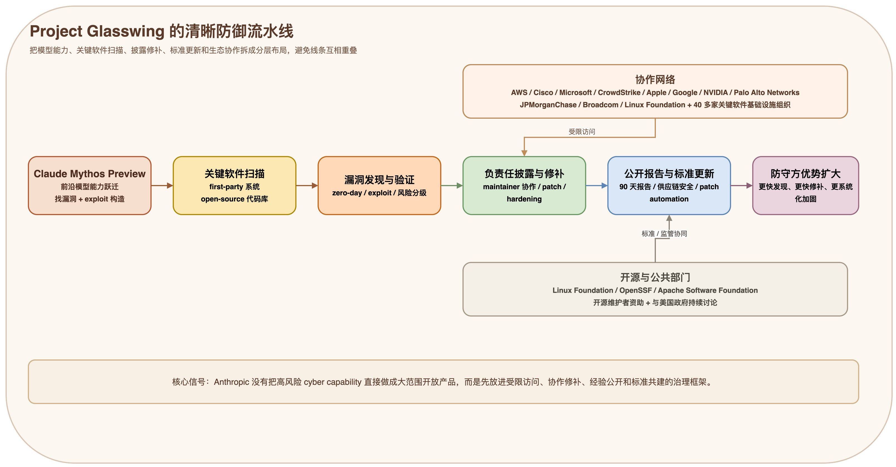

如果你最近在关注 AI 安全和网络攻防，这件事值得认真看一眼。

Anthropic 在 **2026 年 4 月 7 日** 发布了 [Project Glasswing](https://www.anthropic.com/glasswing)。表面上看，它像是一个“安全合作计划”；但如果把官方披露的信息拼起来，你会发现它其实更像一个信号：**前沿模型公司已经开始把“发现漏洞、推动修复、形成行业标准”当成下一阶段的基础设施工程。**

更直白一点说，Glasswing 不是在卖一个安全功能，而是在提前回答一个问题：
**当模型已经强到可以大规模找洞、写 exploit、辅助渗透时，防守方要怎么先把这股能力组织起来？**

> 图 1：我把 Glasswing 重新拆成一条更清晰的防御流水线：模型能力先进入关键软件扫描，再进入验证、披露修补、公开报告与标准更新，最后转化为防守方优势。

## 一、Project Glasswing 到底是什么？

先把官方信息压缩成一句话：

**Project Glasswing 是 Anthropic 围绕未公开模型 `Claude Mythos Preview` 发起的一项防御性安全计划，目标是让头部科技公司、关键基础设施相关组织和开源维护者，先用这类新一代模型能力去扫描并修复世界上最重要的软件。**

公开信息里最值得记住的有 5 个点：

- 参与方不是几家普通合作伙伴，而是 **Amazon Web Services、Apple、Broadcom、Cisco、CrowdStrike、Google、JPMorganChase、Linux Foundation、Microsoft、NVIDIA、Palo Alto Networks** 等一批关键玩家；
- Anthropic 说它观察到的 `Claude Mythos Preview`，已经在找漏洞和利用漏洞这件事上，**超过了绝大多数人类安全专家**；
- 官方称，这个模型已经发现了 **数千个高危漏洞**，覆盖 **每一个主流操作系统和主流浏览器**；
- 除了首批合作伙伴，Anthropic 还把访问权限扩展给 **40 多家构建或维护关键软件基础设施的组织**；
- Anthropic 为这件事承诺了 **最高 1 亿美元模型使用额度**，外加 **400 万美元对开源安全组织的直接捐赠**。

这几个数字摆在一起，已经能说明 Glasswing 的定位：
它不是“发个新 benchmark”这么简单，而是在尝试把一项高度敏感的模型能力，放进 **受控访问、负责任披露、跨组织协作** 的框架里运行。

## 二、为什么 Anthropic 现在要做这件事？

因为它们看到的，不只是“模型代码能力变强了”，而是：
**网络安全的攻防门槛，正在被前沿模型快速重写。**

Anthropic 在官方页面和配套的 Frontier Red Team Blog 里，给了几组非常重的信号。

第一，`Claude Mythos Preview` 不只是能读代码、提修复建议，而是已经能直接参与真实世界漏洞发现。

官方举的例子包括：

- 一个已经存在 **27 年**、后来被修补的 **OpenBSD** 漏洞；
- 一个已经存在 **16 年**、而且被自动化测试命中过 **500 万次**都没抓住问题的 **FFmpeg** 漏洞；
- 多个可被串联起来实现 **Linux kernel 本地提权** 的漏洞链路。

第二，它开始表现出更强的**自主 exploit 构造能力**。

Anthropic 在 Red Team Blog 里明确写到，Mythos Preview 已经能够在一些任务上 **几乎完全不需要人工 steering** 地识别漏洞，并生成相关 exploit。甚至在 Mozilla Firefox JavaScript engine 的实验里，Anthropic 表示此前 `Opus 4.6` 在数百次尝试里只成功了 2 次，而 Mythos Preview 在重新运行该实验时，成功发展出工作型 exploit **181 次**，另有 **29 次** 达到寄存器控制。

第三，它们认为这种能力不会只停留在自己手里太久。

Anthropic 的原话其实很明确：照这个进展速度，类似能力很快就会扩散到更多主体手上；一旦落到没有安全部署约束的参与者手里，后果可能会波及经济体系、公共安全和国家安全。

所以 Glasswing 的逻辑不是“慢慢研究”，而是：
**既然能力拐点已经出现，就要先把这股能力尽可能导向防守侧。**

## 三、这个项目最值得注意的，不是模型本身，而是它背后的组织方式

如果只看 Mythos Preview，很容易把这件事理解成“Anthropic 又做了一个更强的代码模型”。

但真正值得看的是 Glasswing 设计出来的那套组织结构。

| 动作 | 官方披露的做法 | 它释放的信号 |
| --- | --- | --- |
| 受限开放 | 先向合作伙伴和关键基础设施组织开放 Mythos Preview | 高风险 cyber capability 不会直接走完全开放路线 |
| 防守优先 | 先用于扫描和修补 first-party 与 open-source 系统 | 前沿模型能力开始被当成 defensive infrastructure |
| 资源投入 | 最高 1 亿美元 credits + 400 万美元捐赠 | 这不是 PR 项目，而是带预算的长期工程 |
| 报告承诺 | Anthropic 承诺 90 天内公开阶段性收获 | 行业开始要求“能力披露 + 经验外溢” |
| 标准协作 | 将讨论漏洞披露、更新流程、供应链安全、patching automation | 安全流程本身也要被 AI 重新设计 |

这里最关键的一点是：**Anthropic 不是单独做漏洞挖掘，而是在构建“模型能力 -> 漏洞发现 -> 披露修复 -> 标准更新”的闭环。**

这说明头部实验室已经不满足于“模型很强”这个叙事，而是开始往外延伸到：
- 谁先用；
- 在什么边界里用；
- 修出来的经验如何共享；
- 供应链和开源生态如何跟上；
- 政府和受监管行业如何参与。

这一步，比单纯的性能提升更重要。

## 四、从 Glasswing 能看出哪些趋势？

下面这些判断，严格说并不是 Anthropic 逐条写出来的结论，而是我基于官方材料做的推断。但我觉得，这些趋势已经非常清楚了。

### 1. AI 漏洞挖掘正在从“专家稀缺能力”变成“模型规模化能力”

过去很多高质量漏洞发现，依赖的是极少数顶级安全研究员的经验、直觉和耐心。

Glasswing 释放出的第一个强信号是：**这种能力正在被模型放大，而且放大的不只是阅读代码的速度，还包括发现 subtle bug、构造 exploit、做大规模扫描的能力。**

一旦这件事成立，网络安全行业的稀缺资源就会变化：
不再只是“谁最会手工找洞”，而是“谁最先把模型接进扫描、验证、分级、披露、修补的流水线”。

### 2. 前沿安全模型的落地方式，会越来越像“受限开放 + 指定场景”

Anthropic 这次并没有直接把 Mythos Preview 当成通用产品全面开放，而是把它放进合作网络中，以 preview 的方式服务关键组织。

这背后反映的是一个越来越清晰的产品逻辑：
**当模型能力具有显著 dual-use 属性时，最先成熟的商业化路径，不是“人人可用”，而是“分层准入、限定用途、持续观察”。**

这也意味着，未来高风险 AI 能力的发布，很可能越来越像今天的云安全、合规云或 gov cloud：
- 先有受控客户；
- 先跑受限工作流；
- 先看真实世界效果；
- 再决定是否更广泛扩展。

### 3. 网络安全会越来越像“联盟工程”，而不是单点产品竞争

Glasswing 拉进来的不是单一客户，而是一组覆盖云、终端、安全厂商、金融、开源基金会和芯片/基础设施的组织。

这说明大家开始承认一个现实：
**AI 时代的软件安全问题，已经大到不是一家厂商卖一个安全产品就能解决的。**

未来谁能占优势，可能不只是因为谁模型更强，而是因为谁能把下面这些资源更快连起来：
- 代码库和真实资产；
- 安全运营团队；
- 漏洞响应与修补链路；
- 开源维护者网络；
- 合规与政府沟通能力。

换句话说，安全行业会越来越依赖 **模型 + 数据 + 工作流 + 生态位** 的复合竞争。

### 4. 开源安全正在从“公益议题”变成“战略底座”

Anthropic 这次的 400 万美元捐赠，不是撒给泛公益，而是非常明确地投向了 **Linux Foundation 体系下的 Alpha-Omega / OpenSSF** 和 **Apache Software Foundation**。

这件事说明一个趋势：
**开源安全不再只是“谁有余力谁来帮一把”，而是在被重新定义为 AI 时代的基础设施防御工程。**

原因很简单。无论是企业软件、云平台，还是未来更多 agent 自动写出来的新代码，底层都严重依赖开源组件。模型越会写代码，供应链安全和开源维护压力就越大。

所以接下来几年，你大概率会看到更多事情同时发生：
- 安全模型优先服务开源核心项目；
- AI 厂商直接资助开源维护者和基金会；
- 供应链安全、SBOM、依赖治理与 patch automation 被打包讨论。

### 5. 漏洞处置流程会被 AI 重写：不只是“发现”，还包括分流、披露和修补自动化

Anthropic 在官方页面里提到，接下来要共同讨论的方向包括：
**vulnerability disclosure、software update processes、open-source and supply-chain security、secure-by-design、triage scaling and automation、patching automation。**

这其实已经把下一个阶段说得很明白了。

很多人以为 AI for security 的重点只是“更快发现漏洞”，但 Glasswing 暗示的真正变化是：
**整个漏洞生命周期都要被自动化重写。**

未来更有价值的，不只是一个找洞模型，而是一整套系统：
- 自动扫描；
- 自动复现；
- 自动风险分级；
- 自动生成修复建议；
- 自动协助 maintainer 完成补丁；
- 自动验证修复有没有引入新问题。

如果这个链条跑通，软件安全会从今天高度依赖人工瓶颈的流程，转向更接近“持续集成式防御”。

## 五、这件事也提醒我们：AI 安全接下来会更像国家能力问题

Glasswing 官方页面里还有一个很容易被忽略、但其实非常关键的信号：Anthropic 明确提到它们正在和 **美国政府官员** 持续讨论 Mythos Preview 的攻防能力，并表示愿意与地方、州和联邦层面的代表合作。

这说明 frontier cyber capability 已经不再只是企业技术路线问题，而是开始进入：
- 国家安全；
- 关键基础设施保护；
- 民主国家技术领先；
- 受监管行业标准制定。

所以从更长周期看，AI 网络安全的竞争，未必只是公司与公司之间的竞争，更可能是：
**实验室、云厂商、安全厂商、开源社区和政府之间，谁能更快形成协同体系。**

## 六、还需要保留一点判断上的克制

当然，Glasswing 现在仍然有几个必须保留的问号。

- 官方披露的大部分能力描述，当前主要还是 **Anthropic 自述**；
- `Claude Mythos Preview` 还是 **未公开模型**，外界暂时无法独立复现全部能力；
- 已披露的漏洞案例只是很小一部分，因为绝大多数仍在负责任披露阶段；
- 真正决定 Glasswing 含金量的，不是这次 announcement，而是 **90 天后 Anthropic 会公开多少可验证成果**。

所以现阶段最合理的态度不是“已经尘埃落定”，而是：
**先承认信号很强，再继续盯后续披露。**

## 结语

如果要我用一句话总结 Glasswing，我会这么说：

> **Anthropic 不是在单独发布一个更会找漏洞的模型，而是在提前搭建 AI 时代的防御性网络安全操作系统。**

它释放出的核心趋势，并不是“AI 会不会帮助安全团队”，而是：

- AI 找洞能力正在进入拐点；
- 高风险模型会越来越强调受控准入；
- 开源安全和供应链安全会被重新战略化；
- 漏洞处置链路会被自动化重写；
- 防守侧必须用联盟方式，才能追上能力扩散的速度。

这也是为什么我觉得 Glasswing 值得被单独拿出来看。

因为它背后真正的问题不是“Anthropic 发布了什么”，而是：
**当漏洞挖掘和 exploit 构造开始被前沿模型工业化之后，整个软件安全行业准备好怎么重构自己了吗？**

---

## 参考来源（检索时间：2026-04-08）

- Anthropic：<https://www.anthropic.com/glasswing>
- Anthropic Frontier Red Team Blog：<https://red.anthropic.com/2026/mythos-preview>
- Anthropic 新闻页：<https://www.anthropic.com/news>
