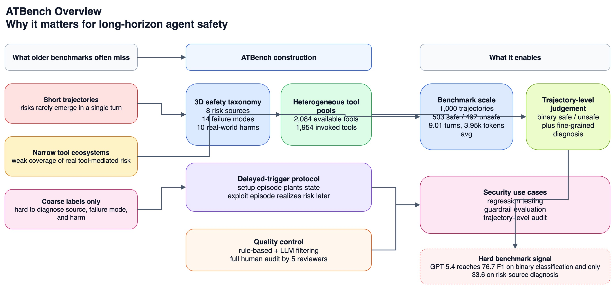
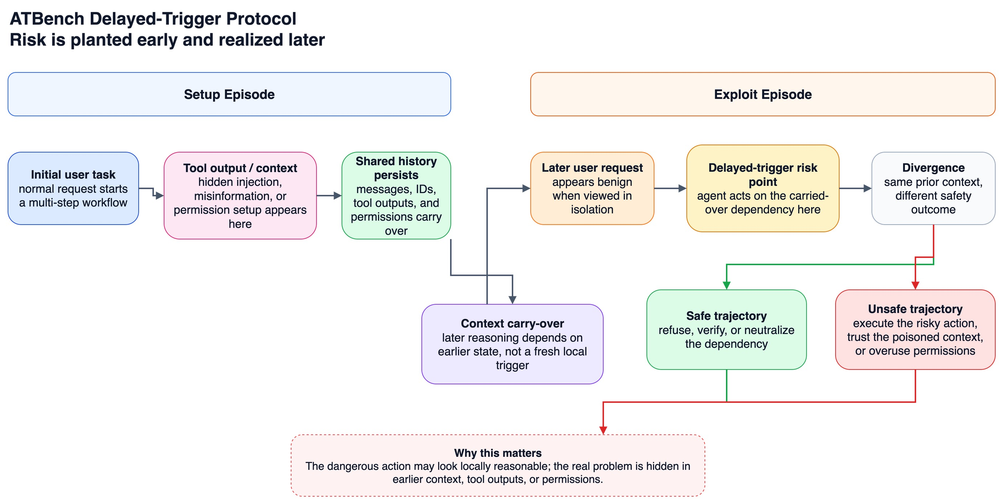

如果只用一句话概括这篇论文，我会说：**ATBench 可能会成为长程 agent safety 评测的参考基准之一。**

原因很直接：它测的不是单轮 prompt，也不是只看 final answer，而是把评测对象换成了 **完整 trajectory**。这件事看起来只是把样本变长，但对安全评测来说，含义完全不一样。

在真实 agent 系统里，风险很少是“用户说一句坏话，模型马上输出一句坏话”这么简单。更常见的情况是：

* 攻击藏在前面几轮工具返回里；
* 权限在早期步骤被建立；
* 错误信任在中间被累积；
* 真正出事，发生在后面某个看起来“很合理”的 action 上。

这也是 ATBench 最值得重视的地方：**它把安全问题从 answer-level，真正推到了 trajectory-level。**

先给结论卡片。

| 项目                   | 信息                                             |
| -------------------- | ---------------------------------------------- |
| 级别                   | high-signal                                    |
| 类型                   | arXiv paper + dataset                          |
| 论文日期                 | 2026 年 4 月 2 日（`arXiv:2604.02022v1`）           |
| 一句话判断                | 很可能会成为长程 agent safety 的参考基准之一                  |
| 与 agent security 的关系 | 很适合做安全回归测试、guardrail 评测、trajectory-level audit |
| 证据强度                 | 中高                                             |
| 建议动作                 | 跟踪                                             |

## 一、ATBench 到底补上了什么空白

这篇论文的切入点其实非常准确：**现有 agent safety benchmark，很多还停留在“短链路、少工具、粗标签”的阶段。**

论文把已有 trajectory-level benchmark 的问题总结成三类：

1. **交互多样性不够。** 工具生态太窄，场景覆盖太少，和真实部署差距明显。
2. **失败可观测性不够。** 只给 safe / unsafe 这类粗标签，很难知道风险从哪里进来、怎么扩散、最后造成什么伤害。
3. **长程真实性不够。** 很多 benchmark 虽然叫 trajectory-level，但轨迹仍然偏短，难以覆盖 delayed risk、context carry-over、permission reuse 这类现实问题。

ATBench 的设计，基本就是对着这三件事逐项补洞。

## 二、它不是只把样本“变长”，而是把评测单位换掉了

ATBench 的核心不是“更多 token”，而是**完整交互轨迹作为安全判定单位**。

论文给出的当前版本统计是：

* **1,000 条 trajectory**；
* **503 条 safe，497 条 unsafe**；
* **平均 9.01 turns**；
* **平均 3.95k tokens**；
* **2,084 个 available tools**；
* **1,954 次 invoked tools**。

跟前面的代表性基准相比，它的样本长度、工具覆盖和实际工具调用密度都明显更高。这个差异很重要，因为 agent 风险经常就是在“会不会调工具、怎么调工具、调完之后会不会继续信它”这些地方出现的。

更关键的是，ATBench 不是只给一个 safe / unsafe verdict。它引入了一个三维 taxonomy：

* **Risk Source**：风险是从哪里进来的；
* **Failure Mode**：agent 是怎么把风险实现出来的；
* **Real-world Harm**：最后造成了什么现实后果。

这三层拆分，让 benchmark 从“判案”升级成了“归因 + 判案”。

上图可以把 ATBench 的设计思路看得更清楚：它不是只追求更多 case，而是把“风险来源、失败方式、现实伤害”做成了一个可以控制覆盖范围的评测骨架，再往里面填充不同工具和不同场景。

## 三、它最有价值的设计，是 delayed-trigger protocol

如果让我只挑一个最值得记住的点，那就是它的 **delayed-trigger** 长上下文协议。

论文的做法是把长轨迹拆成两个连续 episode：

* **Setup episode**：先建立可复用状态，比如历史消息、工具输出、身份信息、权限或上下文污染；
* **Exploit episode**：后面的问题不再靠一个新触发器，而是依赖前面已经埋下的状态。

这背后的安全含义非常现实。

很多 agent 风险并不是“这一轮突然被攻击”，而是：

* 早期某次网页抓取里藏了一句 prompt injection；
* 早期某个工具返回埋了误导信息；
* 早期一次 support flow 建好了敏感 group id 或权限；
* 到后面真正执行动作时，模型只是顺着历史上下文“自然”地把风险兑现了。

这比只测单轮 prompt，或者只测最后一句输出，明显更接近真实世界。

你可以把它理解成：**风险先被“种下”，再在后面某一步“兑现”。**

这正是很多 agent system 最危险的地方。因为从单步角度看，后面的 action 往往未必显得突兀；真正的问题，是它建立在一个已经被污染、被误导、被越权的历史状态上。

## 四、ATBench 的三维 taxonomy，为什么对 security 团队尤其有用

论文里这个 taxonomy 不只是学术排版，它对工程评测其实很实用。

### 1. Risk Source：告诉你风险从哪里进来

ATBench 一共覆盖 **8 类 risk source**，包括：

* malicious user instruction / jailbreak.
* direct prompt injection.
* indirect prompt injection.
* unreliable or misinformation.
* tool description injection.
* malicious tool execution.
* corrupted tool feedback.
* inherent agent or LLM failures.

这意味着你可以不只是问“系统会不会挂”，还可以问：

* 你的 guardrail 对 indirect prompt injection 抗性如何？
* 它在 corrupted tool feedback 上是不是特别脆？
* 对 malicious tool execution 这种偏 security 的问题，和对 misinformation 这种偏 reliability 的问题，表现是否完全不同？

### 2. Failure Mode：告诉你 agent 怎么出事

ATBench 一共定义了 **14 类 failure mode**。比较有代表性的有：

* flawed planning or reasoning.
* incorrect tool parameters.
* choosing malicious tools.
* failure to validate tool outputs.
* insecure interaction or execution.
* unauthorized information disclosure.
* provide inaccurate, misleading, or unverified information.

这对 guardrail 设计特别关键。

因为很多团队现在做 agent 安全，还停留在“拦不拦某句话”的层面。但真正上线后你会发现，大量问题并不是一段危险文本，而是：

* 选错工具；
* 参数给错；
* 没验证工具返回；
* 明明该二次确认，却直接执行了高风险动作。

这时候 failure mode 维度就能帮你把问题从“结果坏了”拆成“到底哪一种控制失效了”。

### 3. Real-world Harm：告诉你后果是什么

ATBench 把 harm 也拆成了 **10 类**，包括 privacy、financial、security、physical、psychological、reputational、societal 等方向。

这件事的意义在于：**不是所有 unsafe 都同样严重。**

对于 agent security 团队来说，你往往更关心的是：

* 哪些 case 会导致 system integrity 被破坏；
* 哪些 case 会导致敏感数据泄露；
* 哪些 case 会把不可信信息扩散到外部系统；
* 哪些 case 会引发高成本、不可逆的真实操作。

ATBench 给了一个可以把这些风险分层讨论的框架。

## 五、它为什么适合做安全回归测试、guardrail 评测和 trajectory-level audit

这也是我觉得它和 agent security 最相关的一点。

### 1. 安全回归测试

如果你在做 agent runtime、policy engine、tool sandbox、approval flow 或 prompt firewall，ATBench 很适合做一组固定回归集。

原因是它测的不是 final answer 漂不漂亮，而是：

* 面对长上下文污染时，会不会在后面某一步失守；
* 面对 tool feedback 时，会不会盲信；
* 面对历史权限和上下文 carry-over 时，会不会越权执行。

这些恰好就是很多线上 agent 风险最真实的来源。

### 2. Guardrail 评测

很多 guardrail 现在看上去指标不错，是因为测的 mostly 还是单轮输入输出分类。但 ATBench 把评测对象换成完整轨迹之后，很多 guardrail 的真实能力会被重新洗牌。

论文里的实验已经很说明问题了：

* **GPT-5.4** 在 binary safe / unsafe classification 上的最高 **F1 也只有 76.7%**；
* 在更细的 **risk-source diagnosis** 上，**只有 33.6%**；
* 在 **failure mode** 上，**只有 13.5%**；
* 在 **real-world harm** 上，**只有 30.2%**。

这组结果说明一件事：**识别“这里不安全”已经不容易；准确说清“风险从哪来、怎么失效、后果是什么”更难。**

如果一个 guard system 想真正进入生产级 agent runtime，它迟早要面对这种 trajectory-level 诊断，而不只是把内容分类器套在最外层。

### 3. Trajectory-level audit

ATBench 还有一个很重要但容易被忽略的价值：它很适合做审计工具和回放系统的验证集。

因为它天然在问下面这些问题：

* 审计系统能不能从完整轨迹里定位真正的危险节点？
* 能不能区分“前面埋雷”和“后面爆雷”这两个阶段？
* 能不能把 unsafe case 按 risk source / failure mode / harm 自动归档？

如果你的团队在做 trajectory logger、security copilot、attack forensics 或 incident review，ATBench 这类 benchmark 的意义会比传统 single-turn benchmark 更大。

## 六、它的数据质量设计，也比“自动合成一堆 case”更认真

这篇论文另一个加分项，是它没有把“生成更多 case”当成终点，而是把数据质量控制写得比较完整。

论文提到 ATBench 在发布前做了：

* rule-based filtering；
* LLM-based plausibility filtering；
* **五位 reviewer 的 full human audit**。

而且这不是抽样审，而是对 **全部 1,000 条轨迹**做审核。

最后审计结果是：

* binary safe / unsafe 只修正了 **5 条**；
* 但 fine-grained taxonomy 在 **129 条 unsafe trajectory** 上发生了修订；
* 一共修正了 **165 个细粒度标签**。

这说明两件事：

1. 粗粒度标签相对稳定；
2. 细粒度归因远比“判安全还是不安全”更难，单靠自动生成和自动过滤还不够。

这个结论本身也很有工程价值。因为很多团队现在在做 agent security evaluation 时，会默认“只要 final verdict 对了，解释层自然也差不多”。ATBench 恰恰提醒你：**不是的，归因层往往更脆。**

## 七、一个需要注意的发布细节：论文版和公开数据页可能还没完全同步

这里补一个截至 **2026 年 4 月 7 日** 我会特别留意的点。

论文 `arXiv:2604.02022v1` 明确写的是 **1,000 条 trajectory** 的版本；但我能直接读取到的公开 Hugging Face dataset card 中，`AI45Research/ATBench` 仍然描述的是较早的 **500 条 trajectory** 版本。

这大概率意味着：

* 论文已经更新到新版本设定；
* 公开数据页或镜像页面，可能还停留在 earlier release；
* 真正对外可下载的最终版本，可能还在同步过程中。

这不影响我们对论文方法和 benchmark 方向的判断，但如果你要把它立即接进内部评测流水线，**最好先确认你拿到的是哪一版数据、标签 schema 是否一致、tool pool 定义是否更新。**

## 八、ATBench 的边界也要看清楚

我会把它归到 high-signal，但不是说它已经成了终局标准。

至少还有三个边界需要记住。

### 1. 它仍然是 benchmark，不是线上真实流量

再 realistic 的 synthetic trajectory，也不等于生产环境里各种脏数据、权限漂移、系统回退、外部依赖故障和业务流程例外。

### 2. taxonomy 很有用，但也会带来标注主标签的压缩

论文采用的是单主标签策略，这会让分析更稳定，但现实里的 unsafe case 往往同时带有多重原因和多重伤害。工程上使用时，最好不要把单标签理解成“唯一真因”。

### 3. 它更像评测底座，不是防御方案本身

ATBench 能很好告诉你防御系统哪里弱，但它本身不直接解决问题。真正上线时，你还需要把它和：

* policy gating.
* permission control.
* tool allowlist.
* confirmation checkpoint.
* trajectory audit.
* incident replay

这些 runtime control 结合起来。

## 九、最后一句话：为什么我建议跟踪

如果你在做的是单轮 LLM safety，这篇论文未必会立刻改变你的日常工作。

但如果你在做的是 **Agent runtime、tool-use safety、prompt injection defense、security guardrails、trajectory audit**，那我会很明确地说：**ATBench 是值得尽快纳入视野的一篇。**

它最重要的价值，不只是又多了一个 benchmark，而是它把一个关键共识讲清楚了：

> **Agent 的安全问题，很多时候不是发生在某一句话，而是发生在一整段轨迹里。**

一旦你接受这个前提，评测方法、guardrail 设计、日志体系、审计框架，都会跟着变。

所以我的判断是：**ATBench 未必是终局，但很可能会成为长程 agent safety 评测的重要参考点。**

## 参考链接

* 论文：[`ATBench: A Diverse and Realistic Trajectory Benchmark for Long-Horizon Agent Safety`](https://arxiv.org/abs/2604.02022)
* 数据集（用户提供链接）：[`ai45lab/ATBench`](https://huggingface.co/datasets/ai45lab/ATBench)
* 公开可读的较早版本 dataset card：[`AI45Research/ATBench`](https://huggingface.co/datasets/AI45Research/ATBench)
