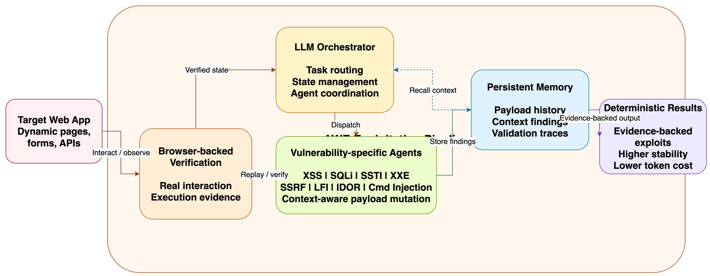

# AWE：安全 Agent 正从「会逛网页」，走向「按漏洞类型稳定打洞」

如果你最近在看 AI for Security，一个越来越明显的趋势是：安全 Agent 的竞争，已经不再只是“它会不会自己探索页面”，而是“它能不能更稳定、更低成本、更可复现地把漏洞真正打出来”。

[AWE: Adaptive Agents for Dynamic Web Penetration Testing](https://www.ndss-symposium.org/ndss-paper/auto-draft-680/) 就很能说明这个转向。

先澄清一个定位：截至 2026 年 4 月 12 日，AWE 同时出现在 NDSS 官网论文页，也被列在 [NDSS 2026 co-located workshop LAST-X 的 accepted papers](https://www.ndss-symposium.org/ndss2026/co-located-events/last-x/accepted-papers/) 中。更准确的说法是：**它是 LAST-X 2026 接收、并由 NDSS 官网收录展示的工作**，而不是简单写成“NDSS 主会论文”。

但这并不影响它的信号强度。恰恰相反，AWE 值得关注，是因为它代表了一种非常清晰的系统设计思路：**把自主 Web 渗透从“自由探索”改造成“围绕漏洞类型组织的 exploitation-driven pipeline”。**

上图可以把 AWE 的关键结构讲清楚：浏览器负责真实交互与验证，orchestrator 负责调度，多种 vulnerability-specific agents 负责按漏洞类型推进分析与利用，persistent memory 则沉淀上下文、payload、证据和验证结果，最终把系统从“会试一试”拉向“能稳定复现”。

## 一、AWE 解决的不是“能不能自动点网页”，而是“怎样别再靠随机游走”

现在的 Web 应用越来越动态，很多页面本身就是在 AI-assisted development、no-code 或 low-code 流程里快速拼起来的。交互逻辑越来越碎，前后端边界越来越松，参数流也越来越不规则。

传统 pattern-driven scanner 在这种环境下会很吃力。它们很擅长规则匹配和大规模扫描，但对上下文推理、复杂交互和漏洞利用链条的理解能力有限。另一边，近两年很热的 LLM-based pentesting agent 虽然更灵活，却又容易掉进另一个坑：**让模型在开放环境里无限探索，最后成本高、行为漂、结果难复现。**

AWE 的价值就在这里。根据 NDSS 页面摘要，它明确批评了 unconstrained exploration 带来的三类问题：**高成本、行为不稳定、可复现性差。** 这说明作者并不是想再做一个“更会逛”的 agent，而是想给自主渗透加上工程约束。

换句话说，AWE 并不把“更像人类黑客四处试错”当成目标，而是把“更像一个结构化漏洞利用系统”当成目标。

## 二、AWE 最关键的设计，不是多 Agent 本身，而是按漏洞类型拆流水线

很多人看到 multi-agent，会本能地把亮点理解成“多个 Agent 一起工作”。但 AWE 真正值得学的地方，其实不是“多”，而是**怎么分工**。

从 NDSS 摘要和 [项目 README](https://raw.githubusercontent.com/stuxlabs/AWE/main/README.md) 可以看出，AWE 的核心不是一个万能总控 Agent 包打天下，而是把不同漏洞类别的分析路径显式做进系统：

* `xss_agent` 负责 context-aware XSS pipeline
* `sqli_agent` 负责数据库指纹与注入利用
* 另外还有 `ssti_agent`、`xxe_agent`、`command_injection_agent`、`lfi_agent`、`ssrf_agent`、`idor_agent` 等模块

这件事为什么重要？因为安全测试从来都不是一个统一动作。

XSS 要看反射位置、编码方式、DOM/浏览器执行上下文；blind SQLi 要看布尔反馈、时间延迟、数据库类型和 side effect；SSRF、LFI、IDOR 又是完全不同的链路。**如果还用一个通用 Agent 试图用同一套思路处理所有漏洞，稳定性天然会受限。**

AWE 的工程判断很明确：既然漏洞利用本身就是类型化的，那 Agent 的推理与行动链条也应该是类型化的。

这其实是安全 Agent 走向成熟的一个标志。因为它意味着系统终于不再迷信“一个更强的大模型就能统一解决一切”，而是开始承认：**漏洞知识、验证逻辑和执行路径应该进入架构层。**

## 三、persistent memory 才是让长链路攻击不那么“失忆”的关键基础设施

AWE 在官方摘要里明确把自己定义为 **memory-augmented** framework，并强调了 **persistent memory**。

这听起来像一个常见配置项，但在自主渗透里，它其实是可靠性的底层基础设施。

为什么？因为 Web 渗透不是单轮问答，而是一个会不断回环的状态机：

* 先探测入口与参数；
* 再形成漏洞假设；
* 再尝试 payload；
* 再观察反馈；
* 再修正策略；
* 最后进入验证和复现。

如果系统没有稳定记忆，它就会反复出现几种典型问题：

* 重复试同一批 payload，白白烧 token；
* 忘掉页面上下文和过滤行为，导致策略抖动；
* 把“猜测成立”当成“证据成立”；
* 多 Agent 协作时互相丢上下文。

AWE 把 memory 放在中心位置，相当于在做三件事：

1. 保存已经探索过的上下文和证据；
2. 保存漏洞利用尝试与反馈结果；
3. 给后续 Agent 提供一致的决策底座。

这也是为什么我会把它看成“工程化设计样例”，而不是单纯 benchmark result。**在真正可落地的 security agent 里，memory 不是加分项，而是地基。**

## 四、browser-backed verification，才是区分“模型自嗨”与“漏洞成立”的分水岭

我觉得 AWE 里最值得安全工程团队重视的一点，是它把 **browser-backed verification** 放进了主链路。

这一步非常关键。因为很多安全 Agent 最大的问题，不是一点都找不到漏洞，而是**太容易误以为自己已经找到了漏洞**。

模型看到某个响应后，可能会生成一个很合理的解释；但合理解释并不等于 exploit 真成立。尤其是 XSS 这类问题，如果没有真实浏览器上下文，你很难区分：

* payload 只是被回显了；
* payload 被编码后展示了；
* payload 进入了错误的上下文；
* payload 真的在浏览器里执行了。

AWE 用浏览器把验证链补上，等于把“漏洞确认”从语言层叙事拉回到了执行层证据。

这也是为什么它特别适合作为一个安全 Agent 设计范式来读：**真正有价值的系统，不只是会描述漏洞，而是会验证漏洞。**

## 五、AWE 的结果说明：架构收益可以大于模型代差

根据 NDSS 官方页面摘要，AWE 在 104-challenge 的 XBOW benchmark 上给出了几组很有代表性的结果：

* XSS 成功率达到 **87%**，比 MAPTA 高 **30.5%**；
* blind SQL injection 成功率达到 **66.7%**，比 MAPTA 高 **33.3%**；
* 在 injection-class vulnerabilities 上，更快、更便宜、也更 token-efficient。

而项目 README 还进一步给出一个很醒目的数字：**相比 prior work，AWE 消耗的 token 少 98%。**

更有意思的是，NDSS 页面还特别提到：AWE 使用的是 **midtier model（Claude Sonnet 4）**，而对比对象 MAPTA 用的是 **GPT-5**。这恰恰让结论更有分量：

> **architecture matters as much as model reasoning capabilities.**

也就是说，在安全 Agent 这个场景里，模型强不强当然重要，但**把模型放进怎样的任务结构、验证结构和记忆结构里，可能同样重要，甚至更重要。**

这点对工程团队的启发非常直接。

如果你一味追求“再换一个更强模型”，你可能只能拿到边际收益；但如果你把 exploit 流水线、证据闭环和记忆组织方式设计好，即便使用中档模型，也可能显著提升稳定性与性价比。

## 六、AWE 也给了我们一个更成熟的比较框架：通用探索 vs. 专项 exploitation

AWE 的结果并不是简单地“完全碾压通用 Agent”。

NDSS 摘要里也很诚实地指出：MAPTA 的 **overall coverage 更高**，因为它具有更广的 exploratory capabilities。AWE 的优势则更集中地体现在 injection-class exploit 的准确性、效率和确定性上。

这其实非常重要。它告诉我们，接下来评估 security agent，不能只问“谁总分更高”，还要问三个问题：

* 它更擅长广覆盖探索，还是更擅长专项利用？
* 它是更像 scanner，还是更像 exploitation engine？
* 它追求的是 benchmark breadth，还是 exploit determinism？

AWE 的价值正在于，它把“专项 exploitation 架构”的优势展示得非常清楚。

所以如果你的目标是：

* 验证某类高价值漏洞是否能稳定打穿；
* 降低自动渗透流程中的 token 成本；
* 让测试结果更便于复现、对比和调优；

那 AWE 这种设计可能比“一个更通用、更爱探索的 Agent”更适合。

## 七、对安全团队最值得借鉴的三条工程原则

如果把 AWE 当成一个 security agent engineering 样例，我觉得最值得带走的是下面三条。

### 1. 按漏洞类型组织 Agent，而不是按工具组织 Agent

浏览器、代理、终端、LLM 都只是系统组件；真正决定推理路径的是漏洞类型本身。围绕 XSS、SQLi、SSRF、IDOR 这些 exploit path 组织工作流，通常比围绕工具接口组织更有效。

### 2. 把验证放进主链路，而不是放到报告结尾

很多系统把验证当成“如果有空就补一补”的后处理步骤，但 AWE 说明，验证本身就应该是核心能力。没有 execution-backed verification，自动渗透很容易滑向自我说服。

### 3. 把 memory 当成基础设施，而不是锦上添花

一旦任务涉及多页面、多参数、多轮 payload 迭代，memory 就不是 fancy feature，而是稳定性前提。没有它，Agent 很难在长链路攻击里维持一致行为。

## 最后一句

如果说过去很多安全 Agent 还停留在“AI 会不会自己找洞”的阶段，那么 AWE 代表的已经是下一步：

**AI 能不能围绕特定漏洞类型，以更低成本、更高确定性和更强可复现性的方式，把漏洞真正打出来。**

这也是为什么我会把它归到 high-signal。

它最值得研究的，不是“它到底用了哪个模型”，而是它证明了一件事：**安全 Agent 的竞争，正在从模型能力竞赛，转向系统架构竞赛。**

对于想做内部安全平台、自动化渗透验证、Agentic AppSec 或 AI Red Team 的团队来说，AWE 更像一个值得拆解的工程样板，而不只是一个榜单上的新名字。

## 参考资料

* [NDSS 官方论文页：AWE: Adaptive Agents for Dynamic Web Penetration Testing](https://www.ndss-symposium.org/ndss-paper/auto-draft-680/)
* [LAST-X 2026 Accepted Papers](https://www.ndss-symposium.org/ndss2026/co-located-events/last-x/accepted-papers/)
* [arXiv：AWE: Adaptive Agents for Dynamic Web Penetration Testing](https://arxiv.org/abs/2603.00960)
* [GitHub：stuxlabs/AWE](https://github.com/stuxlabs/AWE)
