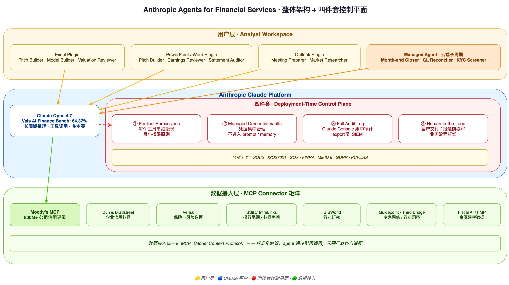
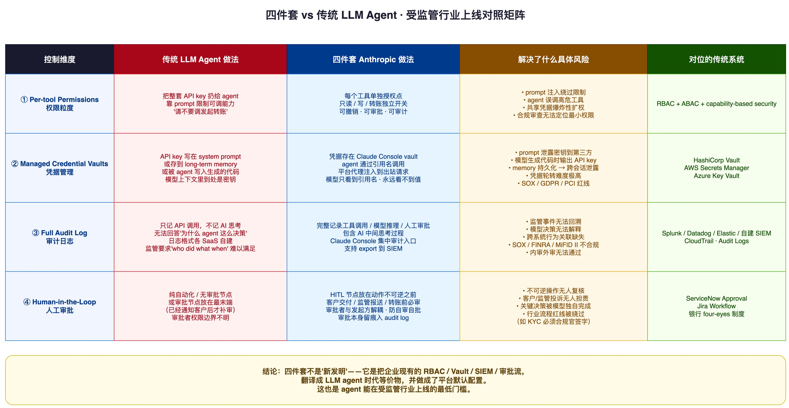

> Anthropic 五月份发布了 [Agents for Financial Services](https://www.anthropic.com/news/finance-agents)：10 个开箱即用的金融服务 Agent 模板，搭载 Opus 4.7，覆盖从 pitchbook 制作到 KYC 筛查再到月结的完整工作流。

> 这次发布**真正值得看的不是模型性能**——尽管 Opus 4.7 在 Vals AI 的 Finance Agent benchmark 上拿了 64.37%，业界领先。**真正值得看的是 Anthropic 把四件事做成了默认配置**：per-tool permissions、managed credential vaults、full audit log in the Claude Console、human-in-the-loop。

> 这是一个非常重要的信号。它说明大模型厂商的安全重点，正在从"让模型更对齐"转向"让 agent 真正能在受监管的企业环境里上线"。本文从这四件套出发，做一次工程视角的剖析。

## 一、写在前面：Agent 上线难，难在哪儿

过去两年，AI Agent 的 demo 很多——Claude Computer Use 控制电脑、Devin 写整个项目、AutoGPT 自动跑任务。但**真正进入企业关键流程的 demo，少之又少**。原因不是模型不够聪明，而是企业 IT/安全/合规团队问的不是"它能不能跑"，而是另外四个问题：

1. **它能动哪些资源**？（权限）
2. **它怎么拿到密钥和凭据**？（凭据管理）
3. **它做了什么我能不能查**？（审计）
4. **关键决策有没有人复核**？（人工审批）

这四个问题的答案如果不是"完整、可执行、对得上现有合规框架"，agent 就上不了线——再聪明都没用。

模型对齐（model alignment）解决的是另一类问题：**"AI 想不想干坏事"**。Constitutional AI、RLHF、red teaming，这些技术保证模型在没有外部干预的情况下也不会主动越界。但模型不主动越界，不等于 agent 在企业环境里就安全。**你还需要一整套"deployment-time control"——部署侧的控制平面**——确保即便模型试图越界，也撞不破企业设定的边界。

Anthropic 这次的 Finance Agents 发布，恰好把"deployment-time control"做成了一个看得见的产品形态。

## 二、不是新模型，是"可上线的 Agent 模板"

先把这次发布的产品讲清楚。

10 个模板分两组：

**Research & Coverage（研究与覆盖）5 个**

- Pitch builder（路演材料制作）
- Meeting preparer（会议准备）
- Earnings reviewer（财报审阅）
- Model builder（财务模型构建）
- Market researcher（市场研究）

**Finance & Operations（财务与运营）5 个**

- Valuation reviewer（估值审阅）
- General ledger reconciler（总账对账）
- Month-end closer（月末结账）
- Statement auditor（报表审计）
- KYC screener（KYC 筛查）

每个模板都对应金融行业里**确实占用大量分析师时间、但流程清晰、可被规则化**的工作。这件事的选品逻辑非常清楚：不去硬碰那些需要复杂判断的核心决策（比如投资决策、信用决策本身），而是覆盖"准备这些决策所需的资料和流程"。

部署形态有两种：

| 部署模式 | 运行环境 | 适用场景 |
|---|---|---|
| **Plugin 模式** | 嵌入 Excel / PowerPoint / Word / Outlook | 高频低风险、与分析师协同 |
| **Managed Agent 模式** | Claude Platform 云端长周期会话 | 多小时工作流、月结、夜间任务 |

Plugin 模式让 agent 跑在分析师桌面，跟现有工作流无缝衔接；Managed Agent 模式则让它在云端独立跑长任务，比如月末把整套对账跑完。

性能层面：**Opus 4.7 在 Vals AI 的 Finance Agent benchmark 上 64.37%**——目前业界第一。但这一节我们不展开讲性能，因为本文的重点在另一处：**这次发布最本质的差异化在"可上线"，而不在"更聪明"**。下一节开始讲四件套。



## 三、四件套之一：Per-tool permissions——把工具调用关进笼子

**Per-tool permissions（每个工具单独授权）**，简单说就是：agent 调用每一个工具，都需要单独的权限点，可以单独开关、单独审批、单独审计。

这件事跟传统 RBAC（Role-Based Access Control）有什么区别？传统 RBAC 的粒度是**"用户/角色 → API"**——分析师可以调用 ledger API，审计员不能。而 per-tool permissions 的粒度是**"agent 实例 → 工具 → 调用上下文"**——同一个 agent 可以调"读账户余额"工具，但不能调"发起转账"工具，即便它们在传统 API 层面属于同一个微服务。

为什么需要这种粒度？因为 **agent 的能力边界不是 API 决定的，是工具集决定的**。把 agent 暴露给"账户管理 API"，等于把账户管理的所有操作都给它。但如果你给 agent 暴露的是"read_account_balance" 这一个工具，agent 就拿不到"发起转账"的能力——即便底层是同一个 API。

金融场景里这件事极其关键：

```text
Agent 任务："给客户做月度账单分析"

需要的工具:
  ✓ read_account_transactions      # 只读交易记录
  ✓ read_customer_profile          # 只读客户资料
  ✓ generate_pdf_report            # 生成 PDF
  ✗ initiate_transfer              # 发起转账（不需要，禁用）
  ✗ modify_credit_limit            # 修改信用额度（不需要，禁用）
  ✗ access_other_customers         # 访问其他客户（不需要，禁用）
```

**最小权限原则在 agent 时代的等价物，就是 per-tool permissions**。Anthropic 把它做成默认配置，意味着开发者无法"偷懒地"把所有工具都开给 agent——你必须显式声明每个工具的权限。这件事看起来繁琐，但对受监管行业来说，这是合规审查能通过的最低门槛。

## 四、四件套之二：Managed credential vaults——凭据不离开企业边界

**Managed credential vaults（托管凭据保险库）**：API key、数据库密码、第三方服务凭据这些东西，由 Claude Console 集中管理，agent 通过引用调用，**永远不会进入 prompt、不会进入模型上下文、不会出现在日志里**。

为什么这件事是重头戏？因为传统 LLM agent 拿凭据有三种"作恶"姿势：

1. **Prompt 里塞 secret**：开发者图省事，把 API key 写进 system prompt——结果模型上下文里到处是密钥；
2. **Memory 里存 secret**：长会话里 agent 把凭据存到 memory 里"方便下次用"——内存被持久化或被另一个 agent 借用就泄露；
3. **代码生成时输出 secret**：agent 写 Python 脚本要调用某 API，模型可能把它认为见过的"示例 key"原封不动写进代码。

这三种姿势在受监管行业一旦出问题，**直接踩到 SOX / GDPR / 监管处罚的红线**。

vault 的设计就是把这条路堵死：

| 步骤 | 传统姿势 | Vault 姿势 |
|---|---|---|
| 凭据存储 | 写在配置文件、prompt、代码里 | 存在 Claude Console 的 vault 里 |
| 凭据调用 | 直接拼接到请求里 | agent 通过引用名调用，平台代理注入 |
| 凭据可见性 | 模型能看到原文 | 模型只看到引用名，永远看不到值 |
| 凭据轮转 | 改完代码重新部署 | vault 里改一次，所有 agent 立刻生效 |

这跟 HashiCorp Vault、AWS Secrets Manager、Azure Key Vault 是同一套思路，**但放在 LLM agent 的语境下意义更重**——因为 LLM agent 比传统服务"更想看密钥的值"（出于训练数据中的模式倾向）。把凭据从模型上下文里彻底剥离，是 agent 真正能上线的前提之一。

## 五、四件套之三：Full audit log——监管的最低门槛

**Full audit log in the Claude Console（完整审计日志）**：每次工具调用、每次模型推理决策、每次人工审批，全部记录到 Claude Console，可被合规团队审查。

为什么这是受监管行业的"最低门槛"？因为各国金融监管框架的**第一条要求都是 "who did what when"**：

- **SOX（萨班斯法案）**：财务相关操作必须可追溯到具体责任人；
- **FINRA**：投行内部所有客户相关沟通必须可审计；
- **MiFID II**：欧盟金融服务对算法交易要求完整决策链留痕；
- **GDPR**：涉及个人数据的处理必须可解释、可审计；
- **PCI-DSS**：涉及支付卡信息的所有操作必须留痕。

这些要求的本质是：**当出事的时候，监管能拿到一份完整的"谁在什么时候做了什么"的日志**。在 AI agent 出现之前，这件事相对容易——日志记的是"分析师 A 在 14:32 调用了 ledger API"。但 agent 加进来之后，事情变复杂了：

- 一个动作的发起者可能是"分析师 A 通过 agent X 调用 ledger API"；
- agent X 在做这个动作之前可能调用了模型 5 次、消耗了 12000 tokens、思考了 3 个备选方案；
- 中间还可能有人工审批节点，审批者是分析师 B。

**完整审计日志在 AI agent 时代要记的不只是"工具调用"，还包括"AI 的中间思考过程"**——哪个 prompt 触发了哪个推理、推理结果是什么、为什么选了这个工具而不是那个。Claude Console 的 audit log 能不能做到这一层，决定了它能不能进入受监管企业。

实操上，企业不会只在 Claude Console 里看日志，**必须把日志 export 到现有 SIEM 系统**——Splunk、Datadog、Elastic、自建的 audit warehouse。这一步的技术对接（webhook / API 拉取 / 流式推送）是落地的关键。

## 六、四件套之四：Human-in-the-loop——业务流程红线

**Human-in-the-loop（HITL，人工审批）**：在客户交付、监管报送、不可逆操作之前，必须有人工审批节点。

注意我这里用的是"业务流程红线"，不是"安全护栏"。两者的区别在哪儿？

- **安全护栏**是防御性的：万一 agent 出错或被攻击，人能介入；
- **业务流程红线**是设计性的：即便 agent 完全正常，关键节点也必须有人参与。

这两件事在受监管行业里都需要，但**HITL 的真正定位是后者**。比如 KYC 筛查这件事，即便 agent 100% 准确，最后给客户开户的决策也必须由合规官签字——这不是 AI 的问题，是行业流程的红线。

HITL 的工程设计有几个关键决策点：

| 决策点 | 关键问题 |
|---|---|
| **何时插入** | 在动作不可逆的那一步之前（最重要的一条） |
| **谁审批** | 角色绑定、最小授权、与原 agent 调用方分离（避免自审自批） |
| **SLA 是多少** | 紧急任务和常规任务的审批超时不一样 |
| **审批者权限边界** | 审批者能改 agent 草拟的内容吗？还是只能批准/拒绝？ |
| **审批留痕** | 审批本身要进 audit log，包括理由 |

Anthropic 在 Finance Agents 的发布里特别强调："**users review and approve Claude's work before client delivery or filing**"——客户交付或监管报送**之前**必须人工复审。这个"之前"是关键时序点：HITL 节点不能放在最末端（动作已经不可逆才审批没意义），必须放在动作不可逆**之前**。

举个具体例子：**KYC 筛查 + 开户**的流程

```text
1. agent 收集客户资料         ← 可自动
2. agent 跑反洗钱筛查           ← 可自动
3. agent 跑制裁名单匹配         ← 可自动
4. agent 起草风险评估报告       ← 可自动
5. ★ HITL：合规官审批 ★         ← 必须人工
6. 系统创建客户账户             ← 不可逆，必须在 5 之后
7. 通知客户开户成功             ← 客户可见，必须在 5 之后
```

HITL 节点放在 5——动作还没下发到底层系统之前。这是一个完整的"业务流程红线"。



## 七、生态：Connector 矩阵 + Moody's MCP 的信号

四件套是骨架，但 agent 真正能跑起来还要看**它能接到哪些数据源**。这次 Anthropic 同时宣布了一批数据 connector：

- **Dun & Bradstreet**（企业信用数据）
- **Fiscal AI**（财务智能）
- **Financial Modeling Prep**（金融建模数据）
- **Guidepoint**（专家网络）
- **IBISWorld**（行业研究）
- **SS&C IntraLinks**（投行尽调与数据房间）
- **Third Bridge**（行业洞察）
- **Verisk**（保险与风险数据）

最值得注意的是 **Moody's 推出的 MCP app**——基于 [Model Context Protocol](https://modelcontextprotocol.io/) 标准，向 Claude agent 提供 **600M+ 公司的信用评级数据**。

这件事的信号意义远超数据本身：

1. **MCP 正在成为金融数据接入的事实标准**：Moody's 这种行业巨头愿意搭 MCP，意味着标准化协议跑通了；
2. **数据厂商主动接 AI agent**：以前数据厂商等的是 SaaS 集成，现在直接出 MCP；
3. **Anthropic 不靠自己抓数据，靠生态**：这是聪明的战略——把数据接入这件事让位给数据厂商，自己只做 agent 平台和四件套控制平面。

对企业客户来说，**评估金融 AI agent 的第一道筛子从"模型多聪明"变成了"它能不能接到我用的数据源 + 四件套到不到位"**。Anthropic 这次发布把两件事一起回答了。

## 八、真正的转折：从 model alignment 到 deployment-time control

退一步看大势。

**过去 2-3 年大模型厂商讲的安全是这些**：

- Constitutional AI（Anthropic）
- RLHF（OpenAI / Anthropic / DeepMind）
- Red teaming（行业公开实践）
- Refusal training（拒答有害请求）
- Many-shot jailbreak 防御
- Sandbagging 检测

这些都属于**training-time safety**——在训练阶段塑造模型的行为倾向。它们解决的核心问题是"模型本身想不想干坏事"。

**而 Anthropic 这次 Finance Agents 发布讲的安全，是另一组**：

- Per-tool permissions
- Managed credential vaults
- Full audit log
- Human-in-the-loop

这些都属于**deployment-time control**——在部署阶段约束 agent 的行为边界。它们解决的核心问题是"agent 在企业环境里有没有合规可上线的边界"。

**这是一个非常重要的转变**。它说明：

1. **模型对齐已经是必要不充分条件**：仅靠模型自己对齐，agent 上不了受监管行业；
2. **真正决定 AI 商业化天花板的，是 deployment-time control**：因为大企业、银行、保险、医疗、政府这些大客单，都受监管约束；
3. **未来一年其他厂商必然跟进**：OpenAI 的 Operator、Google 的 Gemini Agents、AWS Bedrock Agents——它们要进入受监管行业，**这四件套是绕不开的最低门槛**。

对 AI 安全从业者来说，**评估一个 AI agent 产品时，下一步不应该只看 jailbreak 防御能力，还要看四件套到不到位**。模型对齐和部署控制，是两条相互独立但都必须存在的防线。

## 九、写在最后：给企业的 5 条落地建议

如果你是企业 IT/安全/合规团队，正在评估或落地 AI agent，这 5 条建议可以直接拿走：

1. **把 per-tool permissions 当 RBAC 的延伸**：不要靠 prompt 限制 agent 的能力——prompt 可以被绕过、被注入、被忘记。把权限边界放在工具层面，每一个工具单独开关。

2. **凭据绝不进 prompt**：不在 system prompt、不在 memory、不在 tool description 里塞 API key。全部走 vault，agent 通过引用名调用。这是 agent 上线的硬要求，不是优化项。

3. **审计日志一定要接 SIEM**：不要让日志只停在 Claude Console。接到企业现有的 Splunk / Datadog / Elastic / 自建审计仓，跟其他系统的日志一起做关联分析——agent 的行为异常往往要跟其他系统的事件关联才能识别。

4. **HITL 节点不要放在最末端**：放在"动作不可逆"那一步**之前**。客户交付、监管报送、转账、开户——这些动作发出去之后没法收回，HITL 必须在它们之前。

5. **合规对话要前置**：把 per-tool permissions / vault / audit / HITL 这四件套的具体实现写进合规审查文档，**在 agent 上线之前**就跟内部审计/法务/外部审计师对齐——而不是上线后再补。受监管行业最贵的事，是上线后被发现合规缺口。

回到开头的核心论点：**模型对齐永远重要，但它解决的是 "AI 想不想干坏事"。当 AI agent 真的进入企业关键流程时，决定它能不能上线的，是另一组问题——它有没有权限边界、它的凭据怎么管、它的行为怎么留痕、它的关键决策有没有人复核。**

Anthropic 这次给整个行业划了一条工程安全的基线。其他厂商和企业接下来要做的事，是把这条基线**变成自己的默认配置**。

> **本文参考资料**：[Anthropic - Agents for Financial Services 发布页](https://www.anthropic.com/news/finance-agents)、Vals AI Finance Agent Benchmark、Model Context Protocol 规范、行业合规框架文档（SOX / FINRA / MiFID II / GDPR / PCI-DSS）。
