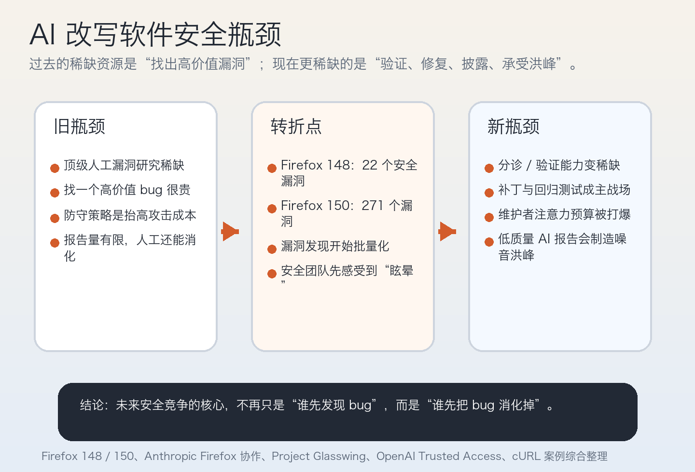

关于 [Wired 这篇报道](https://www.wired.com/story/mozilla-used-anthropics-mythos-to-find-271-bugs-in-firefox/)，最容易传播的 headline 当然是那个数字：

**Mozilla 在 Firefox 150 中，一次性修掉了 271 个由 Anthropic 的 Claude Mythos Preview 帮助识别出的漏洞。**

如果只把它理解成“又一个模型更强了”，其实反而低估了这条新闻。

因为真正值得警惕的，不是某个模型这次又多找出几百个 bug，而是这件事已经开始动摇软件安全过去几十年的一个默认前提：

> **漏洞发现曾经是稀缺资源，现在正在变成可规模化供应；于是安全系统真正吃紧的环节，开始从“找 bug”转向“验证 bug、修复 bug、发布补丁、承受报告洪峰”。**

这不是一个模型发布新闻，而是一条关于**软件安全经济学发生翻面**的新闻。

## 一、先把这件事放回时间线：271 不是孤立事件，而是同一条曲线在加速

如果只看这周 Mozilla 的新博文 [The zero-days are numbered](https://blog.mozilla.org/en/privacy-security/ai-security-zero-day-vulnerabilities/)，你会看到一个极具冲击力的判断：

- Mozilla 在 **2026 年 4 月 21 日**写道，Firefox 团队自 2 月以来一直在用 frontier AI 模型持续寻找并修复浏览器中的潜在漏洞；
- 他们此前已公开过与 Anthropic 的第一次合作：Claude Opus 4.6 帮助 Firefox 148 修掉了 `22` 个 security-sensitive bugs；
- 而这一次，Mozilla 把早期版本的 **Claude Mythos Preview** 应用到 Firefox 上，结果是：**Firefox 150 修复了 271 个在这次初始评估中识别出的漏洞。**

如果把时间往前推一个月，曲线会更清楚。

在 **2026 年 3 月 6 日**，Mozilla 的另一篇官方博文 [Hardening Firefox with Anthropic’s Red Team](https://blog.mozilla.org/en/firefox/hardening-firefox-anthropic-red-team/) 已经披露过第一轮合作结果：

- Anthropic 向 Mozilla 提交了 `112` 份唯一报告；
- 其中 Mozilla 最终给出了 `22` 个 CVE；
- `14` 个被评为高严重性；
- 另外还有大约 `90` 个非安全类 bug，比如崩溃和逻辑错误。

Anthropic 自己在 **2026 年 3 月 6 日**发布的 [Partnering with Mozilla to improve Firefox’s security](https://red.anthropic.com/2026/firefox/) 里还补充了更多过程信息：

- 他们扫描了接近 `6,000` 个 C++ 文件；
- 第一个可验证漏洞在大约 `20` 分钟内就被找出来；
- 之后 Mozilla 鼓励他们批量提交更多发现，而不是逐个手工验证完再上报；
- Anthropic 也明确承认，真正重要的不只是找出 bug，而是让提交材料附带最小复现、PoC 和候选补丁，方便维护者信任和验证。

这组信息如果合在一起看，会发现事情的重点根本不是“22 变成 271”这个单点数字，而是：

**在同一个浏览器、同一家维护组织、同一个合作关系里，AI 辅助漏洞发现的产能，已经从‘能找到一些高价值 bug’迅速跨到‘会把整条修复流水线推到极限’。**

## 二、Mozilla 真正说出的，不是“AI 很厉害”，而是“防守方长期依赖的稀缺性正在消失”

Mozilla CTO Bobby Holley 在新文章里的表述，其实比“271”这个数字更关键。

他的大意是：过去整个行业长期默认的一种安全均衡，是把漏洞发现成本尽量抬高，抬到只有预算几乎无限的攻击者或顶级研究员，才值得为一个漏洞投入大量时间和人力。防守方并不是指望把漏洞清零，而是希望把攻击的成本推高到足够不划算。

这是传统软件安全的一条隐形经济学规律：

- 攻击面很大；
- 顶级人工分析很稀缺；
- 找一个真正高价值漏洞通常很贵；
- 所以“让对方找 bug 很痛苦”，本身就是防守的一部分。

Mozilla 现在的判断是，这个均衡正在被打破。

在 [The zero-days are numbered](https://blog.mozilla.org/en/privacy-security/ai-security-zero-day-vulnerabilities/) 里，Holley 甚至直接写道：

- 过去电脑几乎不可能像顶级研究员那样通过推理找出这类漏洞；
- 但现在它们已经能做到，而且 Mozilla 还没发现“人类能找到、模型却找不到”的漏洞类别；
- 当机器可发现漏洞与人类可发现漏洞之间的差距收窄时，攻击者长期依赖的优势会被削弱，因为发现本身变便宜了。

这段话的意义非常大。

因为它说明 Mozilla 并没有把这件事理解成“多了一个更聪明的扫描器”，而是把它看成：

> **安全行业原本建立在‘高水平漏洞发现能力稀缺’上的旧均衡，正在被 frontier models 改写。**

这也是为什么我觉得这条新闻的真正标题不该是“AI 找了 271 个 bug”，而应该是：

**漏洞发现正在工业化。**

## 三、但这不自动等于“防守方赢了”——真正的新瓶颈已经换地方了

Mozilla 的新文章里有一句很打动我的话：当他们第一次看到这些发现时，感受到的是一种 `vertigo`，也就是眩晕感。

这很准确。

因为当 bug 被成批暴露时，防守方不会自动获得安全感，反而会先感受到一种更强的不适：

**我是不是已经来不及修了？**

这就是我认为这波新闻最应该被讨论的核心：

### 1. 漏洞发现不再是唯一瓶颈，验证与分诊才是

很多安全叙事容易默认一个前提：找出更多漏洞，就等于更安全。

但现实里，从“发现”到“修复”中间至少还隔着几层非常昂贵的人工流程：

- 这个报告是不是真的；
- 它是不是安全问题，而不只是普通缺陷；
- 严重性如何分级；
- 有没有稳定复现路径；
- 是否会和已有漏洞重复；
- 修复会不会引入回归；
- 什么时候发补丁，如何披露，是否牵涉 embargo。

Anthropic 在 Firefox 协作文章里其实也承认了这一点：他们后来之所以能和 Mozilla 高效合作，不只是因为模型找到了 bug，而是因为上报材料带了最小测试用例、详细 PoC 和候选 patch。

换句话说：

**真正高价值的，不是“AI 说它发现了问题”，而是“它能不能交付维护者可验证、可复现、可合并的证据包”。**

### 2. 修复与发布工程，正在变成更难扩容的一侧

发现漏洞可以并行化、自动化、批量化。

但补丁发布链路没有那么容易线性扩张。

Firefox 这样的成熟项目，已经拥有：

- 完整安全团队；
- 较强的 CI / fuzzing / 工程体系；
- 能快速 land fix 的核心开发者；
- 数亿用户驱动下的高优先级安全流程。

即便如此，Mozilla 仍然把这段经历描述为需要“reprioritize everything else”，也就是几乎要把其他事情往后放，集中精力处理这波发现。

这意味着：

**如果连 Firefox 都会因为 AI 漏洞洪峰而感到眩晕，那么大量中小型开源项目真正会先爆掉的，不是扫描能力，而是修复和发布能力。**

### 3. 维护者承载能力，正在变成真正的稀缺资源

这也是为什么我认为这条新闻必须和另一个看似负面的案例放在一起看：`cURL`。

在 **2026 年 1 月 26 日**，cURL 作者 Daniel Stenberg 在官方博客 [The end of the curl bug-bounty](https://daniel.haxx.se/blog/2026/01/) 里宣布结束 bug bounty 计划，并给出了非常直白的原因：

- AI slop 报告大量涌入；
- 2025 年开始，确认率从过去大约 `15%+` 掉到 `5%` 以下；
- 处理这些报告不仅耗时，而且有明显的 mental toll；
- 最终他们决定取消金钱激励、停止把 HackerOne 作为推荐通道。

cURL 的例子和 Firefox 的例子放在一起，恰好构成一个非常残酷的对照：

- **高质量、强验证、带补丁建议的 AI 漏洞研究**，会显著增强像 Mozilla 这样准备充分的团队；
- **低质量、低信号、缺乏复现证据的 AI 垃圾报告**，会直接压垮维护者的注意力预算。

这意味着 frontier models 带来的变化，并不是“安全能力整体上升”这么简单，而是：

> **漏洞发现被规模化之后，谁拥有验证、分诊、修补和过滤噪音的能力，谁才能把这种能力转化为真正的安全收益。**

## 四、为什么 Anthropic 和 OpenAI 都在做“受控开放”：他们知道这不是普通产品问题，而是双用途能力问题

如果只看 Firefox 新闻，可能会误以为这只是 Anthropic 和 Mozilla 的一场成功合作。

但更大的信号是：**主流模型厂商已经开始围绕 cyber-capable models 设计单独的分发与访问制度。**

Anthropic 在 **2026 年 4 月 7 日**发布的 [Project Glasswing](https://www.anthropic.com/project/glasswing) 基本等于公开承认了这一点：

- Claude Mythos Preview 被定位为 gated research preview；
- 参与方包括 AWS、Microsoft、Google、Palo Alto Networks、Linux Foundation 等；
- Anthropic 承诺提供 `1 亿美元` usage credits 和额外对开源安全组织的捐助；
- 官方明确把重点放在“在攻击者大规模拿到类似能力之前，让防守方先做 find-and-fix”。

这不是普通的产品推广口径，而更像一套**防守优先分发机制**。

OpenAI 的动作也很像。

在 **2026 年 2 月 5 日**的 [Introducing Trusted Access for Cyber](https://openai.com/index/trusted-access-for-cyber/) 里，OpenAI 明确说：

- frontier cyber capabilities 需要优先放到 defenders 手里；
- 由于很多 cyber 行为具有双用途性质，单凭请求文本很难判断究竟是在做防守还是进攻；
- 因此他们采用 trust-based access pilot，希望降低善意安全工作中的误伤，同时继续阻断恶意用途。

后续 OpenAI 又进一步扩展了 [Trusted access for the next era of cyber defense](https://openai.com/index/scaling-trusted-access-for-cyber-defense/)，其中提到：

- 会向经过更高等级验证的用户开放 `GPT-5.4-Cyber`；
- 这个版本会降低 legitimate cybersecurity work 的拒绝边界；
- 但由于更 permissive，它仍然会以有限、迭代的方式提供给 vetted vendors、organizations 和 researchers。

把这些动作放在一起看，厂商其实是在同时承认两件事：

1. **这些模型确实在把漏洞研究推进到一个新的能力阶段；**
2. **这种能力不能像普通 coding model 一样无差别放出去。**

所以 Firefox 271 这个新闻，不只是 Mozilla 的好消息，它还是大厂分发策略变化的现实注脚。

## 五、这场变化真正会改写的，不是漏洞数量，而是整个软件安全流程

如果把 Firefox、Glasswing、Trusted Access 和 cURL 这几件事合在一起，我觉得我们已经可以看到下一阶段的软件安全流程会怎样被迫重构。

### 1. 报告格式会从“描述问题”变成“提交证据包”

未来高质量漏洞报告越来越像一份结构化交付物，而不是一段说明文字。

至少要包括：

- 最小复现；
- 验证路径；
- 严重性判断依据；
- 候选补丁；
- 回归测试或补丁有效性证明。

没有这些，维护者就会淹死在海量“也许有问题”的报告里。

### 2. AI for finding bug，必须和 AI for triage / patching 一起上

只部署漏洞发现 agent，而不部署：

- 重复报告去重；
- 自动验证；
- patch plausibility check；
- regression test；
- disclosure workflow automation；

最后结果很可能不是更安全，而是**更拥堵**。

Anthropic 在 Firefox 协作文章里强调的 `task verifiers`，我认为就是下一阶段很关键的基础设施。

### 3. 开源安全会进一步两极分化

Mozilla 的结论有一个很值得警惕的延伸：

如果 AI 确实让“深度漏洞发现”变得廉价，那么：

- 有资源的大型项目会快速补齐旧债；
- 没资源的项目则可能同时面对两种压力：真正的漏洞洪峰 + 垃圾报告洪峰。

这也是为什么 Anthropic 在 Glasswing 里把 Linux Foundation、OpenSSF、Apache Software Foundation 放进去，并承诺 credits 和捐助。

因为他们也知道：

**如果只让头部机构先武装起来，安全能力会更不均衡，而不是更均衡。**

## 六、我的判断：真正的转折点不是“AI 会不会找 bug”，而是“修复体系能不能跟上工业化发现速度”

回到 Firefox 150 的 `271`。

这个数字当然很重要，但它真正标志的，不是“AI 找 bug 终于实用了”，而是更深的一件事：

> **软件安全的主瓶颈，正在从“发现漏洞”转向“消化漏洞”。**

过去，最强的能力是找出少数别人找不到的高价值 bug。

现在，更稀缺的能力开始变成：

- 谁能快速判断哪些是真的；
- 谁能给出可信修复；
- 谁能大规模回归测试；
- 谁能在攻击者利用前完成披露和发布；
- 谁能在维护者不被噪音淹没的前提下维持这个节奏。

也就是说，下一阶段的软件安全竞争，不只是模型能力竞争，而是：

**漏洞发现能力、维护者工作流、补丁工程、披露流程和防滥用访问控制的系统竞争。**

## 写在最后

我觉得 Mozilla 这次最重要的一句话，不是“defenders finally have a chance to win”，而是更早的那个现实感判断：第一次看到这些结果时，会有眩晕感。

这很诚实。

因为 frontier AI 带来的不是简单的乐观叙事，而是一场系统重排：

- 漏洞发现更便宜；
- 攻防两端都会加速；
- 维护者将同时面对更高价值的发现和更多噪音；
- 谁能把“发现能力”转化成“修复能力”，谁才真的更安全。

所以，Firefox 一次修掉 271 个漏洞这件事，最值得记住的不是一个数字，而是一条趋势：

> **零日漏洞正在进入工业化发现时代，而真正决定防守方胜负的，已经越来越不是谁先看到问题，而是谁能先把问题消化掉。**

## 参考链接

- [Wired：Mozilla Used Anthropic’s Mythos to Find and Fix 271 Bugs in Firefox](https://www.wired.com/story/mozilla-used-anthropics-mythos-to-find-271-bugs-in-firefox/)
- [Mozilla：The zero-days are numbered](https://blog.mozilla.org/en/privacy-security/ai-security-zero-day-vulnerabilities/)
- [Mozilla：Hardening Firefox with Anthropic’s Red Team](https://blog.mozilla.org/en/firefox/hardening-firefox-anthropic-red-team/)
- [Anthropic Frontier Red Team：Partnering with Mozilla to improve Firefox’s security](https://red.anthropic.com/2026/firefox/)
- [Anthropic：Project Glasswing](https://www.anthropic.com/project/glasswing)
- [OpenAI：Introducing Trusted Access for Cyber](https://openai.com/index/trusted-access-for-cyber/)
- [OpenAI：Trusted access for the next era of cyber defense](https://openai.com/index/scaling-trusted-access-for-cyber-defense/)
- [Daniel Stenberg：The end of the curl bug-bounty](https://daniel.haxx.se/blog/2026/01/)
