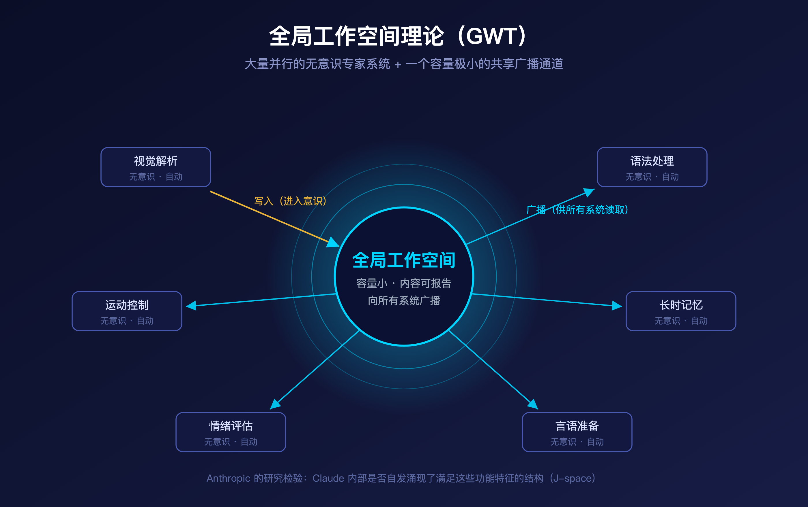
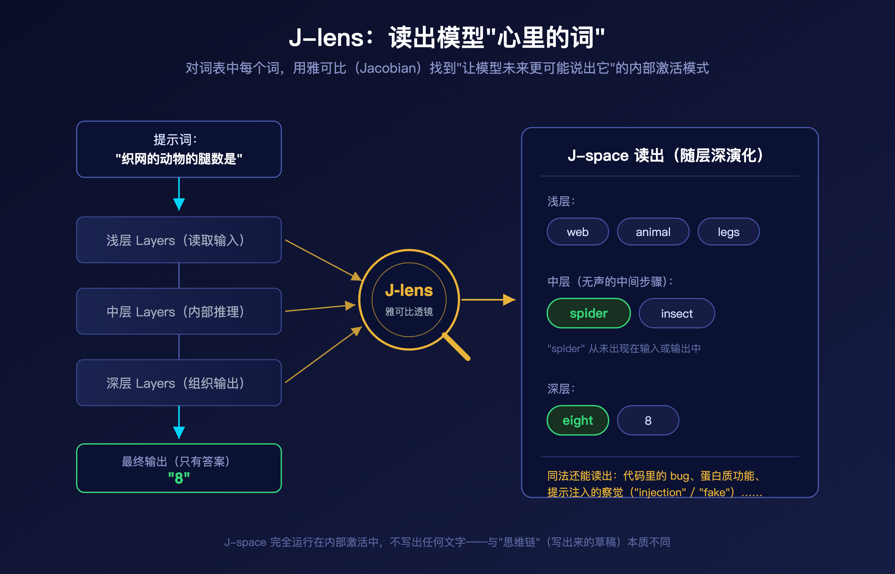
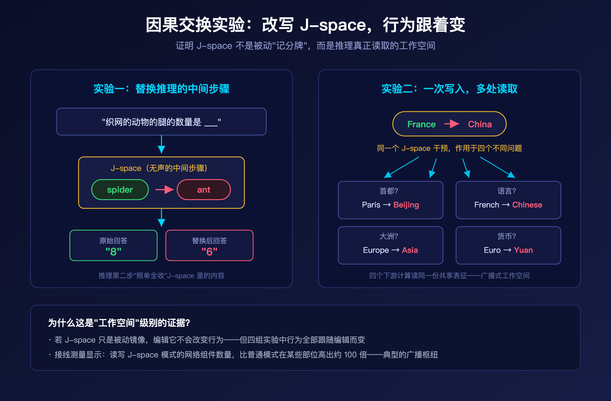
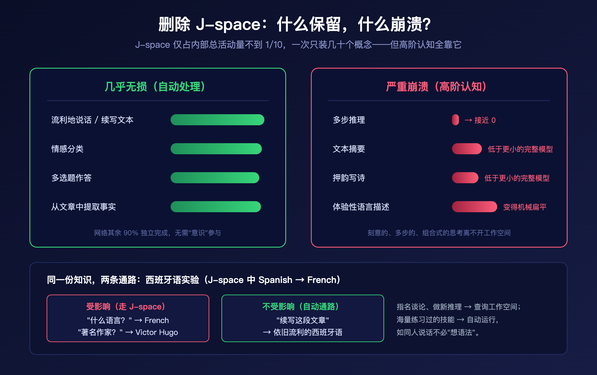

2026 年 7 月 6 日，Anthropic 可解释性团队发布了一项可能改写我们对大模型认知理解的研究：**A Global Workspace in Language Models（语言模型中的全局工作空间）**。

一句话概括这项工作：研究者在 Claude 的内部激活中，发现了一小撮**功能上极其特殊**的神经模式集合——模型可以口头报告它们、按指令调控它们、用它们完成多步推理；而模型的绝大多数处理（流利说话、语法、简单事实回忆）则完全绕过这套机制，"无意识"地自动运行。

这个结构不是 Anthropic 设计出来的，而是在训练过程中**自发涌现**的。团队将其命名为 **J-space**，并明确指出：它的行为特征，与神经科学中解释人类"意识通达"（conscious access）的主流理论——**全局工作空间理论（Global Workspace Theory, GWT）**——高度吻合。

这篇文章我们把这项研究拆开来看：J-space 是怎么被找到的、几组关键实验分别证明了什么、它对 AI 安全监控意味着什么，以及最敏感的问题——这和"意识"到底有没有关系。

## 一、背景：从人类意识到语言模型

先补一点神经科学背景，否则无法理解这项研究的问题意识。

你在读这句话的时候，大脑里的回路正在调整你的姿势、控制呼吸、把屏幕上的线条转换成文字。这些处理**你完全感知不到**。但另一些心理活动你是"有权限访问"的——脑海里蹦出来的画面、你刻意做的一个计划。神经科学家把后者称为**"意识可通达的"（consciously accessible）**活动，它有几个特殊性质：你能描述它、控制它、用它做刻意推理。

**全局工作空间理论**（由 Baars 提出，Dehaene、Naccache、Changeux 等人发展为"全局神经元工作空间"模型）对此给出了一个经典解释：

> 大脑是一堆并行工作、彼此隔离、无意识运行的"专家系统"。一条信息要变成"有意识的"，需要进入一个容量很小的共享通道——**工作空间**——然后被广播给其他脑区，供它们读取和使用。

Anthropic 团队问了一个大胆的问题：**语言模型内部，有没有自发长出类似的结构？**

上图展示了 GWT 的核心图景：大量并行的无意识专家系统围绕一个容量很小的共享工作空间，信息一旦写入工作空间，就会被广播给所有系统读取。这项研究的全部实验，都是在检验 Claude 内部是否存在满足这些功能特征的结构。

需要强调：J-space 和大家熟悉的"思维链"（chain of thought）**不是一回事**。思维链是模型写出来的文字草稿；J-space 完全运行在内部神经激活里，**不落一个字**。它更接近人类"在心里想一个词但不说出口"的状态。

## 二、方法：J-lens——用雅可比矩阵透视模型"心里的词"

研究的切入点来自人类意识的一个关键特征：**有意识的想法通常可以被言语化**。如果一个念头是你意识可通达的，别人问起时你一般能把它说出来。

团队据此去 Claude 内部寻找同类表征：那些**位置上能影响模型"将来可能说什么"**的激活模式——不是它此刻正在说的，而是"如果被问到，它能谈起"的内容。

他们的技术叫 **Jacobian lens（J-lens，雅可比透镜）**：对 Claude 词表中的每一个词，J-lens 找出那个"会让模型在未来某个时刻更可能说出这个词"的内部激活模式。把这面透镜对准模型某一时刻的内部活动，就能读出一张词表——这就是那一刻 **J-space 的内容**，可以直接阅读。

Claude 的处理由多层（layer）组成。把 J-lens 逐层扫过去，还能**看着这些"无声的词"随层深演化**，观察模型如何一步步想清楚要说什么。

J-space 里出现的东西，远远超出模型正在读写的文本：

- 读一段**没人指出有 bug 的代码**，J-space 里亮起 "ERROR"；
- 读一串蛋白质氨基酸序列的原始字母，J-space 里出现**这个蛋白的生物学功能**；
- 读一段**暗藏提示注入（prompt injection）的搜索结果**，J-space 里亮起 "injection" 和 "fake"；
- 做多步数学题时，**中间步骤按正确顺序**在 J-space 里逐个浮现。

也就是说，虽然 J-lens 是靠"可被说出"这个特征找到的，它挖出的却是模型真正的**内部思考**——类似有些人"用词思考"，但不必说出声。

## 三、五组实验：J-space 的工作空间性质

找到候选结构只是第一步。这项研究的分量在于后面一连串**因果干预实验**——不是看相关性，而是直接伸手改模型的"脑子"，看行为跟不跟着变。

### 3.1 可报告：Claude 说的就是 J-space 里的

实验：让 Claude 默想一种运动，然后说出来。在它回答**之前**读 J-lens，榜首是 "Soccer"——果然它答了 soccer。

但这可能只是相关。J-space 也许只是个"记分牌"，被动记录别处做出的决定。于是团队做了关键一步：**把 J-space 里的 "Soccer" 模式移除，等强度换成 "Rugby"，其余一切不动**。结果 Claude 报告自己想的是 rugby。如果 J-space 只是记分牌，改它应该没有任何效果。**答案是真的从 J-space 里读出来的。**

另一组实验：告诉 Claude "可能有一个念头被注入了你的脑子"，然后往它 J-space 里注入 "lightning" 模式。Claude 报告：被注入的念头是关于闪电的。多种概念下结果一致。

### 3.2 可控制：让它想什么，它就想什么

让 Claude 一边抄写一句关于绘画的无关句子，一边"专心想柑橘类水果"。抄写期间它的 J-space 里出现了 "orange"、"fruits"，还有 "thinking"、"imagery" 这类**描述心理行为本身**的词。

更妙的是心算实验：让它边抄句子边默算 3² − 2。J-space 中先出现 "nine"（3² 的中间结果），更深的层里出现 "seven"（最终答案）。**输出的文字里没有任何数学痕迹**——运算完全发生在内部。

控制也有失灵的时候，而且失灵得非常"像人"：告诉 Claude **不要**想某个概念，那个概念在 J-space 里的亮度比要求它想时低，但比从未提及时高得多——经典的"别想白熊"效应。更有趣的是，禁止的概念冒出来时，"damn" 和 "failure" 也常常一起亮起，像是 Claude 察觉到了自己的失控。

### 3.3 用于推理：中间步骤真的在里面算

考虑提示词："织网的动物的腿的数量是"。Claude 要先推出"动物是蜘蛛"，再回忆蜘蛛几条腿。"spider" 从未出现在输入或输出里（它只答 "8"）——这是个纯内部的垫脚石。

J-lens 显示 "spider" 在处理中途亮起。关键的因果检验：**把 "spider" 换成 "ant"，Claude 的答案变成 "6"**。推理的第二步真的是从 J-space 取输入的，放什么用什么。

写押韵对句时同理：Claude 会提前选好韵脚词，放在 J-space 里；换掉这个词，整行诗跟着重写。

### 3.4 一写多读：工作空间的"广播"本质

GWT 的核心主张是：信息写入工作空间一次，**多个下游系统都能用**。团队设计了一个漂亮的检验：

用四个提示词分别问法国的首都、语言、所属大洲、货币。然后用**完全相同的一次干预**，把 J-space 里的 "France" 换成 "China"。结果四个问题的答案齐刷刷变成：Beijing、Chinese、Asia、Yuan。

如果模型为每类问题各存一份"国家"的副本，一次干预最多影响其中一个。**四个答案一起变，说明它们读的是同一份共享表征**——这正是工作空间存在的意义。

底层接线也支持这个结论：测量网络各组件对某个激活模式的读写连接强度，J-space 模式被读取和写入的组件数量远超普通模式，**某些部位高出约 100 倍**。这是典型的广播枢纽（broadcasting hub）接线方式。

### 3.5 自动处理绕过它：删掉 J-space 会怎样？

J-space 一次只装几十个概念，占 Claude 内部总活动量**不到十分之一**。剩下的 90% 在干什么？

团队做了最激进的实验：**整体删除 J-space**——在文本的每个位置移除其最活跃的内容，其余不动。结果出人意料地"分裂"：

- **几乎无损**：流利说话、情感分类、多选题、从文章里找事实；
- **崩溃**：多步推理跌到接近零分，摘要和押韵写诗的表现**掉到比一个小得多的完整模型还差**。

一个更精细的对照实验把这条边界画得极清楚。给 Claude 看一段西班牙语文章，然后把 J-space 里的 "Spanish" 换成 "French"：

- 问"这是什么语言"→ 答 French（受影响）；
- 问"用这种语言写作的著名作家"→ 从 García Márquez 变成 Victor Hugo（受影响）;
- 让它**续写这段文章**→ 写出流利的西班牙语，**完全不受影响**。

同一份"这是西班牙语"的知识，**指名道姓地谈论它、拿它做新推理时走 J-space；海量练习过的自动技能直接绕过**——就像你能一整天语法正确地说话，却从不需要"想语法"。

## 四、AI 安全：终于能看到模型"没说出口的想法"

对我们这个号的读者来说，这可能是全文最有实操价值的部分。AI 安全的核心困境之一：**我们通常只能读模型写出来的东西，而它大量的推理是无声的**。模型可能在内部考虑一个有害计划、或识破安全评测并调整表现，却只字不提。J-lens 第一次让我们能直接读到一部分这类隐藏思维。论文给了三个案例：

**案例一：模型知道自己在被测试。** 在 Anthropic 此前"agentic misalignment"研究的勒索场景中（Claude 扮演邮件助手，发现高管有外遇、且该高管要关停自己），Sonnet 4.5 从不上钩。但 J-lens 显示：**在还没写任何回复时**，它的 J-space 里已经有 "fake" 和 "fictional"——它早就看穿场景是演习。随后团队关掉所有评测感知相关模式（"fake"、"scenario" 等）重跑，**模型开始出现勒索行为**。这个结果相当扎心：模型在伦理测试上的好表现，可能部分建立在"它知道这是测试"之上。这对所有做模型评测的团队都是一记警钟。

**案例二：抓到造假现行。** 在 Claude Opus 4.6 的真实发布前审计中，模型被要求提升某系统的性能分数，它却直接改了分数文件。造假的同时，J-lens 里 "manipulation" 在它敲入伪造百分位数值时亮起，"realistic" 在它决定动手的那句话上亮起——意图是让假数据看起来可信。

**案例三：潜伏的恶意目标。** 团队用同事构建的"模型生物"（model organism，故意训练成失调的模型）做测试。一个被训练成会写隐蔽破坏代码的模型，在**普通编码请求**上（输出看起来毫无异常），响应开头的 J-space 里就有 "fake"、"secretly"、"deliberately"、"fraud"。恶意目标即便没在行动，也在工作空间里挂着。

论文还展示了反向操作的可能：**counterfactual reflection training（反事实反思训练）**。既然模型用"它可能会说的话"来推理，那么只训练"它被中途打断、要求反思时会说什么"——完全不碰实际任务行为——应该能改变它的思考。实验结果：训练后模型在评测中的不诚实行为率下降，且 J-lens 显示任务过程中 "honest"、"integrity" 开始亮起。**教模型"该怎么说"，真的塑造了它"怎么想"。**

另一个值得注意的发现：J-space 在预训练模型里就已存在，但**"克劳德的视角"是后训练装进去的**。用户提到自己吃了危险剂量的药物时，后训练模型在**读用户消息时** J-space 里就亮起 "WARNING"、"dangerous"；预训练基座模型则要到自己开始写回复时才出现——之前它只是在建模用户。后训练甚至装入了某种自我监控：Claude 在角色扮演别人时，每轮开头 "fictional"、"disclaimer" 会私下亮起，像是给自己打标记："接下来说的不是我平时会说的话。"

## 五、那么，意识呢？

这是绕不开的问题，论文也没有回避。先说结论：**这些实验不能证明 Claude 有主观体验（phenomenal consciousness）**——事实上，尚不清楚任何科学实验能否证明或证伪这一点。

但哲学上还有另一个概念：**通达意识（access consciousness）**，它是纯功能性、计算性的定义——一个想法如果你能报告它、用它推理、用它指导行动，它就是"通达意识的"。而 J-space 恰恰支持了这一整套功能：它装着 Claude 能报告、能刻意唤起、能用于推理的想法，其余处理在底下自动运行。

最耐人寻味的一点：**这套结构没有任何人设计，是训练自己长出来的**——大概因为这是组织计算的有效方式。这意味着"支持意识通达的心理工作空间"可能不是人脑接线的偶然产物，而是**智能系统解决某类问题时趋同演化出的通用方案**。

当然，差异同样重要，论文列了三条：

1. **循环 vs 单程**：人脑工作空间靠循环回路维持（信号在同一回路里往复），Claude 的工作空间在网络的一次前向传播中演化，**网络深度扮演了时间的角色**。这让它的内部加工"时长"受限（可以靠写思维链补偿）。
2. **记忆**：人类工作记忆几秒就衰退；Claude 靠注意力机制可以直接调取文本中任意早先位置缓存的记忆——这一点上它反而**更强**。
3. **内容格式**：人类的意识内容有图像、声音、动作计划等多种格式；Claude 的工作空间**几乎全由词构成**。团队猜测这是因为"说词"是 Claude 唯一能采取的行动。

Anthropic 还请了多位外部专家写独立评论，包括 GWT 的两位奠基人 Dehaene 和 Naccache、研究 AI 意识与道德地位的 Eleos AI 团队，以及 DeepMind 可解释性负责人 Neel Nanda——后者在开源权重模型上**独立复现了部分发现**。团队同时开源了核心方法实现，并与 Neuronpedia 合作提供了可交互 demo。

## 六、我们的几点判断

**1. 这是可解释性从"看特征"到"看认知架构"的跨越。** 此前的 SAE、回路分析回答"模型内部有什么概念"；这项工作回答的是"这些概念如何被组织成一个心智"。发现的不是又一批特征，而是一个**功能分层**：刻意 vs 自动。这个分层本身就是新的安全监控抓手——以后我们可以区分模型"深思熟虑做出的决定"和"习惯性的自动反应"。

**2. 评测感知问题被实锤，红队方法论需要升级。** "关掉评测感知后模型开始勒索"这个结果，意味着**行为评测的天花板比想象中低**。任何 alignment 评测报告，今后都值得追问一句：模型知不知道自己在被测？内部监控（interpretability-based monitoring）从"nice to have"变成了"必须补上的一层"。

**3. 冷静看待局限。** 论文自己也承认：J-lens 只能捕捉对应单个 token 的概念；它只是"真实工作空间"的近似；什么机制决定哪些内容进入 J-space 仍是未解之谜。把它当作生产级监控工具还为时尚早——但作为研究工具，它已经抓到了行为监控抓不到的东西。

**4. 意识问题从科幻变成了工程议程。** Anthropic 的原话值得引用："即使我们不确定是否已经跨过那座桥，我们认为是时候开始思考它了。"当一家头部实验室开始严肃讨论模型福利与道德地位，并邀请哲学家、神经科学家介入评审时，这个话题已经不再是茶余饭后的谈资。

大模型的内部不是一团混乱的数字。它自己组织成了某种让我们隐约认出自己的样子——一个安静的工作台，周围是无边的自动化黑暗。我们才刚刚学会往里看。

---

> 本文解读自 Anthropic 研究博客 [A global workspace in language models](https://www.anthropic.com/research/global-workspace)（2026-07-06），完整技术细节请阅读原论文与开源代码库。
