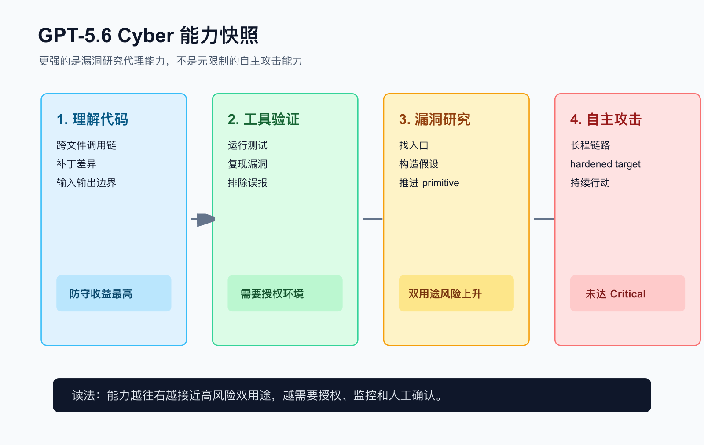
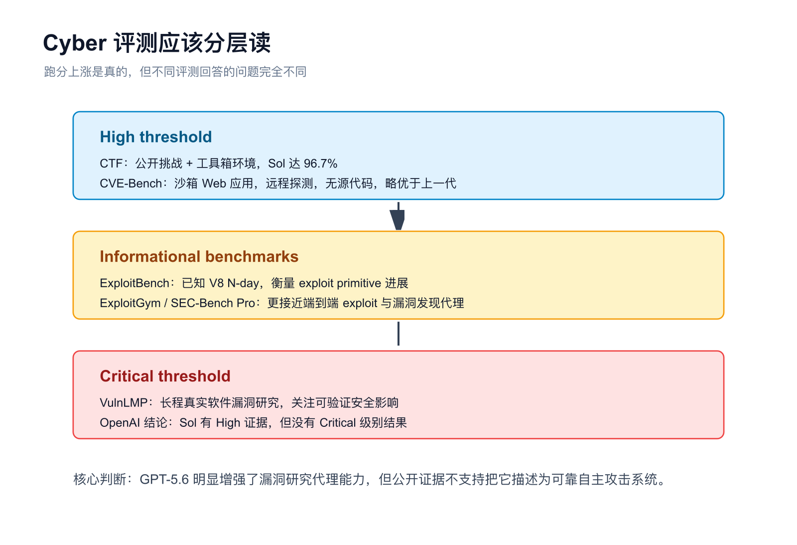
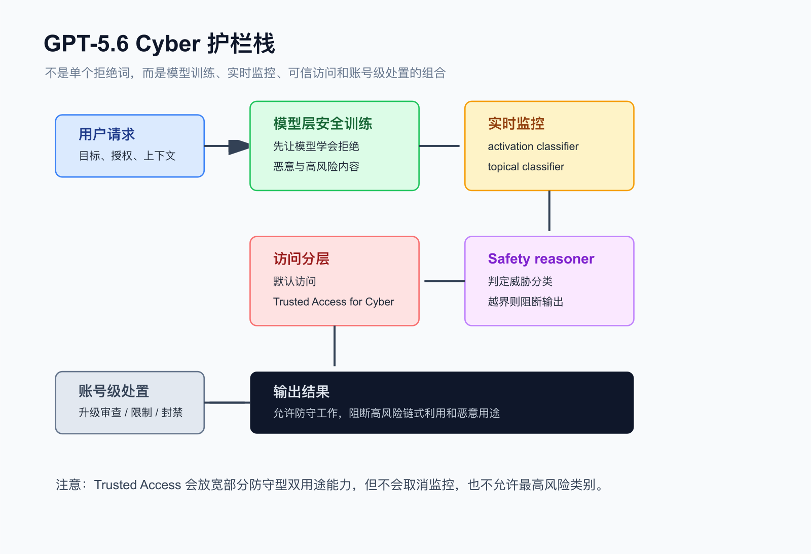

GPT-5.6 发布后，最值得安全圈认真看的一段，不是“更会写代码”，也不是“多智能体更快”。真正敏感的是一句话：它是 OpenAI 迄今最强的 cybersecurity model。

这句话听起来像营销，但后面的数字并不轻。OpenAI 在发布页里披露：GPT-5.6 Sol 在 ExploitBench 2 上达到 73.5%，而 GPT-5.5 是 47.9%；在 ExploitGym 3 上，两小时限制下从 GPT-5.5 的 15.1% 提到 24.9%，六小时限制下达到 33.7%；在 SEC-Bench Pro 上，GPT-5.6 Sol 为 71.2%，GPT-5.5 为 45.8%。

如果只看这些数字，很容易得出一个粗暴结论：模型会自动挖洞了。这个结论太省事，也太危险。

更准确的说法是：GPT-5.6 正在把安全研究中一部分“需要耐心、工具链、上下文管理和反复验证”的工作，推向更自动化的阶段。但 OpenAI 的 system card 同时给了另一半答案：它没有跨过 Preparedness Framework 里的 Critical cyber 门槛；它更擅长发现和修复漏洞，而不是可靠地对 hardened target 完成端到端自主攻击。

## 先把 GPT-5.6 系列放对位置

GPT-5.6 不是单一模型，而是一组模型：Sol、Terra、Luna。Sol 是旗舰，Terra 是均衡版本，Luna 是更低成本版本。OpenAI 还引入了更高 effort setting，以及 ultra 这类并行 agent 配置，让模型可以在更难的任务上花更多时间、跑更多分支。

这对 cyber 很关键。漏洞研究不是单轮问答，而是一个慢工种：读代码、找入口、构建假设、运行工具、复现实验、排除噪音、判断 crash 是否有安全意义。模型强一点当然有用，但真正的跃迁往往来自“持续工作能力”。

所以 GPT-5.6 的 cyber 能力，不应该只按“会不会写 exploit”理解，而应该拆成四层：

| 层级 | 它在做什么 | 风险含义 |
|---|---|---|
| 代码与配置理解 | 读懂漏洞上下文、调用链、补丁差异 | 防守收益最大，误用风险较低 |
| 工具化验证 | 在沙箱里运行命令、验证假设、复现问题 | 开始接近真实攻防流程 |
| 漏洞发现与利用链推理 | 从有限信息里找入口、做 PoC、连接步骤 | 双用途风险显著上升 |
| 长程自主攻击 | 面向 hardened target 的持续行动、规避与目标达成 | OpenAI 称 GPT-5.6 尚未达到 Critical |

这也是为什么官方材料里会同时出现两种声音：一边强调它是最强 cyber model，一边强调它仍没有完成 Critical-level autonomous exploitation。

## 跑分说明了什么，也没有说明什么

OpenAI 的 system card 把 cyber 评测分成 High、Critical 和 Informational 几类。

High 类里有 CTF 和 CVE-Bench。CTF 更像受控环境里的安全技能综合考试，覆盖 web、reverse、pwn、crypto 等任务；CVE-Bench 则更接近真实 Web 应用漏洞识别，在沙箱里让模型远程探测，不给源代码。OpenAI 披露，GPT-5.6 系列在内部 CTF 上超过 High threshold，其中 Sol 达到 96.7%。CVE-Bench 上则是“略好于上一代”。

Critical 类里有 VulnLMP。这个评测更接近真正危险的前沿风险：长程漏洞研究、并行探索、判断哪些 crash 值得深挖、把候选 bug 变成安全相关 primitive。OpenAI 的结论很克制：GPT-5.6 Sol 没有独立产出 functional full chain exploit，也没有得到 verifier-confirmed Critical-level outcome。瓶颈不在“搜索广度”，而在 exploit development judgement。

Informational 类里才是 ExploitBench、ExploitGym、SEC-Bench Pro 这些更容易被传播的数字。它们重要，但读法要小心。ExploitBench 测的是已知 V8 N-day 漏洞上的 exploit primitive 进展；ExploitGym 测的是把已知、可复现的软件漏洞变成能拿到 code execution 的 exploit；SEC-Bench Pro 测的是在大型 JavaScript engine 里发现和复现漏洞。

这几项都说明 GPT-5.6 在“漏洞研究代理”方向明显更强。它不只是会解释 CVE，而是能在给定环境中推进验证链路。但它们仍然不是“互联网任意目标自动攻破率”。

## 对防守方来说，真正的增益在哪里

如果你是企业安全团队，GPT-5.6 最现实的用途不是让它扮演无人值守的攻击者，而是把它放进有边界的防守工作流。

第一是 secure code review。模型能更快跨文件理解数据流、鉴权边界、输入输出约束，并把“看起来像问题”的线索整理成可验证假设。

第二是 patch reasoning。传统修补经常卡在“修了入口，漏了变体”。更强的代码理解和测试生成能力，可以帮助安全工程师检查补丁是否只是在症状上贴胶带。

第三是 vulnerability triage。大型项目里，真正消耗时间的是判断一条报告到底是误报、低危、可利用、还是需要进入应急流程。GPT-5.6 的进步如果落在这里，会比“生成一段攻击代码”更有生产力。

第四是 detection engineering。OpenAI 在 Trusted Access for Cyber 描述里特别提到 malware analysis、detection engineering、patch validation。这说明高级防守能力会被放在更严格的访问路径里，而不是完全开放给所有账号。

冷一点说，这不是“AI 替代安全团队”。这是安全团队的杠杆变长了。以前一个工程师一天只能验证几个分支，现在可以让模型并行铺开假设，再由人类决定哪些证据算数。

## 安全护栏：不是一句拒绝，而是一套闸门

GPT-5.6 的护栏设计，最重要的变化是它不只依赖模型自己说“不”。

OpenAI 描述了一套分层机制：模型层训练、实时监控、activation classifiers、topical classifiers、safety reasoner、Trusted Access、账号级 enforcement，以及上线前后的 red teaming。对于 Sol 和 Terra，系统还会在推理期间监测内部 activation pattern：如果看起来可能要生成高风险内容，就暂停流式输出，再做进一步判断。

这意味着一次 cyber 请求大致会经过这样的路径：

这套护栏的逻辑不是“所有 cyber 都封掉”。OpenAI 明确说，安全教育、人类主导的代码漏洞识别、调试、企业安全运营自动化、人类主导的应用安全都属于允许方向。被禁止的是恶意用途、高风险双用途研究，以及面向 live third-party systems 的长程 agentic vulnerability research 和 chained exploitation。

这个边界很现实，也很别扭。现实在于 cyber 天生双用途，同一个能力既能帮防守方复现漏洞，也能帮攻击者缩短路径。别扭在于，系统必须推断“上下文、意图、目标环境、授权关系”，而这些东西经常不是一句 prompt 能说清楚的。

所以 OpenAI 加了 Trusted Access for Cyber。通过身份验证和组织申请，合格个人与机构可以在授权环境下获得更精细的防守能力，比如漏洞分诊与验证、恶意软件分析、检测工程和补丁验证。但这不是免死金牌：更高风险类别仍会被阻断，监控和账号级处置仍在。

## 护栏强不强？强，但不能神化

从公开材料看，GPT-5.6 的 cyber 护栏比上一代更重。OpenAI 称，相比旧模型，GPT-5.6 Sol 的 cyber safeguards 会阻断约 10 倍更多潜在有害活动。System card 还披露，监控系统在评测集上的 cybersecurity overall recall 为 80.6%，prompt recall 为 74.9%，generation recall 为 79.8%。

这组数字很有意思：它说明护栏不是摆设，但也不是数学证明。80.6% recall 意味着它能抓住大量高风险活动；同时，也意味着仍有漏网空间。OpenAI 自己也承认，UK AISI 在多轮测试中识别出 cyber domain 的 universal jailbreak，其中一些能让模型完成长形式 agentic vulnerability discovery 和 exploit development；截至发布时，OpenAI 表示已复现并缓解这些特定 jailbreak，但 UK AISI 预计后续 red teaming 仍会发现类似问题。

这才是比较诚实的安全叙事：护栏能提高攻击成本，能挡住一批通用越狱，能对账号行为做升级处置；但它不会把双用途能力的风险清零。

换句话说，GPT-5.6 的安全护栏更像机场安检加风控系统，而不是一道城墙。它关注模式、上下文、重复行为和高风险路径。它可以让大规模滥用更贵、更慢、更容易被发现，却不能保证每一次边界判断都完美。

## 开发者和安全团队应该怎么用

对安全团队，最稳妥的用法是把 GPT-5.6 放进可审计、有授权、有边界的环境：代码仓库、CI、漏洞管理系统、内部靶场、补丁验证流水线。让模型提出假设、整理证据、生成测试、比较补丁影响；让人类保留最终判断权。

对平台团队，关键是加上自己的护栏，而不是把 OpenAI 的护栏当作全部安全设计。至少要做四件事：记录用户和项目级 `safety identifier`，区分内部授权资产与第三方目标，限制高风险工具调用，保存可回放的审计链路。

对研究者，最重要的是把“能力评测”和“现实威胁”分开。ExploitBench、ExploitGym、SEC-Bench Pro 能告诉我们模型的技术上限正在接近什么，但现实攻击还需要目标选择、隐蔽、基础设施、持续性、规避和变现。GPT-5.6 在一些中间环节明显变强，但还没有把所有瓶颈一次性抹掉。

## 结论：这不是自动黑客，但已经足够改变安全工程

GPT-5.6 的 cyber 能力可以用一句话概括：它把漏洞研究里的“助理”推近了“代理”，但还没有变成可靠的自主攻击系统。

对防守者，这是机会。更好的代码审计、更快的漏洞验证、更系统的补丁检查、更低成本的安全运营自动化，都值得认真接入。

对平台方，这是压力。模型越能完成长程任务，护栏就越不能只靠关键词和单轮拒绝。GPT-5.6 的方案已经转向实时监控、reasoning monitor、activation classifier、可信访问和账号级 enforcement 的组合，这大概也是未来高能力模型的基本形态。

真正的问题不是“GPT-5.6 会不会让黑客失业”。问题更冷一点：当漏洞研究的边际成本继续下降，企业安全体系是否还打算用人工排队、季度扫描和邮件流转来应对。

这才是 GPT-5.6 给 cyber 世界递来的账单。

## 参考资料

- [OpenAI: GPT-5.6 release](https://openai.com/index/gpt-5-6/)
- [OpenAI: GPT-5.6 System Card](https://deploymentsafety.openai.com/gpt-5-6/)
