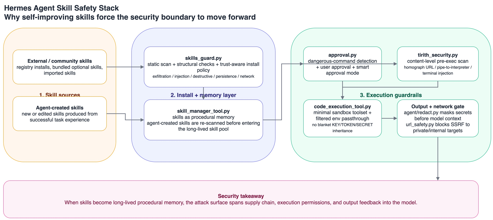

最近认真翻了一遍 `~/content/hermes-agent` 这个项目，我觉得它很值得写，不是因为它又支持了多少模型、多少平台，而是因为它对 Agent 这件事有一个非常鲜明的判断：

> **Agent 不只是会调工具，它还应该把经验沉淀成 skill，并在后续任务里持续复用和改进。**

这件事看上去像“更聪明的自动化”，但从安全视角看，含义完全不一样。

因为一旦 skill 不再只是静态提示词，而变成一种会被安装、会被改写、会被执行、会跨会话复用的 **程序化记忆（procedural memory）**，那它就不只是能力资产，也会变成最关键的攻击面之一。

而 Hermes Agent 有意思的地方恰恰在这：
它不是在“会自我进化”这件事上一路狂飙，而是明显试图把 **skill 供应链、命令执行、沙箱隔离、输出回流** 这些风险点，一层一层收紧。

我看完之后的结论很明确：

> **Hermes Agent 真正独特的，不是它会不会生成 skill，而是它已经意识到：如果 skill 是 agent 的长期记忆和执行器，那 skill 安全就必须比普通 prompt 安全更前置。**

## 一、Hermes Agent 最特别的，不是“会用工具”，而是“会长技能”

先说项目特点。

从 README 能看出来，Hermes 给自己的定位不是一个单纯的 terminal agent，而是一个 **self-improving AI agent**。它强调几件事：

- 能从经验中创建 skill；
- skill 会在使用中继续改进；
- 会被 nudged 去持久化知识；
- 能搜索过去的 session；
- 能跨会话逐步建立对用户的长期理解。

这跟很多“工具调用 + 长上下文”的 agent 项目很不一样。

很多 agent 的记忆增强，本质上还是：
- 多存一点历史；
- 多塞一点摘要；
- 多配几个 tool；
- 多跑几个 subagent。

Hermes 则更进一步：它把 **skill** 直接当成一种长期能力沉淀。

在代码里，这个判断其实写得非常直白：`tools/skill_manager_tool.py` 里就把 skills 定义成 agent 的 **procedural memory**。也就是说，在 Hermes 的设计里，skill 不是“额外插件”，而是 agent 学会一类事情之后，留下来的可复用做法。

这个项目的整体形态也因此比较完整：

- 它有 CLI，也有 Telegram、Discord、Slack、WhatsApp、Signal 等多平台 gateway；
- 它能跑在本地、Docker、SSH、Modal、Daytona、Singularity 等不同 backend；
- 它支持 cron 自动任务；
- 它支持 subagent delegation；
- 它还有 MCP、memory、session search、context compression 这些典型 agent runtime 组件。

所以 Hermes 不是一个“demo 型 agent”，而是明显在往 **长期在线、跨平台、可持续运行的 agent runtime** 方向做。

而一旦 Agent 真开始“长期运行”，skill 的安全权重就会迅速上升。

## 二、为什么说 Skill 安全，比普通 Prompt 安全更值得紧张

很多人一提 skill，第一反应还是“那不就是一段说明文档吗？”

但在 Hermes 这类系统里，skill 早就不是单纯文档了。

一个 skill 至少同时具备四种属性：

1. **它是指令**：会影响模型如何理解任务；
2. **它是工作流**：会引导工具调用顺序；
3. **它是执行入口**：可能带脚本、模板、辅助文件；
4. **它是长期资产**：会被保存、更新、复用，甚至由 agent 自己生成。

这四件事叠加在一起，skill 的风险就比普通 prompt 大很多。

因为普通 prompt 的风险，很多时候还停留在“这一轮对话会不会被带偏”；
但 skill 的风险是：

- 会不会被安装进长期环境；
- 会不会跨会话继续生效；
- 会不会影响后续所有类似任务；
- 会不会借执行链路碰到凭据、文件、网络和终端；
- 会不会在 agent 自我改写过程中逐步积累风险。

这也是为什么我觉得，你说“这个 agent 会自动总结 skill，所以是不是 skill 安全更要注意”，方向是对的，但我会把它说得更准确一点：

> **Hermes 不只是会“总结” skill，而是在试图把经验固化成 skill，并允许 skill 进入长期运行链路。**

一旦是这样，skill 安全就不再是一个边角问题，而会变成整个 agent 系统的核心边界。

## 三、Hermes 最有辨识度的地方，是它把 Skill 风险拆成了多层防线

我看完代码后，一个很明显的感受是：Hermes 对“skill 很危险”这件事，不是停留在口号层面，而是真的做了几道机制。

上图可以把 Hermes 的安全思路看得更直观：左边先把 skill 当作供应链对象处理，中间再把它纳入长期 procedural memory，右边则把真正危险的执行链路拆成审批、预执行扫描、沙箱和输出回流四道门。

### 1. Skill 安装前先过扫描，而且是带信任分级的

`tools/skills_guard.py` 是我觉得这个项目里最值得注意的安全文件之一。

它做的不是一个简单的 keyword blacklist，而是一套 **externally-sourced skill 安装前扫描** 机制，里面至少有几层：

- 扫描 exfiltration 模式；
- 扫描 prompt injection 模式；
- 扫描 destructive command；
- 扫描 persistence 行为；
- 扫描 network / obfuscation 模式；
- 做结构检查、二进制检查、不可见 Unicode 检查。

更重要的是，它不是“一刀切”，而是有 **trust-aware install policy**：

- `builtin`：内置技能，直接信任；
- `trusted`：受信源，允许 `caution`，阻断 `dangerous`；
- `community`：社区来源，只要有明显发现就倾向阻断；
- `agent-created`：agent 自己生成的 skill，不是默认放行，而是单独一档策略。

这点很关键。

很多系统做 skill marketplace，关注点更多在“怎么装更方便”；
Hermes 的思路则是：**skill 先是供应链对象，之后才是能力对象。**

这在 agent 时代是对的。

### 2. Agent 自己写出来的 Skill，也要重新扫一遍

如果一个 agent 支持“自动创建 skill”，但对 agent 自己写出来的 skill 不做任何检查，那基本等于把风险直接持久化。

Hermes 在这点上做得比较克制。

`tools/skill_manager_tool.py` 里，agent 对 skill 的 `create`、`edit`、`patch`、`write_file` 等动作之后，都会走一次 `_security_scan_skill()`。也就是说：

> **不是只有外部下载的 skill 会被查，agent 自己新长出来的 skill 也会被重新审视。**

这背后的安全直觉非常重要：

- 风险不只来自外部社区；
- 风险也可能来自 agent 在一次复杂任务里“学歪了”；
- 只要 skill 要进入长期资产池，就应该进入审计链。

这正是我觉得 Hermes 相比很多 agent 项目更成熟的地方。

### 3. 真正执行命令前，不是只看 shell pattern，还会叠加语义扫描

Hermes 的命令执行前防线不是单点的。

一层是 `tools/approval.py`：
它会检测危险命令模式，比如递归删除、覆盖系统配置、写敏感路径、pipe-to-shell、kill 核心进程等，并要求审批。

但更特别的是，它没有把安全判断停在 regex 级别。

另一层是 `tools/tirith_security.py`：
它会在执行前调用 Tirith 做 **content-level threat scanning**，关注的包括：

- homograph URL；
- pipe-to-interpreter；
- terminal injection；
- 其他更偏语义层的命令风险。

而且这两层最后会被合并成一个审批决策。

这意味着 Hermes 的设计不是“匹配到危险命令就弹窗”，而是更像：

> **先把语法层和语义层的风险都收集起来，再统一进入批准流程。**

如果你在做 Agent 安全，这个思路其实很值得借鉴。

### 4. 进入沙箱后，也不是把环境变量全量放进去

如果 skill 会调用脚本或代码执行工具，那另一个核心问题就是：
**secret 会不会直接跟着环境变量一起被送进执行上下文？**

Hermes 在 `tools/code_execution_tool.py` 里专门做了一层限制：

- code execution sandbox 里默认只允许非常有限的一组工具；
- 子进程环境变量会做筛选；
- 带 `KEY`、`TOKEN`、`SECRET`、`PASSWORD` 这类特征的变量默认不下发；
- 只有被 skill 明确声明、并通过 `tools/env_passthrough.py` 注册的变量，才允许定向 passthrough。

这个设计很像在说：

> **skill 可以申请它需要的能力，但它不能天然继承整个宿主机的秘密。**

这点非常对。

因为一旦一个系统鼓励 agent 持续沉淀 skill，它就必须假设：
将来某个 skill 可能不是坏的，但也不一定永远写得对。

那最稳妥的办法，就是把 secret 暴露面本身做小。

### 5. 即使泄露真的发生了，输出回流前还要再挡一次

Hermes 还有两层我觉得容易被忽视，但实际上很重要的机制。

第一层是 `agent/redact.py`。

它会对日志和工具输出做 secret redaction，覆盖 API key、token、Authorization header、私钥块、数据库连接串、手机号等多类模式。对于 `execute_code` 这类路径，它还会在 stdout/stderr 返回给模型之前再次做 redaction。

第二层是 `tools/url_safety.py`。

它会阻断访问内网、localhost、metadata endpoint 这一类目标，防 SSRF 把 agent 变成“帮攻击者探内网的工具”。

再加上 `tools/credential_files.py` 里对 symlink-safe skills copy 的处理，整体能看出一个非常清楚的工程倾向：

> **不是只在入口防，而是在 skill 安装、命令执行、环境透传、输出回流、文件挂载这几处都各自加一道门。**

这就是比较像样的 agent security engineering 了。

## 四、我觉得 Hermes 最值得讨论的，不是“有没有防住”，而是“它为什么知道要这样防”

看到这里，其实可以反过来理解 Hermes 的独特性。

它为什么会在 skill 上做这么多机制？

我觉得不是因为它更保守，而是因为它比很多项目更早承认了一件事：

> **Skill 一旦成为 agent 的长期能力载体，它就天然同时属于 prompt 层、代码层、供应链层和运行时层。**

这四层只守一层，都是不够的。

如果一个 skill 只是提示词片段，那你可能只需要担心 prompt injection；
但如果一个 skill 会：

- 被 agent 自动创建；
- 被后续任务继续复用；
- 携带脚本、模板和引用文件；
- 触发命令、文件、网络、沙箱；
- 再把输出喂回模型；

那它其实已经变成了一种 **跨层资产**。

而跨层资产的安全，最怕的就是“大家都只管自己那一层”。

Hermes 至少做对了一件大事：
它在工程上承认了这个复杂性。

## 五、如果你也在做会“长 Skill”的 Agent，我觉得至少要抄 Hermes 这几条作业

看完这个项目，我觉得最值得带走的不是某个具体实现，而是下面这几个原则。

### 原则 1：把 Skill 当供应链对象，而不是知识片段

Skill 不是普通文档。
只要它能进入长期环境、影响后续执行，它就应该像插件、脚本、依赖包一样被对待。

### 原则 2：Agent 自己生成的 Skill，也必须纳入审计

“AI 自己写的东西”不应该天然更可信。
恰恰相反，只要它会持久化，就该被重新扫描、重新分级。

### 原则 3：执行权限要按需下发，不要默认继承

不要让 skill 或沙箱脚本天然拿到全套环境变量、全量文件系统、全部网络目标。
默认拒绝，按需透传，才是长期方案。

### 原则 4：stdout 不是纯 observability，而是潜在数据外泄通道

如果输出会回填给模型，那日志就是上下文的一部分。
这时 redaction 就不是锦上添花，而是边界控制。

### 原则 5：Prompt 安全、命令安全、运行时安全，必须联动

只做 prompt guard 不够；
只做 shell approval 也不够；
只做 sandbox 还是不够。

真正危险的路径，往往恰好发生在这几层的交界处。

## 六、最后的判断：Hermes 真正给行业的提醒，是“Skill 会把 Agent 风险持久化”

如果只从产品能力看，Hermes 的卖点当然很多：
多平台、云端运行、subagent、memory、toolset、cron、MCP、长期在线。

但如果从安全视角看，我觉得它最值得讨论的一点反而是：

> **它把 skill 当成 agent 的可持续进化单元，而这会直接改变安全边界的位置。**

当一个 agent 只是偶尔调用工具时，风险更多发生在“这次调用”；
当一个 agent 会把经验写成 skill、再让 skill 长期参与未来任务时，风险就会从一次性误用，升级成 **可复用、可传播、可积累的系统性风险**。

也正因为这样，我反而觉得 Hermes 最有价值的地方不只是“更强”，而是“它已经开始围绕这种更强，补上对应的安全结构”。

这可能才是下一代 agent 真正该有的样子：

不是只会自己长能力，
而是知道能力一旦能自我沉淀，**防线也必须一起进化。**

## 附：我从仓库里读到的几个关键判断

如果你也想自己去看源码，我建议先看这几个文件：

- `README.md`：看项目定位，尤其是 self-improving loop、skill creation、memory、gateway；
- `tools/skills_guard.py`：看 skill 扫描和 trust-aware install policy；
- `tools/skill_manager_tool.py`：看 agent-created skill 也会被回扫；
- `tools/approval.py`：看危险命令审批与 smart approval；
- `tools/tirith_security.py`：看 pre-exec 安全扫描和二进制校验；
- `tools/code_execution_tool.py`：看沙箱、env filter、stdout/stderr redaction；
- `tools/url_safety.py`：看 SSRF 防护；
- `agent/redact.py`：看输出脱敏。
