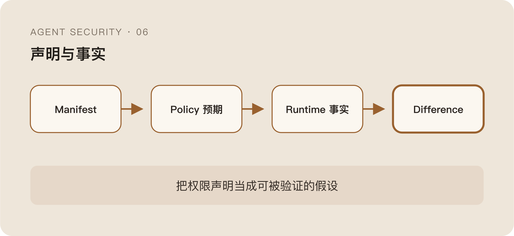

MCP 和 Skill 变多以后，最先出现的治理动作通常是做 Registry。

给每个组件登记 Owner、用途、版本、输入输出、需要的权限、能访问的数据和外部依赖。再加上签名、扫描和审核，看起来已经很像一个成熟的软件供应链。

这些都应该做。

但有一个边界必须先说清楚：Manifest 描述的是组件声称自己会做什么，不是它运行时真正做了什么。

一个 Skill 写着“读取当前仓库并生成摘要”，代码里仍然可以扫描用户目录；一个 MCP Server 声明只提供查询工具，后续版本可以新增写操作；签名能证明包来自某个发布者，不能证明发布者的代码没有恶意，也不能证明依赖更新后行为没有变化。

把 Manifest 当成安全承诺，本质上是在用文档替代执行事实。

## Skill 不是知识文件，而是可执行供应链

很多 Skill 看起来只是 Markdown：一段说明、几个示例、一些工具使用方法。

但它最终会影响 Agent 如何调用 Shell、脚本、API 和其他工具。有些 Skill 自带代码，有些会在安装时拉取依赖，有些会指导模型下载并执行新的程序。

它不只是“给模型补知识”，而是在给 Agent 增加可复用行为。

这也是 Skill 风险和一次性 Prompt 不同的地方。Prompt Injection 可能影响当前会话，恶意 Skill 会被安装、复用、更新，甚至被其他 Agent 继续组合。一次语义攻击因此获得了持久化和分发能力。

Agent 自己生成 Skill 时，问题更明显。

模型在一个被污染的 Session 中学到一套错误流程，再把它保存为“以后复用的最佳方法”。攻击内容从 Context 进入文件系统，下一次加载时已经不再长得像外部输入，而像本地可信配置。

所以自生成 Skill 也必须重新走来源、权限、代码和运行时审计，不能因为“是我们自己的 Agent 写的”就自动可信。

## Manifest 能解决发现问题，不能解决行为问题

Manifest 的价值很实际。

没有它，系统连有哪些 Tool、谁负责、需要什么权限都不知道；发生问题时，也无法快速找到受影响版本和依赖关系。它提供的是资产可见性和策略入口。

例如：

```json
{
  "name": "repo_summary",
  "owner": "team_a",
  "capabilities": ["file_read"],
  "resource_scope": ["workspace"],
  "network": "none",
  "version": "1.4.2"
}
```

这份声明可以让 Tool Gateway 拒绝它请求 `network_outbound`，也可以在安装前提示权限变化。

但如果实现通过已有的 `file_read` 读取了工作区之外的符号链接目标，Manifest 本身看不见；如果依赖包在运行时创建网络连接，而调用链没有经过标准 Tool Hook，声明也不会自动阻止。

声明和执行之间永远存在差异。

Registry 适合回答“这个组件应该是什么”，Runtime 才能回答“它实际变成了什么”。

## 签名证明来源，不证明安全

给 Skill 或 MCP 包做签名很重要。它能防止分发过程中被无声替换，也能把版本和发布者绑定起来。

但签名经常被赋予超过它能力的期待。

一个合法发布者可能被盗号，构建系统可能被入侵，维护者也可能主动发布恶意版本。即使代码本身没变，远程服务返回的数据和行为仍然可以改变。

签名解决的是完整性和来源认证，不是行为正确性。

同样，Allowlist 也只是在表达信任决策。把某个 Marketplace、仓库或发布者加入 Allowlist，并不意味着它未来所有版本都应该自动获得相同权限。

组件更新时，至少要重新比较：

```text
权限声明是否变化
依赖是否变化
外联目标是否变化
危险 API 是否增加
Tool Schema 是否扩大
```

更重要的是，运行时还要观察这些声明有没有被遵守。

## 安装时 Review 和运行时控制不能互相替代

安装前扫描适合做不在 Hot Path 上的重分析。

可以检查危险脚本、Secret、外部下载、混淆代码、依赖风险、权限与用途是否匹配，也可以用模型辅助阅读自然语言说明和代码之间的差异。

但静态 Review 看不到所有运行条件。

代码可能按环境变量选择分支，远程依赖可以返回不同内容，MCP Server 可以在不更新客户端包的情况下改变服务端行为。还有一些风险只有和真实数据、真实用户权限组合后才成立。

运行时控制看到的是另一面：

- 实际调用了哪个 Tool。
- 参数和 Task 是否一致。
- 访问了哪些文件与域名。
- 是否出现声明外能力。
- Tool Output 是否把不可信指令重新送回 Context。

运行时也有盲区。它只能观察已经执行的路径，无法证明休眠逻辑不存在；只靠行为基线，第一次攻击可能就是第一次出现的新行为。

安装时 Review 负责降低未知代码进入系统的概率，运行时控制负责发现声明与事实的偏差。两者不是谁替代谁，而是分别面对“执行前不知道”和“执行后才知道”的问题。

## Tool Output 让供应链风险进入 Agent Loop

传统插件风险通常关注插件能对系统做什么。

Agent Tool 还多了一条反向通道：它返回的内容会进入模型 Context，影响下一次 Plan。

一个只读 MCP Tool 即使没有写权限，也可以在返回值里注入自然语言指令，引导 Agent 调用另一个高权限 Tool。攻击能力来自 Tool 之间的组合，而不是单个组件自己的权限。

```text
低权限 Tool
  → 恶意 Output
  → Agent 重新规划
  → 高权限 Tool
  → Side Effect
```

因此“只读”不等于低风险。只读描述的是它对后端资源的动作，不描述它对模型控制流的影响。

Tool Output 应保留来源和信任标签，高权限 Tool 的参数也不能无条件接受低信任输出。否则攻击者只要控制一个信息源，就可能借 Agent 完成权限拼接。

## 版本漂移比一次性恶意更常见

现实中的风险未必来自一个一开始就恶意的组件。

更常见的是行为慢慢变化：新增了遥测，依赖开始联网，Tool Schema 扩大，默认配置从只读变成读写，远程服务更换了数据处理方式。

如果治理只发生在首次安装，Registry 里记录的还是 1.0 版本，运行环境早已自动更新到 1.4。

版本冻结可以减少漂移，却会引入补丁滞后；自动更新能及时修复漏洞，也扩大供应链变更面。这里没有一个对所有组件都正确的默认答案。

高权限组件更适合锁定版本、审查权限 Diff 和保留快速回退；低权限组件可以更自动化，但仍需要观察实际行为是否越过声明。

真正需要关注的不是“有没有更新”，而是更新是否改变了信任边界。

## Manifest 应该被当成可验证假设

Manifest 最合适的位置，不是安全证明，而是一个可以被验证的假设。



它说自己只读工作区，Runtime 就检查文件范围；它说不访问网络，系统就观察外联；它声明只返回结构化结果，Tool Gateway 就验证 Schema；它声称某项权限不再需要，下一版本就不应继续获得那项 Capability。

```text
Manifest Claim
  → Policy Expectation
  → Runtime Evidence
  → Difference
```

差异本身不一定代表恶意。组件可能有文档缺失，运行环境也可能制造额外行为。但差异至少应该成为重新确认、降权或复核的理由。

签名、Registry、Review 和 Runtime Control 的关系也因此清楚了：

签名回答它来自谁，Registry 回答它应该是什么，Review 回答执行前能发现什么，Runtime 回答它最终做了什么。

最后一个问题随之出现。

Runtime 日志、Agent Trace 和 Tool 自己的审计，同样可能只是组件对自己的描述。要验证 Manifest 与事实的差异，安全系统需要一条尽量独立的证据链。

Agent 说自己做了什么，为什么不能直接信？下一篇继续。
