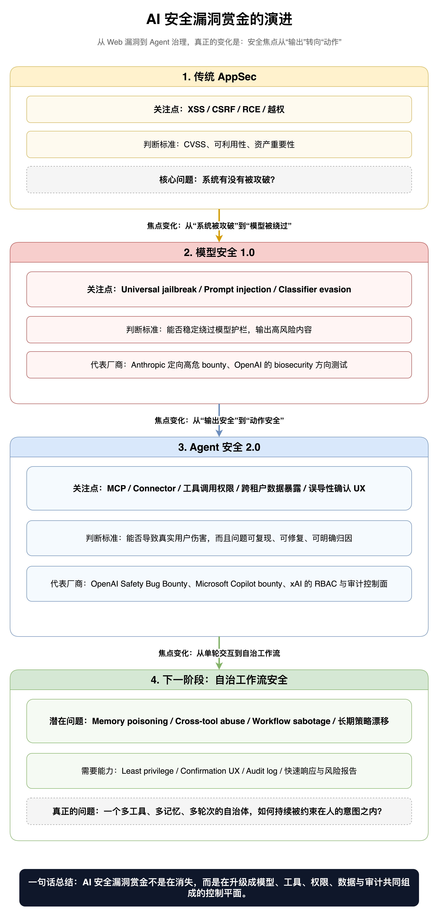

如果你还把 bug bounty 理解成 XSS、RCE、越权和提权，那你可能会错过一个很重要的行业信号。

**OpenAI 这次公开 Safety Bug Bounty，真正值得注意的，不是“又开了一个赏金计划”，而是它第一次用公开、可奖励、可复现的方式，把 AI 安全的问题边界画得非常清楚：什么是安全漏洞，什么不是；什么值得研究者投入，什么只是模型输出层面的抱怨；什么属于内容治理，什么已经上升为系统治理。**

这件事的分量并不只是 OpenAI 自己的动作。把它和 Anthropic、xAI、Microsoft 近两年的公开机制放在一起看，会看到一个非常明显的变化：

> AI 安全正在从“模型会不会说错话”，转向“系统会不会替用户做错事”。

这背后意味着，安全研究的主战场也在迁移：从 Prompt 和输出，迁移到 Agent、权限、外部工具、确认 UX、跨租户边界、可审计性，以及高风险场景下的持续响应机制。

## 一、先看 OpenAI 这次到底做了什么

OpenAI 官方在 **2026 年 3 月 25 日**发布了公开的 [Safety Bug Bounty](https://openai.com/zh-Hans-CN/index/safety-bug-bounty/)，定位上明确说它是对既有 Security Bug Bounty 的补充，面向的是“select safety and abuse issues”。

如果只看这句描述，你可能会觉得它有点抽象。但结合当前的 [Bugcrowd 项目页](https://bugcrowd.com/engagements/openai-safety) 来看，它其实已经非常具体了。

截至 **2026 年 4 月 1 日** 我整理本文时，Bugcrowd 公页能看到几组很关键的信息：

- 当前项目公开统计显示：**2 个 rewarded vulnerabilities**、**平均 payout 为 500 美元**、**validation within 9 days**。
- 当前项目的奖励分层对应区间为：**250-500 / 750-1500 / 2500-3500 / 5500-7500 美元**。
- 公开范围并不把“模型说了不该说的话”当作主要奖励对象，而是把注意力集中到 **Agentic Tools including MCP**、**OpenAI proprietary information**、**Account and Platform Integrity** 和 **Other Novel Abuse** 这几类问题。

这里的统计数字看上去并不夸张，甚至会让一些人误以为“这事没那么重要”。我倒不这么看。**我的判断**是：这更像是一个刚进入公开化阶段、范围刻意收紧、只奖励工程可闭环问题的早期信号，而不是风险本身很轻。换句话说，OpenAI 不是在用大数字制造声量，而是在先把问题类型定义清楚。

这里有一个值得特别指出的时间细节：

- OpenAI 官方文章的公开发布时间是 **2026 年 3 月 25 日**；
- 但 Bugcrowd changelog 预览里显示，这个 engagement 的 `startsAt` 是 **2025-07-29 18:00:00 UTC**。

**我的推断**是：相关计划在 Bugcrowd 侧可能有更早的运行或筹备期，而 **2026 年 3 月 25 日** 是 OpenAI 把它更正式地面向外界公开定义与阐释的时间点。无论如何，对外界来说，2026 年 3 月 25 日是这个项目被广泛看见的关键日期。

## 二、真正重要的，不是赏金额度，而是 OpenAI 在奖励什么

OpenAI 这次最有价值的地方，是它把“AI 安全漏洞”从一个模糊概念，压缩成了几类**可修复的系统问题**。

### 1. 它公开承认：Agent 才是新战场

Bugcrowd 页里最有信号量的一类，是 **Agentic Tools Including MCP**。

这不是一句普通的范围描述，而几乎是在公开宣告：

**AI 安全的下一阶段，不再只看模型本身，而要看模型接上工具、接上 Connector、接上 MCP、接上外部账号后，会不会越权、误用、误导和外泄。**

OpenAI 当前列入 in-scope 的点非常值得咀嚼：

- 通过第三方内容或间接 prompt injection，诱导 Agent 误用 Connector / MCP 工具；
- 越过用户、workspace 或 app integration 的权限边界访问数据；
- 在用户理解不足或确认被误导的情况下执行高影响动作；
- 借助 agentic 工具绕过平台控制，例如规模化创建账号。

这几条说明了一件大事：

**Prompt Injection 在 Agent 时代，不再只是“模型被绕过”这么简单，它会直接变成权限问题、数据问题、租户边界问题和用户授权问题。**

也就是说，过去很多人把 Prompt Injection 归类为“模型安全”或“对齐问题”；而在 OpenAI 这套定义里，只要它最终体现为真实可修复的系统风险，比如错误调用工具、错误导出数据、错误跨租户访问，那它就已经跨进了更传统、也更工程化的安全世界。

### 2. 它在给研究者划线：不要只交“截图”，要交“修得掉的漏洞”

OpenAI 的规则里还有一句很关键：

**报告必须能够通过清晰的 mitigation steps 来处理；它不奖励泛泛的产品改进请求。**

这句话听起来像常规要求，但放在 AI 安全语境里很不一样。

它的潜台词是：

- 我们不再把“模型有时会回答得不好”直接等同于安全漏洞；
- 我们更看重那种能够落到系统设计、权限模型、确认链路、集成逻辑上的具体缺陷；
- 一个问题要想进入赏金体系，必须具备**可验证、可复现、可定责、可修复**四个条件。

这其实是在把 AI 安全从“讨论伦理”和“展示奇怪输出”，推进到一个更成熟的工程阶段。

**换句话说，OpenAI 不是在收集截图，它在收集可以进入修复 backlog 的系统级缺陷。**

### 3. 它明确把“纯内容问题”排除在外

OpenAI 当前的 out-of-scope 也很鲜明：

- 单纯的内容问题；
- 模型生成了违规回答；
- 没有明确工程修复路径的泛化问题。

这件事非常重要，因为它实际上在重构“AI 安全研究”的激励方向。

过去很多公开讨论都围绕“模型有没有被越狱”“模型能不能输出危险内容”。但 OpenAI 这次公开赏金告诉大家：

**如果一个问题最终只是“模型输出不理想”，而不能沉淀成具体的权限缺陷、控制缺陷、确认缺陷、数据边界缺陷，那么它未必会被视为赏金意义上的安全漏洞。**

这是一个很大的范式变化。

它不是说内容安全不重要，而是说：

- 内容安全仍然重要；
- 但公开赏金更偏向奖励那种能产生明确修复动作的系统级问题；
- 至于更高风险、更难工程化的领域，则会转向更定向、更封闭的测试机制。

## 三、这背后真正的趋势：AI 安全正在从“输出安全”走向“动作安全”

把 OpenAI 这次 bounty 放大来看，你会发现它不是孤立事件，而是整个行业的共同收敛方向。

图里我想表达的核心很简单：

- 第一阶段，大家奖励的是传统 AppSec 问题；
- 第二阶段，大家开始奖励 universal jailbreak、prompt injection、classifier evasion；
- 第三阶段，真正的重心开始转向 Agent、MCP、确认链路、外部工具权限、跨租户暴露；
- 下一阶段，很可能是**自治工作流安全**：记忆污染、跨工具链滥用、长期策略漂移、workflow sabotage。

这里最本质的变化是：

**AI 系统的风险单位，正在从“一个回答”升级成“一个动作序列”。**

传统模型时代，风险的基本单位是单轮输入输出；
Agent 时代，风险的基本单位变成：

- 读取了什么数据；
- 是否看错了权限；
- 是否误解了用户确认；
- 是否把第三方不可信内容当成了高优先级指令；
- 是否在多步执行里逐步偏离了人类意图。

这就是为什么 MCP 会这么关键。

MCP 本质上让模型从“文本解释器”变成“外部系统的代理入口”。一旦模型可以代表你搜索、读取、发送、创建、更新、导出，它面临的就不再只是对齐问题，而是一个完整的**权限控制面**。

而 OpenAI 把 MCP 明确写进公开赏金范围，本质上是在说：

> AI 安全已经不是单点模型问题，而是一个跨模型、跨工具、跨权限、跨租户的系统性问题。

## 四、为什么说 OpenAI 的这一步，比表面看起来更深

很多人看到这类公告时，容易把它理解成“又一个安全 PR 动作”。

但如果你看得更深，会发现 OpenAI 这次实际做了三件更重要的事。

### 第一，它在公开定义“什么叫可验证的 AI 安全”

AI 安全里一直有个难题：很多问题你知道它危险，但很难把它转成一个工程团队可以处理的 ticket。

OpenAI 这次的做法，本质上是在说：

- 如果它能导致真实用户伤害；
- 如果它能稳定复现；
- 如果它能明确归因到产品设计、权限、确认、集成逻辑；
- 如果它能提出清晰修复建议；

那它就进入 bounty 的语言体系。

这是一种**工程可验证性筛选器**。

它会让研究者的提交逐渐从“看，这里又能绕”转向“看，这里存在一个可修复的系统边界失败”。

### 第二，它在把“安全”和“安全对齐”重新接到一起

过去一段时间，安全团队和对齐团队常常像在两个宇宙里说话：

- 安全团队讨论认证、权限、租户边界、审计日志；
- 对齐团队讨论 jailbreak、危险能力、拒答策略、内容过滤。

OpenAI 这次的 bounty 范围，实际上让这两个世界开始重叠。

比如第三方 prompt injection 导致 Connector/MCP 工具误用——这到底算安全问题还是对齐问题？

答案是：**已经不重要了。**

因为在 Agent 场景里，它同时是：

- 对齐失败；
- 意图识别失败；
- 权限系统失败；
- 用户确认失败；
- 外部数据边界失败。

**Agent 安全正在把“model safety”和“product security”重新熔到一起。**

### 第三，它在向市场发出一个清晰信号：公开项目负责广覆盖，私有项目负责深水区

OpenAI 官方页面同时提到，它还会保留围绕特定 harm types 的私有 bug bounty 活动；而公开搜索结果也能看到 OpenAI 针对 Biosecurity 的 GPT-5 bug bounty 等更定向项目。

这意味着什么？

意味着前沿厂商正在形成一套更分层的测试市场：

- **公开 Safety Bug Bounty**：负责发现大范围、可工程修复、适合公开提交的系统缺陷；
- **定向/私有高风险 bounty**：负责更难、更敏感、需要受控环境和特定研究者能力的前沿风险；
- **内部/外部 red teaming**：负责覆盖那些还不适合公开流程化的深层能力风险。

这其实很像传统安全世界里：

- 公共漏洞披露；
- 私密渗透测试；
- 高敏资产红队；

三者长期并存。

AI 安全不是在取代这套体系，而是在把它重新分层。

## 五、把 OpenAI 放到 Anthropic、xAI、Microsoft 里一起看，趋势就更清晰了

先给一个压缩版对比：

| 厂商 | 当前公开机制 | 主要奖励/关注对象 | 我看到的真正信号 |
|------|--------------|-------------------|------------------|
| OpenAI | Safety Bug Bounty + 既有 Security Bug Bounty + 定向高风险 bounty | Agent、MCP、权限、确认、平台完整性 | 从“模型输出”转向“系统动作” |
| Anthropic | Model Safety Bug Bounty + Public Vulnerability Reporting + RSP 3.0 | Universal jailbreak、ASL-3 biological concerns、分类器与快速修补 | 把 bounty 接进 frontier governance 闭环 |
| xAI | Public bug bounty / HackerOne + Security page + Frontier AI Framework | 企业控制面、日志、RBAC、least privilege、公开披露 | 先把可审计控制面做厚 |
| Microsoft | AI/Copilot bounty + AI bug bar / Online Services bug bar | 把 AI 风险纳入成熟漏洞分级体系 | AI 安全开始标准化、产品化、运营化 |

### 1. Anthropic：把高风险 universal jailbreak 做成了更垂直的“前沿风险市场”

Anthropic 这几年给出的信号，其实比很多人想象中更完整。

一方面，它在 **2024 年 8 月 8 日** 就公开宣布扩展 [Model Safety Bug Bounty](https://www.anthropic.com/news/model-safety-bug-bounty)，重点是寻找 **universal jailbreak**，尤其面向 **CBRN** 和 cyber 等高风险领域。

另一方面，Anthropic 当前帮助中心的 [Model Safety Bug Bounty Program](https://support.anthropic.com/en/articles/11380364-model-safety-bug-bounty-program) 页面已经显示，**base rewards 可达 35,000 美元**。而它的 [Public Vulnerability Reporting](https://support.anthropic.com/en/articles/11427875-public-vulnerability-reporting) 页面又明确接受 **ASL-3 uses of concern** 相关的 universal jailbreak 报告，特别提到生物威胁信息的诱导问题。

这和 OpenAI 的差别很有意思。

OpenAI 当前公开 Safety Bug Bounty 更像是在奖励“可落地修”的系统安全问题；
Anthropic 则把一部分更高危、更偏前沿能力边界的问题，做成了更定向、更高奖励、更有研究门槛的测试机制。

如果再往上接一层看 Anthropic 的 [Responsible Scaling Policy](https://www.anthropic.com/responsible-scaling-policy)，信号就更强了。

Anthropic 在 **2026 年 3 月 24 日** 更新页面，RSP 3.0 自 **2026 年 2 月 24 日** 起生效，并引入了 **Frontier Safety Roadmaps** 和 **Risk Reports**。更关键的是，RSP 里公开写到：新发现的 jailbreak、bug bounty 结果和 incident response 会反馈到分类器更新、快速修补和后续缓解策略里。

这说明 Anthropic 已经不把 bug bounty 仅仅看成“收漏洞”的表单，而是把它接进了整个 frontier governance loop：

- 发现问题；
- 分类评估；
- 快速修补；
- 更新部署缓解；
- 再进入风险报告与治理文件。

**这比单纯的“有赏金”更重要。它意味着赏金计划正在成为模型治理体系的一部分。**

### 2. xAI：更强调企业安全控制面，而不是先公开一套花哨的模型安全奖励分类

和 OpenAI、Anthropic 相比，xAI 在公开页面上释放的信号稍有不同。

根据 xAI 的 [Security 页面](https://x.ai/security/) 当前公开内容，漏洞可以通过 **HackerOne** 或 `vulnerabilities@x.ai` 提交，且所有报告都会通过其 public bug bounty program 跟踪。页面同时还公开强调了：

- **Role-Based Access Control**；
- **Audit Logging**；
- **90 天应用内 Audit Trail**；
- **180/365 天日志保留**；
- **least privilege / need-to-know**；
- SSO、日志监控、WAF、第三方渗透测试等企业控制。

与此同时，xAI 也已经对外发布了自己的 **Frontier AI Framework** 与相关 model card / 风险管理材料。

xAI 当前的公开打法，更像是在先把企业级控制面搭起来：

- 我有公开漏洞披露；
- 我有 bug bounty 路径；
- 我有日志、RBAC、SSO、访问控制；
- 我有对外可解释的 frontier framework。

这件事本身也说明一个趋势：

**对很多 AI 公司来说，真正的竞争不只是“模型有多强”，而是“控制面有多可审计”。**

谁能把最小权限、审计日志、访问监控、响应流程这些基础设施先做好，谁就更有可能承接企业和高敏场景的部署。

### 3. Microsoft：AI bounty 已经开始被标准化、产品化、分级化

Microsoft 的路线更像一个大型平台公司的典型做法。

它早在 **2023 年** 就推出了面向 AI Bing experience 的 [Microsoft AI Bug Bounty Program](https://msrc.microsoft.com/blog/2023/10/introducing-the-microsoft-ai-bug-bounty-program-featuring-the-ai-powered-bing-experience/)。随后在 **2025 年 2 月**，MSRC 又专门更新 [Copilot Bounty Program](https://msrc.microsoft.com/blog/2025/02/exciting-updates-to-the-copilot-ai-bounty-program-enhancing-security-and-incentivizing-innovation/)，把 Copilot 的漏洞奖励与 **AI bug bar** / **Online Services bug bar** 更紧密结合，并把中等严重度案例也纳入了激励范围。

Microsoft 这条线传达的信息是：

**AI 漏洞奖励不一定非得做成一个完全独立的新物种，它也可以被吸收到成熟的大厂漏洞分级、严重度分类和产品安全流程里。**

这会带来两个后果：

- AI 风险开始获得与传统在线服务漏洞类似的运营化处理方式；
- AI 安全不再是实验室特例，而会进入标准化的严重度、范围、奖励与修复体系。

## 六、把这些厂商放在一起，至少能看到 5 个明确趋势

### 趋势 1：从“模型是否违规”转向“系统是否越权”

这几乎是今天最重要的变化。

以前很多讨论围绕输出本身；现在更核心的问题是：

- 模型会不会调用不该调用的工具；
- 会不会读不该读的数据；
- 会不会在用户未充分理解时执行高影响动作；
- 会不会被第三方不可信内容劫持成一个越权代理。

AI 安全的核心对象，正在从 **response** 变成 **action**。

### 趋势 2：公开赏金越来越只奖励“工程上可闭环”的问题

OpenAI 明确要求可修复路径；Microsoft 把 AI 问题纳入 bug bar；Anthropic 对 universal jailbreak 设定更明确的目标和环境。

这意味着未来研究者更容易获得奖励的，并不是“这个模型很怪”，而是：

- 这个问题能被稳定复现；
- 这个问题能被明确归因；
- 这个问题能形成清晰修复动作；
- 这个问题能在产品与控制层真正降低风险。

AI 安全在变得越来越工程化，也越来越不欢迎纯表演型 PoC。

### 趋势 3：公开项目和私有项目会越来越分层

这是一个非常现实的产业结构变化。

- 广覆盖、相对低敏的系统问题，适合公开 bug bounty；
- 高风险、敏感、灾难性 misuse 场景，适合 invite-only、受控环境和定向研究者群体；
- 最深水的 frontier risk，往往要靠红队、合规治理、模型评估和风险报告共同承担。

所以未来不会只有“一个 bounty 解决所有问题”，而会是一个**分层测试组合拳**。

### 趋势 4：安全研究的价值正在从“找到绕过”转向“帮助建立控制面”

OpenAI 把确认 UX、权限边界、集成逻辑写进范围；xAI 公开 RBAC、日志与最小权限；Anthropic 把 bounty 输入接进 RSP 响应闭环。

这意味着：

**研究者最有价值的提交，不再只是证明 guardrail 能被破，而是帮助厂商明确应该在哪一层加控制：模型层、策略层、工具层、权限层、确认层还是审计层。**

这其实是在帮整个行业建设 AI 的“零信任控制平面”。

### 趋势 5：MCP / Connector / 外部工具生态会成为未来 12-24 个月的主战场

这一点我几乎可以下一个明确判断。

未来 12 到 24 个月，最值得关注的 AI 安全问题，不太可能只是“模型还能不能被越狱”，而更可能是：

- MCP server 权限注解是否真实可信；
- Connector 读取范围是否过宽；
- 用户确认是否足够具体；
- Agent 对第三方内容的信任边界是否错误；
- 多工具编排时是否会出现跨系统的数据拼接与越权动作；
- 审计日志能否还原整个动作链。

换句话说，**AI 安全会越来越像身份系统、数据系统和工作流系统的联合安全。**

## 七、如果你是做 AI 产品的，这篇文章真正想提醒你什么

如果你是模型公司、Agent 平台、企业 Copilot 团队，或者做 MCP / Connector 生态的开发者，我觉得至少有四件事现在就该做。

### 1. 不要再把“安全”理解成单一的内容过滤

内容过滤当然重要，但它只是一层。

真正的风险更可能发生在：

- 工具调用授权；
- 外部数据接入；
- workspace / tenant 边界；
- 用户确认和意图表达；
- 事后可审计性。

### 2. 把 Prompt Injection 当成权限攻击来建模

在 Agent 场景里，Prompt Injection 已经不只是文本对抗，而是**权限代理劫持**。

如果你的系统能调用工具，最少也要建立：

- 工具级最小权限；
- 高风险动作二次确认；
- 对外部不可信内容的来源标记；
- 明确的执行审计日志；
- 对跨租户/跨 workspace 的硬隔离。

### 3. 提前把“公开 bounty”和“私有高风险测试”分开设计

不要等到出大问题才想起要做安全研究者合作。

一个更现实的策略是：

- 公开项目负责工具权限、数据暴露、确认链路、平台滥用等问题；
- 私有项目负责更敏感、更高风险的 misuse 场景；
- 内部 red team 则专门覆盖公开流程难以承接的深水区。

### 4. 安全控制面必须能被外界理解

未来企业客户和监管更关心的，不只是“你有没有 guardrail”，而是：

- 你有没有 RBAC；
- 你有没有 audit log；
- 你怎么做 least privilege；
- 你怎么做安全事件响应；
- 你怎么处理研究者披露；
- 你怎么把新发现的问题反馈回产品和模型治理。

没有这些，可解释性就会停留在 PPT 上。

## 八、最后的判断：AI 安全，正在进入“可支付、可验证、可运营”的阶段

我认为 OpenAI 这次 Safety Bug Bounty 最重要的意义，不在于金额，也不在于它是不是第一个。

它真正重要的地方在于：

**它让 AI 安全第一次以一种更成熟的工程语言被公开表达出来。**

这个语言不是“模型有多聪明”，也不是“模型有多听话”，而是：

- 哪些风险可复现；
- 哪些风险可归因；
- 哪些风险可修复；
- 哪些风险需要公开处理；
- 哪些风险必须进入更高等级的私有测试与治理体系。

这意味着 AI 安全正在离开“概念争论期”，进入一个新的阶段：

> **它开始变成一种可以付费采购、可以持续运营、可以被研究社区协同推进的安全能力。**

而一旦行业进入这个阶段，接下来的竞争就不只是模型能力之争，而会越来越变成：

**谁能更快构建出一套覆盖模型、工具、权限、数据、确认、审计与响应的完整 AI 安全控制平面。**

我觉得，这才是 OpenAI 这次 Safety Bug Bounty 真正应该被看见的地方。

---

## 参考资料

- OpenAI: [Safety Bug Bounty](https://openai.com/zh-Hans-CN/index/safety-bug-bounty/)
- Bugcrowd: [OpenAI Safety Bug Bounty Engagement](https://bugcrowd.com/engagements/openai-safety)
- OpenAI: [Expanding on our approach to biosecurity](https://openai.com/index/expanding-on-our-approach-to-biosecurity/)
- Anthropic: [Expanding our model safety bug bounty program](https://www.anthropic.com/news/model-safety-bug-bounty)
- Anthropic Help Center: [Model Safety Bug Bounty Program](https://support.claude.com/en/articles/12119250-model-safety-bug-bounty-program)
- Anthropic Help Center: [Public Vulnerability Reporting](https://support.claude.com/en/articles/11427875-public-vulnerability-reporting)
- Anthropic: [Responsible Scaling Policy](https://www.anthropic.com/responsible-scaling-policy)
- xAI: [Security](https://x.ai/security/)
- xAI: [Frontier Artificial Intelligence Framework](https://data.x.ai/2025-12-31-xai-frontier-artificial-intelligence-framework.pdf)
- Microsoft MSRC: [Introducing the Microsoft AI Bug Bounty Program featuring the AI-powered Bing experience](https://msrc.microsoft.com/blog/2023/10/introducing-the-microsoft-ai-bug-bounty-program-featuring-the-ai-powered-bing-experience/)
- Microsoft MSRC: [Exciting updates to the Copilot (AI) Bounty Program](https://msrc.microsoft.com/blog/2025/02/exciting-updates-to-the-copilot-ai-bounty-program-enhancing-security-and-incentivizing-innovation/)
