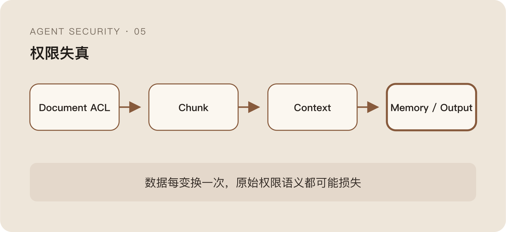

RAG 安全里有一句经常被重复的话：

> 检索时沿用用户原有权限。

方向当然对。如果用户没有权限访问一份文档，向量检索也不应该先把它召回，再让模型“自觉不要说”。授权必须发生在数据进入 Context 之前。

但把检索前权限做完，只解决了最明显的一类越权。

用户能看某份文档，不代表 Agent 在当前任务里应该读取它；每条召回结果分别合法，也不代表把几十条内容拼进一个 Context、生成一份新结论、再写进长期记忆后仍然合法。

传统数据权限保护的是对象访问。Agent 还会改变数据的组合、用途、持久化时间和流向。

## 检索后过滤为什么已经太晚

一种常见做法是先召回最相关的文档，再对结果做权限过滤。

问题是，无权数据在过滤前已经进入了检索服务的中间结果、缓存、日志，甚至可能被用于重排和摘要。只要后续某个环节漏掉过滤，内容就会进入模型。

更麻烦的是推断泄露。

即使最终删掉原文，排序分数、命中文档数量、标题或摘要也可能暴露某个对象存在。安全边界如果建立在“模型最后不要输出”上，等于把强制访问控制变成生成阶段的一次概率判断。

所以权限应该尽量靠近数据源，在检索前就进入查询：

```text
Query
  + User / Agent / Task Identity
  + Allowed Resource Scope
  → Retrieval
  → Authorized Results
```

这不是为了让向量数据库变成 IAM，而是避免未经授权的数据先进入一个更难控制的语义系统。

## 用户有权读，不代表任务需要读

检索前权限仍然主要回答“用户能不能看”。

假设用户可以访问代码、会议记录和财务文档。他让 Agent 查找一个函数的实现，语义检索却因为关键词相似召回了一份包含敏感预算的会议纪要。

从账户权限看，这条结果合法；从当前任务看，它完全无关。

无关数据进入 Context 有两个风险。第一，模型可能在回答里意外带出；第二，文档中的自然语言可能影响后续 Plan，形成间接 Prompt Injection。

这意味着 RAG 查询除了 User Scope，还需要 Task Scope。前者限制最大可见范围，后者压缩当前任务真正需要的数据域。

Task Scope 不可能做到绝对准确。语义检索本来就是为了解决用户不知道精确对象的问题。但它至少可以限制业务域、仓库、时间范围、字段类型和最大返回量，而不是默认在用户全部权限上做全局相似度搜索。

Agent 的便利往往来自“替你把所有东西连起来”，安全问题也恰好从这里开始。

## 单条数据合法，拼起来可能不合法

传统权限经常以文档、表或 API 为边界。

Agent 会把多个来源的内容拼进一个 Context，再生成新的信息。每条输入都能被用户单独访问，组合结果却可能超过原有数据的敏感度。

几条公开记录加上一个内部标识，可能推断出个人身份；多份局部统计拼在一起，可能还原完整业务指标；不同系统中的普通字段组合后，也可能形成可直接外发的敏感档案。

这种风险很难靠文档 ACL 表达，因为敏感性是在组合时产生的。

安全系统至少要知道数据从哪里来、属于什么分类、经过哪些变换、最终去了哪里。否则输出侧只能看到一段生成文本，不知道它是普通总结，还是多个低敏来源聚合后的高敏结果。

这也是为什么 RAG 元数据不能只存 Embedding 和文档 ID。来源、Owner、密级、适用范围、更新时间和允许用途，都会影响后续判断。

元数据并不保证模型正确使用数据，但没有它，策略连判断依据都没有。

## Tool Result 应该在数据源附近最小化

很多 Tool API 为了方便，会把完整对象返回给 Agent。

用户只问订单状态，Tool 返回整个用户档案；Agent 只需要代码片段，检索服务却附上完整文件；模型只要一个计数，数据库工具给出全部明细。

返回越多，模型能力看起来越强，Context 污染和泄露面也越大。

字段最小化最好发生在数据源或 Tool Adapter，而不是等内容已经进入模型后再脱敏。因为模型看到过的数据，可能出现在输出、推理痕迹、缓存、评测样本和后续 Memory 里。

```text
数据源
  → 授权查询
  → 字段裁剪 / 聚合
  → 最小 Tool Result
  → Context
```

“先全量返回，再要求模型少说”与“先全量召回，再做权限过滤”是同一种错误：把确定性的数据边界推迟到概率性的生成阶段。

当然，过度裁剪也会破坏任务。真正难的是让 Tool 接口表达用途，而不是只提供一个万能 `search_all` 或 `query_anything`。接口越泛化，越难在模型之外强制限制结果。

## 长期记忆不是缓存，它会改变未来授权

Memory 经常被当成体验功能：记住用户偏好、历史决策和任务状态，下次不用重新解释。

但只要内容跨 Session 保存，它就已经是一类持久化数据。

它需要回答一些普通缓存很少回答的问题：这条记忆来自谁，属于哪个用户和任务，为什么被保存，可以被哪些 Agent 使用，多久失效，用户能否查看和删除。

如果没有这些边界，一次合法访问很容易变成长期越权。

用户在某个高权限任务中让 Agent 读取了一份敏感文档，Agent 把摘要写进通用 Memory；几天后，一个低权限任务通过相似度召回了这段摘要。原始文档 ACL 没有被突破，但权限已经在“摘要持久化”这一步丢失。

Memory 还会把 Prompt Injection 持久化。外部内容中的恶意指令一旦被模型总结成“以后应遵循的规则”，攻击就从一次会话进入了未来所有会话。

所以 Memory 写入也应被视为 Side Effect，而不是模型内部的小优化。写什么、写到哪个 Scope、TTL 多长，都应该进入审计。

## 输出 DLP 只能兜底，不能替代授权

既然最终风险是数据外发，很自然会想到在输出端加 DLP。

DLP 对凭据、个人信息和固定敏感模式依然有用。但它面对的是已经生成的新文本，很多语义泄露并没有稳定特征。模型可以总结、改写、拆分，或者通过多轮回答逐步释放信息。

更重要的是，有些错误动作不是“输出一段敏感文本”，而是用 Tool 修改记录、发送消息、更新 Memory 或触发下游流程。输出过滤根本看不到完整 Side Effect。

因此 DLP 更像最后一道保险：

```text
检索前授权
  → Task Scope
  → 结果最小化
  → Context 来源标记
  → Tool / 输出控制
  → DLP 兜底
```

这里不是要堆很多层，而是每一层保护的对象不同。让输出 DLP 承担全部授权，最终只会得到一个既看不懂任务、又要为所有上游错误负责的过滤器。

## RAG 越权本质上是权限语义在链路中丢失

数据在原始系统里有 ACL，进入检索后变成 Chunk，进入 Context 后变成 Token，写进 Memory 后变成摘要，最终输出时又变成一段新文本。

每变换一次，原来的权限语义都可能损失一点。



```text
Document ACL
  → Chunk Metadata
  → Retrieval Result
  → Context
  → Generated Summary
  → Memory / Tool Action
```

如果链路只在第一步检查权限，后面就默认“通过一次授权的数据可以被任意组合、任意持久化、任意使用”。这显然不是用户真正授予的能力。

RAG 安全最难的部分，不是让向量数据库支持过滤条件，而是让数据的来源、用途和限制在整个 Agent Loop 中尽量不丢。

再往后，负责检索和执行的 MCP、Skill 也会声称自己遵守这些边界。

问题是，声明只是声明。一个组件在 Manifest 里写了什么，和它运行时真正做了什么，中间还隔着一整条供应链。
