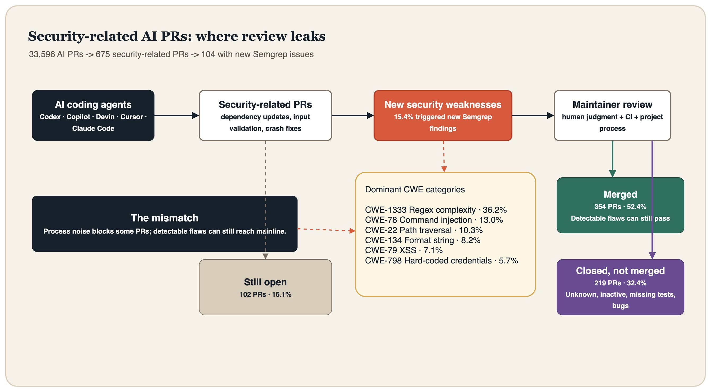

AI coding agent 正在进入开源软件的日常维护流程。它们不再只是补全一行代码，或者在 IDE 里建议一个函数签名，而是开始生成完整提交、打开 Pull Request、等待 CI、回应审查，甚至尝试修复安全问题。

这听起来像一件好事。安全修复通常缺人、缺时间、缺上下文。一个能自动提交补丁的 agent，理论上可以缩短漏洞暴露窗口，替维护者处理大量重复工作。

但论文 [Insights into Security-Related AI-Generated Pull Requests](https://arxiv.org/abs/2604.19965) 给出的现实更冷一些：**AI 确实在提交安全相关 PR，但这些 PR 自身也会引入新的安全缺陷；更麻烦的是，现有审查流程并没有稳定地把高风险缺陷和低价值流程噪声区分开。**

这篇论文发表于 2026 年 4 月 21 日，作者基于 AIDev 数据集分析了 `33,596` 个 AI 生成 PR，并最终筛出 `675` 个 security-related AI PR。研究覆盖的 agent 包括 OpenAI Codex、GitHub Copilot、Devin、Cursor 和 Claude Code。

它的重要性不在于又证明了“AI 会犯错”。这个结论太便宜。真正有价值的是，它把 AI coding agent 放回了真实开源工程流：PR 会不会被合并？审查要多久？缺陷集中在哪些类型？被拒绝时维护者到底说了什么？

换句话说，这不是一个 benchmark 故事，而是一个供应链入口的故事。

## 一、论文到底研究了什么

作者先从 AIDev 数据集中筛选出 GitHub star 数超过 `100` 的仓库，再提取其中由 AI agent 创建的 PR，共得到 `33,596` 个 AI-generated PR。

接下来，他们用安全关键词做第一轮过滤。关键词包括 CVE、CWE、vulnerability、XSS、SQLi、injection、CSRF、RCE、path traversal、race condition、sanitize 等强安全词，也包括 fix、patch、resolve、mitigate 这类通用修复词。为了降低误报，通用修复词只有在和强安全词接近出现时才计入。

这一步得到 `1,047` 个候选安全相关 PR。随后作者使用 Gemini 2.0 Flash 对 PR 标题和正文做二次判定，最终得到 `675` 个 security-related AI-generated PR。

这 `675` 个 PR 的状态分布很有意思：

- `354` 个已合并，占 `52.4%`；
- `219` 个关闭但未合并，占 `32.4%`；
- `102` 个仍处于 open 状态，占 `15.1%`。

也就是说，安全相关 AI PR 并不是被开源社区一概拒绝。超过一半进入了主线或默认分支附近的工程现实。问题随之变得更具体：这些被合并的代码，到底可靠吗？

## 二、最刺眼的发现：15.4% 的安全 PR 引入了新安全告警

作者用 Semgrep 对每个 PR 做了差分扫描：先扫描 PR 前的 baseline commit，再扫描 PR 引入后的版本，只统计 PR 版本中新出现的安全问题。

结果是：`675` 个安全相关 AI PR 中，有 `104` 个引入了至少一个新的 Semgrep 告警，占 `15.4%`。总告警数为 `853` 个。受影响 PR 的告警中位数是 `3` 个，最高的一个 PR 达到 `109` 个告警。

这里需要谨慎解释。Semgrep 告警不等于可利用漏洞，静态分析会有误报，也会漏报。论文自己也把这一点列为有效性威胁。但作为一个大规模横向信号，它已经足够说明问题：**AI 生成的安全补丁，并不天然比普通代码更安全。它们也可能在修一个洞时，顺手开出另一个洞。**

更具体地看，告警高度集中在少数 CWE 类型：

- `CWE-1333`，低效正则表达式复杂度，占 `36.2%`；
- `CWE-78`，OS command injection，占 `13.0%`；
- `CWE-22`，path traversal，占 `10.3%`；
- `CWE-134`，externally-controlled format string，占 `8.2%`；
- `CWE-79`，XSS，占 `7.1%`；
- `CWE-798`，hard-coded credentials，占 `5.7%`。

前六类加起来超过全部发现的 `80%`。

这组分布很像当前 AI 代码生成的盲区画像。AI 很容易写出“看上去合理”的字符串处理逻辑：拼 shell command、拼 SQL、拼路径、拼正则、拼 HTML。它也很容易在局部上下文里给出能跑的代码，却没有充分处理输入边界、执行环境和复杂度攻击。

尤其是 `CWE-1333` 的比例很高，值得单独看。低效正则通常不像 command injection 那样醒目。它不会在代码审查里以“危险函数调用”的形态跳出来，而是藏在一个看似普通的 pattern 里。对 agent 来说，正则是高频生成对象；对攻击者来说，ReDoS 是一种低成本放大器；对维护者来说，它又经常不是第一优先级。于是它刚好落在审查盲区里。

## 三、最反直觉的地方：有缺陷的 PR 仍然会被合并

如果审查系统足够敏感，那么带有明显静态分析告警的 PR 应该更容易被拒绝。论文的结果没有这么简单。

不同 agent 的表现有差异。例如 Copilot 的 rejected PR 中告警集中度较高，尤其是正则复杂度、命令注入和硬编码凭证。Cursor 的 open PR 中有问题的比例较高。Devin 的 accepted PR 中则经常出现 path traversal 和 XSS。Claude Code 的规模较小，但 accepted PR 中也出现了日志敏感信息泄露和 SSRF 等问题。OpenAI Codex 的整体告警比例相对较低，但 accepted PR 中仍有 path traversal、unsafe reflection、eval injection 等类型。

论文没有把这些观察解释成某个 agent “更安全”或“更危险”的排行榜，这一点是对的。因为数据受仓库类型、任务类型、提交时间、审查风格和样本规模影响很大。但它暴露了一个更普遍的问题：

**维护者审查 AI PR 时，未必能稳定捕捉那些机器本来就能捕捉的安全模式。**

这是一种尴尬的错位。AI 写出了可被静态分析发现的问题，人类审查没有挡住；另一边，许多 PR 又不是因为清晰的安全风险被拒绝，而是因为流程、测试、项目活跃度或反馈缺失而消失。

开源维护流程原本就是不完美的。AI agent 的加入没有自动修复这种不完美，反而把它放大了：提交数量可以自动化，审查瓶颈不能自动化；代码生成可以规模化，信任建立不能规模化。

## 四、PR 会不会被接受，很多时候不是由“安全性”直接决定

论文的第二个研究问题分析了哪些因素影响 PR 审查延迟和接受结果。

对 review latency 来说，几个因素显著缩短审查时间：

- requester 过去参与 review 的次数更多；
- requester 过去的成功率更高；
- 项目整体 PR merge rate 更高；
- 项目配置了 CI；
- first-time contributor 的 PR 反而处理更快。

几个因素会拉长审查：

- PR 描述中 hashtag 更多；
- 评论数更多，说明讨论更复杂；
- 仓库 star 更多；
- CI 运行时间更长；
- PR 包含测试代码。

对 acceptance 来说，最强的信号仍然是社会与项目层面的：requester 成功率、项目整体 merge rate、requester 过去参与 review 的数量、评论互动等。项目 open PR 数越多，接受概率越低。描述中 hashtag 越多，接受概率也越低。

最值得注意的是：**包含测试代码反而和更低的合并概率相关**，论文给出的 odds ratio 是 `0.51`。这不一定说明“写测试不好”，更可能说明 AI 生成的测试经常无法提供维护者真正需要的信心：测试可能噪声高、覆盖点不对、与项目习惯不一致，或者只是让审查者意识到改动比表面更复杂。

这对 agent 产品设计是个提醒。未来的 coding agent 不应只在 PR 里附上一些看似勤奋的测试文件，而应该提供更结构化的证据：哪些测试被运行、覆盖了哪个风险点、哪些边界没有覆盖、为什么这个修复不会引入回归。

安全 PR 的审查不是看“有没有测试”，而是看“测试是否构成可信证据”。

## 五、commit message 质量没有想象中重要

在人类提交的 PR 研究里，commit message 往往很重要。一个好的 message 不只是说改了什么，还要解释为什么改。论文复用了 C-Good 模型，判断 commit message 是否同时包含 `What` 和 `Why`。

结果有点冷：在 AI 安全 PR 里，更高质量的 commit message 并没有稳定提高接受率，也没有明显缩短审查时间。

整体上，包含 What 和 Why 的高质量 message 对应的接受率是 `45.6%`，低质量 message 的接受率反而是 `58.0%`。审查延迟也差别很小：高质量 message 平均关闭时间 `4.31` 天，中位数 `0.90` 天；低质量 message 平均 `4.46` 天，中位数 `1.48` 天。

这不意味着 commit message 没用。更合理的解释是，维护者面对 AI PR 时，对 message 的信任权重下降了。

人类写出清楚的 rationale，往往意味着作者理解项目上下文；AI 写出清楚的 rationale，可能只是语言模型擅长生成解释。解释变得廉价以后，解释本身就不再足以建立信任。

这也是 AI coding agent 的一个结构性问题：它们最擅长生成“看起来像理由”的文本，但开源维护者真正需要的是可验证的理由。未来 agent 的 PR 描述可能需要从 prose 转向 evidence：命令输出、测试日志、威胁模型片段、差分扫描结果、回滚影响、兼容性说明。

## 六、为什么 AI 安全 PR 会被拒绝

论文分析了 `219` 个 closed but not merged 的 PR，并给出拒绝原因分类。

最常见的类别不是“代码有安全漏洞”，而是 `Unknown`，占 `38.8%`。也就是 PR 被关闭了，但没有明确解释。第二名是 inactive，占 `12.3%`，通常是 stale bot 或长期无人响应导致关闭。

更具体的技术或质量原因包括：

- 引入 bug 或破坏 API，占 `10.5%`；
- 设计不佳，占 `5.9%`；
- 没有增加实际价值，占 `5.5%`；
- 已被其他方案实现，占 `5.0%`；
- 测试失败或覆盖不足，占 `4.1%`；
- 代码风格或格式问题，占 `3.7%`；
- 明确不信任 AI-written code，占 `1.8%`。

这个分布很有现实感。维护者不是在一个理想化的安全审查实验室里工作。他们面对的是 stale bot、CI 队列、积压 issue、项目路线、贡献者信誉、测试维护成本和上下文切换。AI PR 被拒绝，很多时候不是因为它触发了某个明确的 CWE，而是因为它没有顺利穿过开源项目的社会机器。

论文还观察到，不同 agent 的拒绝模式不同。Copilot 的拒绝更多涉及 bug、API 破坏和无价值改动；Devin 更容易遇到 inactive；Cursor 的 rejected PR 中 bug/API break 占比很高；Codex 的拒绝中无反馈比例最高。

这说明 agent 改进不能只盯模型能力。一个更好的安全 coding agent 至少要会做三件事：选择还活跃且愿意接收外部贡献的仓库；在提交前做足自检；把改动的安全动机、测试证据和风险边界以维护者可消费的形式交出来。

## 七、这篇论文的局限

这篇论文是 high-signal，但不能过度解读。

第一，安全相关 PR 的识别依赖关键词和 Gemini 标注。作者做了人工抽样验证，但人工验证只覆盖最终 `675` 个 PR，没有覆盖被筛掉的候选，因此更能控制 false positive，不能充分估计 false negative。

第二，Semgrep 是单一静态分析工具，且使用默认规则。它的发现不能等同于真实可利用漏洞，也不能覆盖所有安全类型。论文结果更适合作为“可检测风险分布”，而不是“真实漏洞率”。

第三，数据来自 GitHub star 超过 `100` 的开源仓库，并且限于 2025 年 8 月前的 AIDev 数据集版本。agent 行为和维护者态度都在快速变化，未来数据可能不同。

第四，回归分析描述的是相关性，不是因果关系。比如“包含测试代码”和“更低接受率”相关，不代表测试导致拒绝；也可能是复杂、高风险、争议性更大的 PR 更倾向于包含测试。

这些限制不削弱论文的核心价值。它的价值不是给出一个永恒比例，而是把 AI security PR 从宣传语带回了工程证据。

## 八、对安全团队和开源维护者的启示

如果你的团队已经允许 AI agent 提交安全相关改动，最危险的默认假设是：既然它是“安全修复 PR”，风险就低于普通功能 PR。

论文显示，这个假设站不住。安全修复是高敏感小改动，正因为小，才容易让审查者放松；正因为敏感，才更需要额外证据。

比较务实的做法包括：

1. 对 AI 生成的安全 PR 强制运行差分静态分析，不只看全量扫描结果，而要看 PR 新引入的问题；
2. 对字符串拼接、路径处理、shell 调用、SQL 构造、正则表达式、HTML 输出编码设置专门审查清单；
3. 要求 agent 在 PR 描述中提供测试证据，而不是只生成自然语言 rationale；
4. 对 AI 生成测试保持怀疑，重点看测试是否覆盖漏洞触发条件和回归边界；
5. 对被关闭的 AI PR 记录结构化原因，至少区分 risk、test、design、inactive、duplicate、style；
6. 不要把 commit message 的流畅程度当作理解能力证明。

对 agent 构建者来说，论文更像一张产品路线图。下一代安全 coding agent 不能只优化“能不能生成 patch”，还要优化“能不能提交一个可审查、可验证、可拒绝后学习的 patch”。

真正的能力不只是写代码，而是降低维护者判断成本。

## 九、结语：AI 安全 PR 的问题，不只是 AI 的问题

这篇论文最冷的一点，是它没有给出一个简单反派。

AI agent 会引入正则复杂度、命令注入、路径遍历、XSS 和硬编码凭证等问题。维护者有时会漏掉这些问题。另一些 PR 又会因为无反馈、inactive、缺测试、风格问题或项目流程被关闭。commit message 写得更像人，也不一定更有用。

这不是“AI 不可靠”这么简单。它说明现有开源审查流程原本就依赖大量隐性信任、社会信号和维护者经验。AI agent 加入以后，这套系统开始遇到一种新型输入：数量更大、解释更流畅、作者身份更模糊、局部正确性更强、上下文责任更弱。

安全 PR 原本应该降低风险。AI 让它们变得更便宜，也让它们变得更需要审查基础设施。

最后可以把这篇论文的结论压缩成一句话：

**AI coding agent 不是不能写安全补丁，而是我们还没有足够好的机制，判断哪些 AI 安全补丁真的安全。**

这才是开源供应链接下来要面对的麻烦。

## 参考资料

- Md Fazle Rabbi, Asif K. Turzo, Arifa I. Champa, Minhaz F. Zibran. [Insights into Security-Related AI-Generated Pull Requests](https://arxiv.org/abs/2604.19965), arXiv:2604.19965, 2026-04-21.
