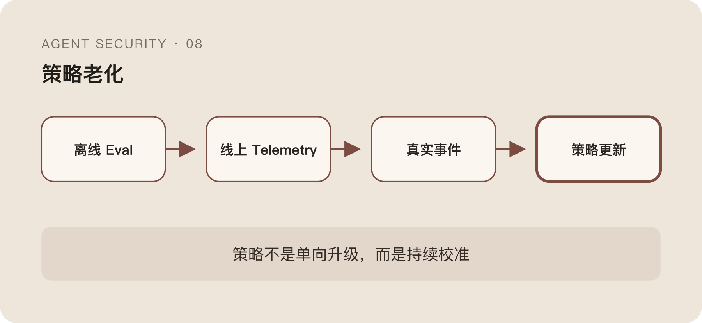

安全策略第一次上线时，往往表现最好。

规则来自最近的攻击样本，分类器用的是刚整理的数据，Tool Schema 和 Runtime 版本都对得上，误报也经过一轮人工调试。看板上的命中率、确认率和延迟都很漂亮。

几周以后，事情开始变化。

模型升级了，同样的任务换了一种规划方式；Tool 新增参数，原来的 Capability 映射不再完整；正常用户学会绕开频繁确认；攻击者也知道哪些表达会触发检测，开始退避、改写和拆分动作。

策略文件可能一行没变，保护对象已经不是原来的系统。

Agent 安全最难运营的地方，不是第一版规则不够多，而是所有判断都建立在一个持续变化的行为分布上。

## 正常行为本身会漂移

传统基线检测至少可以假设一段时间内，服务进程、网络目标和调用路径相对稳定。

Agent 的正常行为变化更快。

换一个模型，Plan 长度、Tool 选择和重试方式都会改变；Prompt Template 调整，Context 结构也会变化；新增一个 Skill，原本不常见的命令突然变成高频；Runtime 从串行改成并行，事件节律和进程树都会变。

昨天的异常可能是今天的新功能。

如果 Drift 只学习历史频率，它会把模型升级后的正常动作大量标红；如果为了降误报迅速放宽阈值，又可能把攻击行为一起放过去。

所以策略版本不能只绑定规则版本，还要绑定它所适用的模型、Runtime、Tool 和配置环境。没有这个上下文，指标变化时很难知道是风险上升，还是系统换了分布。

## 攻击者会针对你的信号调整节奏

第一代 Drift 常用一个很好理解的信号：被拒绝后快速重试。

Agent 刚刚尝试读取凭据，被 Block 后立刻换路径、换编码、换 Tool 再试一次，这种连续行为确实比单条调用更可疑。

一旦检测公开或被多次试探，绕过也很直接。

攻击者可以插入无关步骤，等待更长时间，改写目标描述，把动作拆到多个 Session，或者让不同 Sub-agent 分别完成收集和外发。单次会话里的 Retry 次数恢复正常，完整攻击链却没有消失。

这说明信号永远只是对已知行为的压缩。

“立即重试”不是攻击本质，只是某一阶段攻击者还没有隐藏的物理表现。安全系统如果把观察到的表现直接写成长期定义，最终一定会被绕过。

更稳妥的做法是保留信号来源和适用假设。某条规则为什么存在、依赖什么行为、已知绕过是什么，都应该和规则本身一起版本化。否则几个月后只剩一个没人敢删的神秘分数。

## 用户也会被策略训练

安全系统不只观察用户，也在改变用户行为。

如果 Confirm 太多，用户会形成条件反射，没读提示就点击允许；如果同一种合法任务不断被 Block，用户会寻找旁路，换一个不受控 Tool 或直接关闭插件；如果 Audit 结果从来没人处理，开发者也会默认告警没有实际后果。

策略因此可能出现一种很讽刺的“指标优化”。

确认通过率越来越高，看起来用户认可决策；实际上用户只是学会了无脑通过。拦截量下降，看起来风险减少；实际上任务迁移到了系统看不见的路径。

因此不能只看策略命中了多少，还要看它把行为推向了哪里。

一次 Confirm 的价值，不在弹窗出现过，而在用户是否获得了足够信息做判断；一次 Block 的价值，也不在阻断成功，而在同类任务是否转入了更安全的路径，而不是彻底绕开控制。

## 线上反馈不是天然的 Ground Truth

动态免疫听起来很诱人。

从攻击会话中提取 Signature，下次命中时提高 Drift；把用户确认结果、人工研判和真实事件持续送回系统，策略就能越用越聪明。

问题是，反馈本身也会错。

用户点击 Allow 可能只是嫌提示麻烦，不代表动作安全；分析人员关闭告警可能因为证据不足，不代表它是假阳性；某次事件中出现的命令可能只是伴随信号，不是攻击原因。

如果直接把这些结果当标签，系统会学习组织的操作习惯，而不是学习风险。

攻击者还可以主动污染反馈。反复制造低风险相似行为，让系统逐渐降低某个 Pattern 的权重；或者诱导用户多次批准，再在相同外观下混入真正高风险动作。

所谓“抗体”如果没有来源、置信度和失效时间，很快会变成另一份不可解释的黑名单。

## Signature 不应该脱离行为链

从事件中提取一个域名、一条命令或一段文本，适合快速阻断完全相同的重复攻击。

但 Agent 攻击的关键经常不在单个字符串，而在关系：

```text
任务要求 A
  → 不可信内容引入 B
  → Tool 读取与 A 无关的数据 C
  → 结果流向外部 D
```

只记住 D 的域名，换域名就失效；只记住读取路径，换一份凭据就失效；只记住注入语句，改写表达就失效。

更有价值的 Signature 应尽量保留行为结构，例如“低信任内容触发任务外数据读取，并在短链路内产生外部 Side Effect”。它仍然会被绕过，但迁移性比字符串高。

结构化 Signature 也更贵。它需要跨层关联和上下文，无法全部放进 Hot Path。比较现实的方式是慢路径提取结构，快路径只使用能够被压缩和解释的局部信号。

## Eval 和线上观测必须互相喂数据

离线 Eval 可以稳定复现已知攻击，比较模型、策略和 Runtime 版本之间的变化。

它的问题是环境太干净。固定数据集不会主动适应防御，工具和权限也经常被简化，测试通过不代表真实链路不会出现新的组合。

线上观测拥有真实分布，却缺少完整标签。大部分行为没人知道绝对正确与否，很多风险也只有事故发生后才被确认。

两者应该形成回路：



```text
离线攻击与回归
  → 上线门槛
  → 线上 Telemetry
  → 人工研判与真实事件
  → 新的 Eval Case
```

这条回路最有价值的产物，不是一个永远上涨的总分，而是一组能够重复运行的失败案例。

一次线上问题如果只变成新规则，它可能很快被同类改写绕过；如果同时沉淀原始 Context、Task、Tool Chain、Runtime Fact 和期望决策，就能在模型、Tool 和策略升级时持续回归。

当然，真实数据进入 Eval 也要脱敏和限制访问。为了复现数据泄露而永久保存泄露内容，本身又会制造新的数据风险。

## 策略应该允许退回 Audit

策略演化不总是越来越严。

模型或 Tool 版本变化后，一条原本准确的 Block 规则可能突然产生大量误报。此时继续强制执行，只会训练用户绕过；直接删除，又会失去观察。

把它退回 Audit 或 Confirm，重新收集分布，往往比硬扛更合理。

```text
Audit → Confirm → Block
Block → Confirm → Audit
```

策略状态应允许双向变化。

安全团队很容易把“从 Block 降级”理解成防护倒退，但无法解释的强阻断并不比可观测的弱控制更高级。控制强度应该跟证据置信度、影响范围和当前分布匹配。

同样，例外也不应永久存在。一次为解决紧急任务开的 Allow，如果没有 Owner、范围和失效时间，会慢慢变成系统真正的默认路径。

## 动态免疫不是一个自动学习开关

如果把动态免疫理解成“把线上日志喂给模型，让它自动长规则”，很快会遇到反馈污染、概念漂移和不可解释决策。

它更像一个持续运营过程：

```text
观察变化
  → 识别失败
  → 保留证据
  → 形成可复现 Case
  → 调整策略
  → 灰度验证
  → 继续观察
```

这里没有哪一步可以被完全自动化。

模型可以聚类事件、提取候选 Signature、解释行为差异；规则系统可以执行确定性约束；Eval 可以稳定回放；人负责判断业务目标和不可接受结果。但任何一个角色都不应该独自决定“系统已经学会了”。

安全策略上线以后慢慢失效，不是因为当初写得不够聪明，而是它面对的对象一直在变化。

整个系列从一个问题开始：系统看见 Agent 做了什么，为什么仍然不知道它该不该做。写到这里，答案其实没有变。

我们只能不断把意图、身份、数据、Tool、Runtime 和历史证据串得更完整，让决策更有根据；却不能把一个开放、变化的不确定系统，变成一次设计后就永久可信的对象。

Agent 安全不是部署完的一套规则，而是一条需要持续校准的执行边界。
