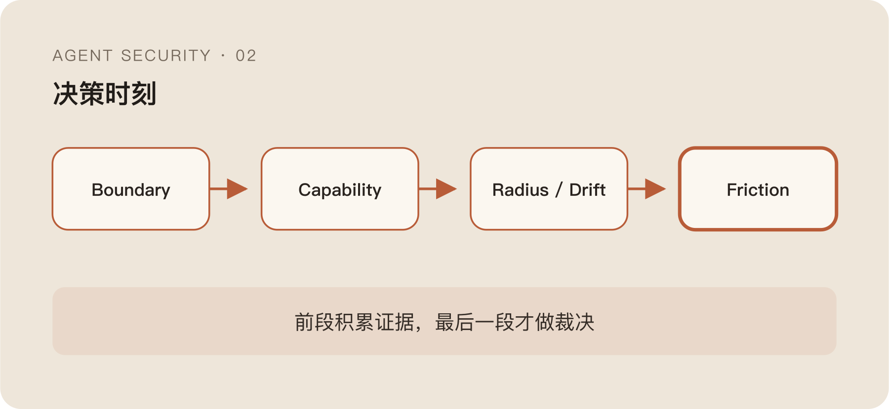

上篇把 Agent 行为拆成了一条链：

```text
prompt → llm_response → tool_call → side_effect
```

真正能做通用决策的位置，通常落在 `before_tool_call`。原因也很直接：再早一点，模型还没形成具体动作；再晚一点，文件已经写了、消息已经发了、网络请求也出去了。

但把决策点放在 Tool Call 前，只解决了“在哪里判断”，没有解决“凭什么判断”。

Hot Path 留给安全系统的时间可能只有几十毫秒。它手里有工具名、参数、部分会话上下文和一些历史状态，却要回答一个很重的问题：这次动作是否符合用户真正授权的任务？

把一个大模型塞进去问一句“安全吗”，当然也能返回答案。然后你会得到不可控的延迟、难以复现的决策，以及一个同时申请动作又参与批准动作的模型。

这不是控制，只是把不确定性从 Agent 搬到了 Guardrail。

## 为什么每层都阻断，最后一定会变成全局 Allow

很多第一版安全插件都会这样长出来：

- 命中危险命令，Block。
- 调了未声明工具，Block。
- 访问外部网络，Block。
- 模型判断与任务不一致，Block。
- 历史会话分数太高，Block。

看起来层层设防，真正跑进日常任务以后，很快会遇到相反的问题。

一个安装脚本里出现 `curl | sh`，风险确实高；但一个开发者可能就在明确测试安装流程。会话没有预先声明 `network_outbound`，更常见的原因是任务启动时没人把能力列全，而不是 Agent 已经被劫持。访问外部网络会扩大影响范围，但包管理、查文档、调用 API 本来就需要外联。

每个信号都可能有风险，却没有几个信号能独立证明攻击。

如果它们各自都能 Block，用户很快会被迫不断确认。确认多了以后，人会形成点击习惯；再往后就是给整个仓库、整个工具甚至整个 Agent 永久放行。安全系统表面上规则很多，实际上把最有价值的决策权亲手训练没了。

所以我更愿意先拆开三件事：

```text
这是不是异常？
异常的影响有多大？
这一次到底允不允许？
```

Boundary、Capability、Radius、Drift、Friction 五段管线，本质上就是不让一个模糊信号同时回答这三个问题。



## Boundary：硬边界必须少，而且必须真的硬

Boundary 处理的是少量不应被普通上下文覆盖的动作。

比如删除系统根目录、关闭关键防护、向受保护分支强推、明确的反向 Shell、把下载内容直接交给解释器执行。这类规则的价值不是“覆盖所有攻击”，而是给系统保留一小块确定性。

工程上的第一个坑是规范化。

```bash
rm -rf /
rm -r -f //
command rm '-rf' /
```

如果直接做字符串匹配，攻击者甚至不需要理解模型，只要改变空格、引号、Flag 顺序或路径表达就能绕过。规则判断前至少要完成 Token 化、Wrapper 剥离、路径归一和等价 Flag 合并。

但规范化只能是 best-effort。Shell 不是一门可以靠几个正则完全还原语义的语言。`$IFS` 拆词、Here-doc、命令替换、ANSI-C Quoting、动态变量拼接，再加上不同 Shell 的行为差异，决定了等价表达不可能枚举完。

这也是为什么 Boundary 必须少。它适合承载真正不可覆盖的红线，不适合成为无限增长的攻击词库。

那些看起来像混淆、但又不足以直接定性的信号，可以继续往后传。`eval`、编码解码、动态下载和解释执行的组合很值得怀疑，却不必在这一层直接判死。

## Capability：未声明和被拒绝，不是一回事

Capability 回答的是这次 Tool Call 需要哪些能力。

```text
shell_exec
file_read
file_write
network_outbound
credential_use
message_send
```

会话启动时可以声明一组粗粒度能力，工具 Manifest 再声明自己的能力需求。两层比对后，如果 Agent 调用了清单之外的能力，最自然的动作通常是 Confirm，而不是 Block。

这里很容易把“未声明”误读成“明确禁止”。

前者往往只是任务在开始时无法穷举所有步骤。例如修改代码的任务，跑到一半才发现需要下载依赖；调查一个错误，最后需要访问文档站点。开放式任务本来就会发现新需求。

被拒绝则不同。用户刚刚拒绝了外发，Agent 随后换一个工具继续尝试；策略明确禁止读取某类凭据，Tool Call 却试图通过别名路径访问。这些才会成为更强的对抗信号。

Capability 的目标不是预测整个未来，而是让能力扩张留下一个重新授权的位置。

如果未声明就 Block，系统会惩罚所有无法预先写出完整计划的正常任务；如果完全忽略，Agent 又会在 Loop 中不断扩大自己的能力。Confirm 正好承担中间的摩擦。

## Radius：影响范围很重要，但它不是罪名

同样一个文件写入动作，写 `/tmp`、改当前仓库、覆盖用户配置和修改系统目录，影响完全不同。

同样一个网络请求，访问已有依赖源、调用用户指定 API、连接未知域名和上传批量数据，也不应获得相同决策。

Radius 只做影响范围分类：

```text
local → project → user → external
```

它不直接判断恶意。

原因是影响大不等于意图坏。发布版本、发送消息和调用生产 API 都可能是用户明确要求的高影响动作；而一个只在本地发生的凭据读取，也可能是后续外传的准备步骤。

Radius 更像一个风险放大器。它告诉最终决策层：如果判断错了，代价会落在哪里，是否可逆，是否需要额外确认。

把 Radius 自己变成 Block 规则，会得到一种看似保守、实际无法工作的系统：所有真正有价值的 Agent 动作恰好都是有副作用的。

## Drift：不要只给动作打分，要看整条会话怎么变

单条 Tool Call 很少能够说明完整问题。

一个 Agent 读取配置文件可能正常，解析编码文本可能正常，访问网络也可能正常。但如果它刚刚因为凭据外发被拒绝，随后开始搜索同类文件、换用另一种编码、改走新的网络工具，整条会话的 Risk Profile 已经发生变化。

Drift 记录的是这种变化，而不是给某一条命令贴“恶意”标签。

可以进入 Drift 的信号包括：

- 高 Severity 信号是否持续累积。
- 被拒绝后是否快速重试相似动作。
- Tool 是否不断换壳，但目标资源保持一致。
- 当前动作是否离用户原始目标越来越远。
- Radius 是否从本地逐步扩展到外部。

这里最容易犯的错误，是把第一代观察直接写成理论。

“被拒后立即重试”确实常见，但有耐心的攻击者会退避、改写参数、插入无关步骤，甚至跨 Session 接力。正常 Agent 也会因为工具失败自动重试。单纯数 Retry 次数，很快就会被绕过或制造误报。

所以 Drift 更适合维护一段可解释的会话状态，而不是吐出一个神秘总分。分数可以用于排序，但最终决策仍需要知道它为什么升高。

## Friction：安全不是 Allow 和 Block 的二选一

前四段都不应该偷偷做最终决定。

Friction 收到的是一组证据：

```text
是否触碰硬边界
需要的能力是否已经授权
影响范围和可逆性
会话是否持续偏离目标
用户是否已经拒绝过相似动作
```

最后输出的也不只有 Allow 和 Block。

`Allow` 适合已授权、低影响、与任务一致的动作；`Confirm` 用于能力扩张、高影响但可能合理、或者语义证据不足的动作；`Block` 留给确定性红线、明确拒绝后的规避，以及多种高置信证据已经收敛的行为。

还可以保留 `Audit`。有些信号值得记录和异步复核，却不值得打断任务。否则每一个新检测能力都会立刻变成用户体验问题。

真正的难点是让 Confirm 有信息量。

“Agent 请求执行命令，是否允许？”几乎等于没有提示。更有价值的确认应该告诉用户：当前任务是什么、请求了哪项新增能力、影响范围在哪里、哪些历史信号让系统提高了摩擦。

确认不是把责任甩给人，而是把机器无法收敛的语义差异暴露出来。

## 50 毫秒里不应该塞进完整世界

Hot Path 只适合做确定性强、计算有界、失败语义清楚的判断。

命令规范化、Manifest 比对、静态参数约束、已缓存的会话状态和少量轻量分类，可以放在 Tool Call 前完成。完整会话重放、大模型复核、跨 Session 关联和复杂 Runtime Trace，更适合进入慢路径。

```text
快路径：规则 + 能力 + Radius + 已有 Drift 状态
                    ↓
            Allow / Confirm / Block
                    ↓
慢路径：完整上下文 + Runtime Fact + 异步复核
                    ↓
              更新下一轮状态
```

快路径不追求解释整个世界，只负责在证据已经足够时增加正确的摩擦。慢路径负责发现新的模式、修正误判，并把结果压缩成下一次能够快速使用的状态。

这里还要提前定义失败方式。

策略服务超时，是默认 Allow、Confirm 还是 Block？不同 Tool 不应共用一个答案。读取公开文档可以 Fail Open，删除数据和发送消息可能更适合 Fail Closed，无法判断的高影响动作则可以退回 Confirm。

如果不区分动作影响，所谓“安全优先”通常只是把所有超时都变成生产事故。

## 决策管线真正约束的是安全系统自己

五段管线看起来是在约束 Agent，实际也在约束安全系统不要滥权。

Boundary 不能把模糊信号伪装成红线；Capability 不能把配置缺口当攻击；Radius 不能把高价值动作等同于高风险；Drift 不能把历史相关性说成因果；Friction 也不能为了追求零漏报，把所有不确定性都推给用户。

这套设计不会消灭误报和绕过。它只是让每种证据待在自己该待的位置，让最终决策能够回答：为什么这次是 Allow，为什么需要 Confirm，又为什么少数动作必须 Block。

再往下追，Capability 还有一个更难的问题。

当前会话拥有 `file_read`，只能说明它具备读文件的能力；用户账号能访问某个仓库，也只能说明传统 IAM 允许访问。它们都不能证明，这次任务真的授权 Agent 去读那个对象。

有权限和该执行之间，还隔着一层任务授权。

下一篇继续拆这层差异。
