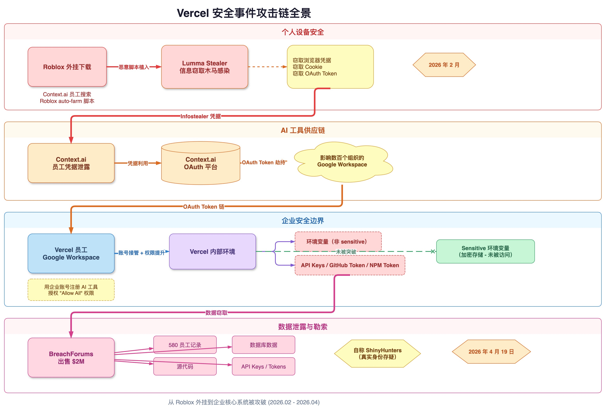

2026 年 4 月 19 日，Vercel——全球最大的前端云平台、Next.js 的缔造者——发布了一则安全公告：**内部系统遭到未授权访问，部分客户凭据已被泄露**。

这不只是又一起云服务商被攻破的事件。**它是 AI 工具供应链攻击从理论走向现实的标志性案例**。攻击的起点不是 0-day 漏洞，不是钓鱼邮件，甚至不是 Vercel 自身的任何缺陷——而是一个 Vercel 员工安装的第三方 AI 工具 Context.ai，以及这个 AI 工具的一名员工在下载 Roblox 游戏外挂时感染的信息窃取木马。

从一个游戏外挂，到 200 万美元的数据勒索——这条攻击链的荒诞和精巧，值得所有关注 AI 安全的人深入思考。

## 事件全景：六步击穿企业核心

让我们按时间线还原这条攻击链：

**第一步：Roblox 外挂 → Lumma Stealer（2026 年 2 月）**

Hudson Rock 的调查显示，Context.ai 一名拥有敏感系统访问权限的员工，在搜索和下载 Roblox 游戏的"auto-farm"外挂脚本时，感染了 Lumma Stealer 信息窃取木马。这类游戏外挂下载是 Lumma Stealer 最臭名昭著的分发渠道之一。木马静默窃取了该员工的浏览器凭据、Cookie、OAuth Token 等关键信息。

**第二步：Context.ai OAuth 令牌失窃**

攻击者利用窃取的凭据，获取了 Context.ai 平台的 Google Workspace OAuth 令牌。Context.ai 是一个企业级 AI Agent 平台，其 OAuth 应用连接了数百个组织的 Google Workspace。

**第三步：Vercel 员工的"个人决定"**

一名 Vercel 员工使用其**企业 Google Workspace 账号**注册了 Context.ai 的 AI Office Suite，并在 OAuth 授权时点击了**"Allow All"**——授予了完整的 Google Workspace 访问权限。关键的是：**Vercel 并非 Context.ai 的客户**，这完全是员工个人行为。

**第四步：横向移动 → Vercel Google Workspace**

攻击者通过失窃的 Context.ai OAuth 令牌，接管了该 Vercel 员工的 Google Workspace 账号。Vercel CEO Guillermo Rauch 确认，企业 OAuth 配置允许这种宽泛的权限授予。

**第五步：进入 Vercel 内部环境**

攻击者从 Google Workspace 向 Vercel 内部环境进行了一系列权限提升操作，枚举并访问了未标记为"sensitive"的环境变量。Vercel 标记为"sensitive"的变量采用加密存储，目前无证据显示被访问——但**未标记的变量全部暴露**。

**第六步：数据泄露与勒索**

一个自称"ShinyHunters"的威胁行为者在 BreachForums 上以 **200 万美元**的价格出售被盗数据，声称包括 580 条员工记录、API 密钥、GitHub Token、NPM Token、源代码和数据库内容。尽管真正的 ShinyHunters 组织否认参与，但泄露的数据已经流出。



上图展示了从 Roblox 外挂到 Vercel 核心环境被攻破的完整攻击链路。每一个环节看起来都不致命，但串联起来就形成了一条从个人设备到企业核心的"六级跳"。

## AI 安全视角一：AI 工具是新型供应链攻击的完美载体

传统供应链攻击的目标是代码依赖——npm 包、Python 库、Docker 镜像。而 Vercel 事件揭示了一种全新的供应链攻击模式：**AI 工具本身成为了攻击载体**。

为什么 AI 工具特别危险？

**权限广度远超传统工具。** 一个 npm 包只能在构建时执行代码。而一个 AI 办公工具，通过 OAuth 一键授权，可以同时获得邮箱、日历、文档、Drive、联系人的完整读写权限。Context.ai 的 OAuth 应用连接了数百个组织——任何一个组织中的一个员工被攻破，就可能成为进入该组织所有系统的跳板。

**AI 工具的信任是"默认授予"而非"逐步获取"的。** 当一个 AI Agent 说"我需要访问你的 Google Workspace 来帮你管理邮件和日程"，大多数用户会直接点击"Allow All"。这不是用户愚蠢，而是 AI 工具的交互模式天然诱导宽泛授权——AI 助手要表现出"智能"，就需要广泛的数据访问权限。

**数量正在爆炸式增长。** Gartner 预测，2026 年 40% 的企业应用将嵌入 AI Agent，而 2025 年这一比例不到 5%。每一个 AI Agent 都是一个拥有凭据、权限和访问路径的非人类身份（Non-Human Identity，NHI）。Hudson Rock 的 2026 年数据泄露报告指出，NHI 失陷已成为企业攻击面增长最快的向量。

2026 年的数据更是触目惊心：**AI 相关攻击同比增长 490%**。而仅有 29% 的组织表示已经准备好安全地部署 Agentic AI，只有 6% 的组织拥有先进的 AI 安全策略。

## AI 安全视角二：OAuth "Allow All" 是 AI 时代的定时炸弹

这起事件的核心不是 OAuth 协议有漏洞——OAuth 作为授权框架运作正常。**问题在于 OAuth 只验证"应用已被授权"，无法验证"应用是否按预期行为运行"**。

在 AI 工具时代，这个设计假设已经不再成立。

传统 SaaS 工具的 OAuth 权限相对可预测：一个项目管理工具请求 Calendar 读权限，一个 CRM 请求 Contacts 读写权限。但 AI Agent 的权限需求是**开放式**的——它要"理解上下文"、"处理所有任务"、"自动化工作流程"。这种描述本质上就是在请求 "Allow All"。

Context.ai 事件暴露的致命缺陷：

- **一个员工的个人决定就能绕过整个企业安全边界。** Vercel 并非 Context.ai 的客户，公司从未采购或评估过这个工具。但一个员工用企业账号注册并授权，就足以让攻击者通过 OAuth 令牌链接入 Vercel 的 Google Workspace。

- **OAuth 令牌是持久化的。** 不像密码可以被强制定期轮换，OAuth Token 一旦授予，通常长期有效。Context.ai 的 OAuth Token 在被盗后持续有效，为攻击者提供了充足的时间窗口。

- **OAuth 作用域（scope）在 AI 工具场景下形同虚设。** 当 AI 工具请求的 scope 就是"everything"时，scope 机制本身就失去了最小权限控制的意义。

这不仅仅是 Vercel 的问题。任何允许员工使用企业账号注册第三方 AI 工具的组织，都面临完全相同的风险。Google Workspace 管理员应该立即审查 OAuth 应用清单，特别是 Context.ai 的应用 ID：`110671459871-30f1spbu0hptbs60cb4vsmv79i7bbvqj.apps.googleusercontent.com`。

## AI 安全视角三：Infostealer → AI 工具 → 企业核心——三级跳的放大效应

这起事件中最值得深思的不是每个环节的技术细节，而是**攻击链的放大效应**。

传统路径下，一个员工的个人设备感染信息窃取木马，影响通常局限于该员工的个人账户。但在 AI 工具的桥梁效应下：

```
个人设备安全事件 → 影响 1 个人
        ↓ (通过 AI 工具的 OAuth 连接)
AI 工具平台失陷 → 影响数百个组织
        ↓ (通过企业 OAuth 授权)
单一组织核心系统暴露 → 影响数百万用户
```

**一个 Context.ai 员工下载 Roblox 外挂的决定，最终影响了 Vercel 的数百万用户和整个 JavaScript 生态的供应链信任。**

这个三级放大效应是 AI 工具时代特有的。它的根源在于：

1. **AI 工具是高权限中间件。** 它们既连接个人身份（员工账号），又连接组织身份（企业 Workspace），还连接下游系统（CI/CD、环境变量、部署流水线）。攻击者只需要攻破 AI 工具这一个中间节点，就能向两端扩展。

2. **信息窃取木马的检测窗口被 AI 工具拉长了。** Lumma Stealer 感染发生在 2 月，Vercel 事件在 4 月才被发现。如果 2 月就检测到感染并吊销凭据，整个事件链都不会发生。但 AI 工具的长期 OAuth Token 让攻击者有了 2 个月的静默操作窗口。

3. **个人行为与企业安全的边界被 AI 工具彻底模糊。** 一个员工在个人时间安装 AI 工具并用企业账号授权，这在以前只是"影子 IT"问题。但在 AI 工具时代，这成了"影子攻击面"——它不在任何安全团队的可见范围内，但直接连通企业核心。

## AI 安全视角四：Opt-in Security 反模式的代价

Vercel 事件中还有一个值得关注的设计决策：**环境变量默认是"非敏感"的，需要用户手动标记为"sensitive"才会加密存储**。

这是经典的 **Opt-in Security 反模式**——把安全当作可选功能，而不是默认保护。

在没有 AI 工具威胁的时代，这个设计也许可以接受：环境变量的访问通常需要通过 Vercel 的认证系统。但在 AI 工具可能获取广泛 OAuth 权限的时代，**"默认不加密"等于"默认暴露"**。

Vercel 在公告中强调"标记为 sensitive 的变量未被访问"，但换个角度想：**有多少用户真的会去手动标记每一个变量为 sensitive？** 大多数团队把数据库连接字符串、API 密钥、第三方服务凭据放在环境变量里，但不会想到要一个个手动标记。

这个问题的本质是：**安全产品的默认值应该是安全的（Secure by Default）**。在 AI Agent 可能通过 OAuth 链获得广泛访问权限的时代，任何 "opt-in" 的安全机制都意味着一个被遗忘的复选框就等于一个开放的后门。

## AI 安全视角五：OWASP Agentic AI Top 10 的现实验证

2026 年，OWASP 发布了《Agentic Applications Top 10》，列出了 AI Agent 系统的十大安全风险。Vercel 事件几乎完美地验证了其中三项：

**ASI03 — Identity and Privilege Abuse（身份与权限滥用）**

Vercel 员工的 OAuth 授权被利用作为攻击跳板。AI Agent（Context.ai）通过委托信任（delegated trust）获得了远超必要的权限范围，而这些权限在凭据被盗后直接变成了攻击者的通行证。

**ASI04 — Agentic Supply Chain Vulnerabilities（Agentic 供应链漏洞）**

Context.ai 作为 AI 供应链中的中间环节被攻破。攻击者不需要直接攻击 Vercel——他们只需要攻破 Vercel 信任链上的一个 AI 工具供应商。这与传统的依赖库供应链攻击如出一辙，只是攻击面从代码扩展到了身份和权限。

**ASI07 — Insecure Inter-Agent Communication（不安全的代理间通信）**

OAuth Token 成为了 Context.ai 与 Vercel Google Workspace 之间的通信凭据。这个凭据既没有时间限制（长期有效），也没有行为审计（无法检测异常使用模式），更没有最小权限约束（"Allow All"）。

OWASP 的这份榜单不再只是理论框架——**Vercel 事件证明，这些风险正在以比我们预期更快的速度变成现实。**

## 启示：AI 安全治理的四个紧迫命题

Vercel 事件不是个案，它揭示了一组系统性的 AI 安全治理缺陷。以下是每个组织都需要立即思考的四个命题：

### 1. Shadow AI：你不知道员工在用哪些 AI 工具

就像十年前的"影子 IT"（Shadow IT）问题一样，今天的"影子 AI"（Shadow AI）正在成为企业安全的最大盲区。Vercel 事件中，公司从未采购 Context.ai，但员工自行安装并用企业账号授权。**安全团队无法保护他们看不见的东西。**

企业需要的不是禁止 AI 工具（这不现实），而是建立 AI 工具使用的可见性和治理框架——知道谁在用什么 AI 工具、授予了什么权限、这些工具的安全态势如何。

### 2. AI 工具的 OAuth 权限需要最小化审计

Google Workspace 管理员可以设置 OAuth 应用白名单，限制哪些应用可以获得授权。但大多数组织没有启用这个控制——因为它会影响"效率"。Vercel 事件是一个代价昂贵的提醒：**OAuth 权限治理不是可选项**。

具体行动建议：
- 启用 Google Workspace 的 OAuth 应用白名单
- 对所有已授权的 AI 工具进行权限审计
- 设置自动告警：当新的 AI OAuth 应用被授权时
- 定期清理不再使用的 OAuth 授权

### 3. 零信任架构必须扩展到 AI Agent

传统零信任关注的是人和设备。但在 AI Agent 时代，非人类身份（NHI）的数量正在指数级增长。每一个 AI Agent 都有自己的凭据、权限和访问路径，它们的行为比人类更难预测，操作速度比人类更快。

**零信任的"永不信任，始终验证"原则必须同等适用于 AI Agent。** 这意味着：
- 为 AI Agent 建立独立的身份管理和访问控制
- 对 AI Agent 的操作实施持续的行为监控
- 为 AI Agent 设置操作上限和熔断机制

### 4. AI 工具供应链需要安全评估框架

我们有 SOC 2、ISO 27001 来评估传统 SaaS 供应商的安全能力。但对于 AI 工具供应商，我们还没有等效的评估框架。

Vercel 事件暴露了需要评估的维度：
- AI 工具请求的 OAuth 权限范围是否符合最小必要原则？
- AI 工具供应商的员工安全培训和设备管理策略如何？
- OAuth Token 的生命周期管理和异常检测能力如何？
- 供应商发生安全事件时的通知和响应机制是否存在？

## 结语：AI 工具供应链安全不是选修课

Vercel 事件有一个讽刺的时间节点：就在安全事件披露前几天，Vercel 被报道正准备 IPO，营收同比增长 240%，主要增长动力来自"企业客户采用 AI 驱动的部署工作流"。

AI 正在让一切变得更快——包括攻击。

**一个 Roblox 外挂 → 一个信息窃取木马 → 一个 AI 工具的 OAuth 令牌 → 一家拥有数百万用户的云平台。** 这条攻击链没有利用任何 0-day 漏洞，没有进行任何复杂的漏洞利用。它利用的是 AI 工具时代的系统性信任缺陷：我们对 AI 工具授予了太多权限、给予了太多信任、建立了太少监控。

如果你的组织正在使用 AI 工具（大概率是的），Vercel 事件不是别人的故事。**AI 工具供应链安全，不是选修课，是必修课。**

---

> **参考来源**

> - [Vercel April 2026 Security Incident](https://vercel.com/kb/bulletin/vercel-april-2026-security-incident) — Vercel 官方公告
> - [Vercel Breach Tied to Context AI Hack Exposes Limited Customer Credentials](https://thehackernews.com/2026/04/vercel-breach-tied-to-context-ai-hack.html) — The Hacker News
> - [Vercel confirms breach as hackers claim to be selling stolen data](https://www.bleepingcomputer.com/news/security/vercel-confirms-breach-as-hackers-claim-to-be-selling-stolen-data/) — BleepingComputer
> - [Breaking: Vercel Breach Linked to Infostealer Infection at Context.ai](https://www.infostealers.com/article/breaking-vercel-breach-linked-to-infostealer-infection-at-context-ai/) — InfoStealers
> - [Hackers exploit Vercel's trust in AI integration](https://www.csoonline.com/article/4160853/hackers-exploit-vercels-trust-in-ai-integration.html) — CSO Online
> - [Vercel Breach Exposes AI Tool Supply Chain Risk Ahead of IPO](https://startupfortune.com/vercel-breach-exposes-ai-tool-supply-chain-risk-ahead-of-ipo/) — Startup Fortune
> - [Hack at Vercel sends crypto developers scrambling to lock down API keys](https://www.coindesk.com/tech/2026/04/20/hack-at-vercel-sends-crypto-developers-scrambling-to-lock-down-api-keys/) — CoinDesk
> - [OWASP Top 10 for Agentic Applications](https://owasp.org/www-project-top-10-for-large-language-model-applications/) — OWASP
> - [Navigating Security Tradeoffs of AI Agents](https://unit42.paloaltonetworks.com/navigating-security-tradeoffs-ai-agents/) — Palo Alto Networks Unit 42
