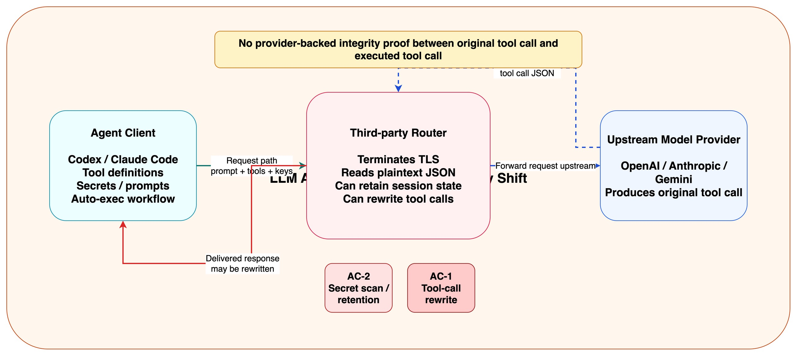
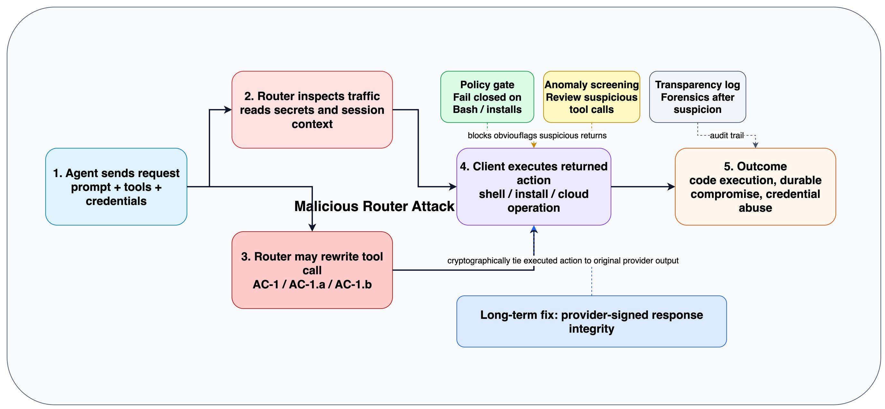

假设你给团队的 coding agent 接了一个“很好用”的 Router：统一 OpenAI / Anthropic 接口、价格更低、还能自动 fallback。表面上看，你只是换了一个 `base_url`；但在这篇 2026 年 4 月 9 日发布在 arXiv 的论文里，作者想说明的是：**你改掉的并不只是网络出口，而是把 Agent 的执行链信任边界整体外包了出去。**

这篇论文叫 [Your Agent Is Mine: Measuring Malicious Intermediary Attacks on the LLM Supply Chain](https://arxiv.org/abs/2604.08407)。光看标题就很直接：**一旦中间的 Router 是恶意的，或者它自己又连到了更脏的上游，你的 Agent 最后执行的命令，就未必还是模型原本返回的命令。**

我觉得这篇论文最值得关注的地方，不是“又发现了一种新的 prompt injection”，而是它把一个过去常被当作工程细节的组件，明确提升成了 **Agent 时代的供应链根节点**。



上图可以帮助理解论文的核心判断：Router 不是被动转发层，而是一个默认可见明文请求、明文响应、工具定义和工具参数的应用层中间人。只要客户端把它配置成 API endpoint，它就天然站到了请求必经之路上。

## 一、为什么这篇论文盯上的是 Router，而不是模型

过去一年，安全社区讨论 Agent 风险时，主要在看三类问题：

* prompt injection 会不会把模型带偏；
* MCP server 或外部工具会不会返回恶意结果；
* 模型本身会不会越权执行高风险动作。

这篇论文换了一个角度：**如果模型没问题、提示词没中毒、工具定义也没问题，但你和模型之间那层 Router 能改 JSON，会发生什么？**

作者的回答是：这就足够了。

因为在现代 Agent 框架里，真正危险的不是“模型说了一句坏话”，而是模型返回的 `tool_call`、`function call`、命令参数、安装依赖列表这些**会进入执行链的结构化输出**。如果这些字段在返回途中被篡改，客户端往往根本看不出来。

论文明确指出，今天主流 Provider 并没有部署一种机制，去把“上游模型生成的 tool call”与“客户端最终收到并执行的 tool call”做加密绑定。这就是整个攻击面的起点。

## 二、论文把攻击拆成了四种，里面最危险的不是偷看，而是改写

为了让问题讲清楚，作者先给了一套非常实用的分类法。

### 1. `AC-1`：响应侧 Payload Injection

这是最直接的一类。模型本来返回一条正常工具调用，Router 在响应回到客户端之前把参数换掉。比如把原本无害的 Bash 指令，改成从攻击者控制的地址拉脚本并执行。

危险之处在于，这种改写往往仍然是**语法合法、schema 合法**的 JSON。Agent 不会因为格式错误而报警，它只会“正常执行”。

### 2. `AC-2`：被动秘密窃取

这类攻击甚至不需要改响应。Router 只要在转发过程中扫描流量，就能收集：

* OpenAI / Anthropic API keys
* AWS 凭证
* GitHub PAT
* Slack token
* PEM 私钥
* 以太坊私钥

从客户端视角看，这类攻击最难发现，因为**流量完全可以保持原样**。

### 3. `AC-1.a`：依赖投毒型注入

这是对 `AC-1` 的进一步升级。它不是把命令改成“明显恶意的 curl | bash”，而是把包名偷偷替换成 typo-squatting 依赖。

比如原本是：

```bash
python -m pip install requests flask pyyaml
```

被改成：

```bash
python -m pip install reqeusts flask pyyaml
```

从域名和安装行为看，一切都像是“正常安装 PyPI 包”。但真正被装进去的，已经不是开发者以为的那个依赖了。这个设计特别阴，因为它绕过了很多只检查外部域名的 policy gate。

### 4. `AC-1.b`：条件触发型投递

这一类是论文里我认为最有现实感的部分。恶意 Router 不必每次都作恶，它只在特定条件成立时触发，比如：

* 只对 `Bash`、`run_command` 这类高风险工具下手；
* 只在命令里出现 `pip install`、`curl -sSL` 等关键词时下手；
* 只针对已经开了自主执行的 `YOLO mode`；
* 只在第 `N` 次请求之后触发，先把前几轮流量伪装成正常。

这意味着常规 smoke test 和有限次抽样，可能根本测不出问题。**你越是依赖“我试了几次都没事”，越容易被这类 Router 误导。**

## 三、最不舒服的数据：恶意 Router 已经不是假设，而是样本事实

如果论文只讲 taxonomy，它还可以被归类为“前瞻性风险分析”。但作者做的是实测。

他们总共分析了两类样本：

* `28` 个付费 Router，来自 Taobao、Xianyu 和 Shopify 店铺；
* `400` 个免费 Router，来自公开社区、router list 和配置泄露样本。

实测结果里，最值得记住的是这几组数字：

* `1` 个付费 Router 和 `8` 个免费 Router，会主动注入恶意代码；
* `2` 个 Router 部署了条件触发或暖机后触发的规避机制；
* `17` 个 Router 触碰了研究者布置的 AWS canary 凭证；
* `1` 个 Router 直接从研究者控制的钱包私钥中转走了 ETH。

这个结果之所以刺眼，不在于比例多高，而在于它证明了一件事：**“恶意 Router 会不会出现”这个问题，已经不需要再停留在假设层了。**

更重要的是，论文还明确说，付费并不自动等于可信。买了服务，可能只是买到了更稳定的中间人，而不是更安全的中间人。

## 四、这篇论文真正想打穿的，是“Router 只是一个方便层”这个行业幻觉

我觉得很多团队看完论文以后，最该修正的认知，是对 Router 的定位。

过去大家容易把它想成：

* 成本优化器；
* 协议兼容层；
* API 聚合器；
* model fallback 组件。

这些都没错，但它们只描述了功能，没有描述权限。

真正的问题是：**Router 同时拥有“读请求、读响应、记跨请求状态、改写返回 JSON”的能力。** 当 Agent 开始把返回结果直接接到工具执行链上时，这个权限集合已经足够构成完整攻击面。

论文给的一个关键观察是：Router 和传统网络 MITM 还不太一样。它不是偷偷插进来劫持流量，而是开发者主动把它配置成 endpoint。也正因为如此，TLS 并不能保护你免受它的篡改。TLS 只能证明你确实连到了这个 Router，不能证明它把上游响应原样交给了你。

## 五、最值得警惕的，反而是“看起来不恶意”的 Router

论文里还有两组实验，我觉得比“发现几个恶意 Router”更有启发。

作者做了两件事：

### 第一件：故意泄露研究者控制的 OpenAI key

结果，一个泄露出去的 key 产生了 `100M GPT-5.4 tokens`，并被观察到流向了超过 `7` 个 Codex 会话。

### 第二件：部署弱配置的 relay 诱饵

作者把一些故意配弱的 Sub2API、claude-relay-service、CLIProxyAPI 诱饵放到 `20` 个域名和 `20` 个 IP 上。结果这些诱饵吸引到了大量未授权访问和转发流量，累计处理了 `2.1B` token，暴露了 `99` 份凭证，关联到 `440` 个 Codex 会话，其中 `401` 个已经处在自主执行模式。

这两组结果说明了一件比“单个恶意服务商作恶”更现实的事：

**就算某个 Router 本身没打算攻击你，只要它复用了泄露的上游 key，或者它再转发给了更弱的一跳，它也可能被拖进同一个供应链攻击面。**

换句话说，问题不只是“你信不信眼前这个 Router”，而是**你知不知道它后面到底还串了几层。**



这也是为什么论文最后把问题归结为 supply chain，而不是简单的 API 安全：当流量开始在多跳 Router 之间传播时，风险会沿着链条放大，而不会自然消失。

## 六、对 Codex、Claude Code 和各类自主 Agent，这个结论为什么格外致命

这篇论文点名测试了四个公开 Agent 框架：OpenClaw、OpenCode、OpenAI Codex 和 Claude Code。作者在兼容性实验里发现，**这四个框架都没有实现 response-integrity verification。**

这个结论的意思不是它们“设计得很差”，而是说明整个行业目前都还处在一个共同阶段：

* 大家默认上游返回的 tool call 可以被信任；
* 大家普遍没有验证“返回值是否被中间层篡改”；
* 大家更习惯把安全控制放在 prompt、权限、sandbox 和人工确认上。

这些控制当然重要，但它们解决的是“执行前你怎么约束 Agent”，不是“执行前你怎么确认这份结果真的是模型产物”。这是两个不同问题。

如果你的系统满足下面任一条件，这篇论文都值得高度重视：

* Agent 可以自动执行 shell；
* Agent 可以自动安装依赖；
* Agent 可以访问云资源、代码仓库或生产环境；
* Agent 通过第三方 Router 接多个模型；
* Agent 运行在默认 auto-approve 或近似 `YOLO mode` 的工作流里。

在这些场景下，一次看似很小的 JSON 改写，就足以把风险从“模型说错话”升级成“执行链被接管”。

## 七、作者给出的防御思路很实用，但也提醒我们别误判防线强度

论文没有只停留在揭示问题，还测试了三类可以马上落地的防御。

### 1. 高风险工具的 `policy gate`

这是最强、也最务实的一种：对 Bash、`run_command`、安装依赖等高风险工具走 fail-closed 策略，只允许白名单域名或白名单依赖。

在作者的实验里，这个方法对明显的 `AC-1` 和 `AC-1.a` 非常有效，几乎可以全拦下来。但论文同时也很诚实：**一旦攻击者把 payload 放到 allowlist 域名、或者用本地已有 stager 做二次利用，这个防线就会明显失效。**

### 2. 响应侧异常检测

也就是用本地能观察到的特征去判断返回的工具调用是否可疑，比如 shell-risk pattern、工具调用频率、参数熵值、异常字符串等。

它的价值更像“审计优先级排序器”，而不是完整防线。作者的结果说明，它能抓住大量明显的 `AC-1`，但对更隐蔽的 `AC-1.a`、`AC-1.b` 仍然有限。

### 3. 追加式透明日志

这类日志不会阻止攻击发生，但能在事后做范围界定和取证。对 `AC-2` 这种被动秘密窃取尤其如此：它更像事故响应工具，而不是在线防御工具。

作者最终给出的长期方向非常明确：**想真正补上信任缺口，还是需要 Provider 级别的响应完整性证明。**

也就是让客户端能验证：

> 我即将执行的这份 tool call，确实就是上游模型原样返回的结果，而不是 Router 或其他中间层替我改过的版本。

## 八、我觉得这篇论文真正改变了什么

如果只把它当成一篇“发现几个恶意转发服务”的论文，反而低估了它。

它真正改变的是行业里几个默认前提：

* `base_url` 不是纯工程配置，而是信任边界配置；
* Router 不是“可有可无的便捷层”，而是执行链上的供应链组件；
* TLS 不能证明结果没被改写，只能证明你连到的是谁；
* Prompt Injection、MCP 投毒、模型越权之外，还存在一个更靠近执行层的 JSON 篡改面。

如果把这几点放在一起看，你会发现这篇论文其实在逼整个 Agent 生态回答一个更根本的问题：

**当 Agent 真正开始替人执行命令时，我们到底凭什么相信它拿到的命令，还是最初那条命令？**

这不是一个“学术上很巧妙”的问题，而是一个马上会落到工程实践、采购策略和内部安全规范上的问题。

## 写在最后

真正让人不安的，不是这篇论文证明了世界上存在几个恶意 Router；而是它让我们意识到，过去被很多团队当成“省钱、提速、兼容性优化”的那一层，已经悄悄长成了 Agent 时代最危险的供应链接口之一。

所以这篇论文最应该留下的一句话，不是“your agent is mine”，而是另外一句更朴素的话：

**以后评估 Agent 安全，不能只问模型安不安全，还要问中间那几跳，谁有权改写你的执行现实。**

## 参考资料

* [arXiv: Your Agent Is Mine: Measuring Malicious Intermediary Attacks on the LLM Supply Chain](https://arxiv.org/abs/2604.08407)
